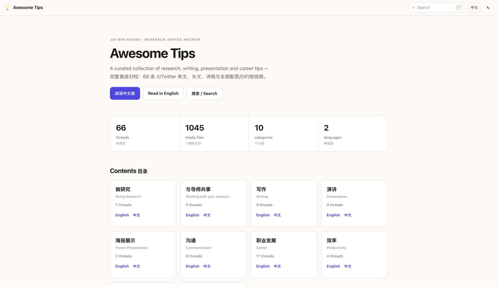

# Awesome Tips（中文版）

本文件把 README 中每一条内容都映射到**本地中文 Markdown**，无需访问 X / Dropbox。

基于 [jbhuang0604/awesome-tips](https://github.com/jbhuang0604/awesome-tips)（MIT 许可）。该项目链接的每一条串文都已在本仓库完整归档（含全部配图与短视频），此外还有全站中译、两份讲稿的逐页提取，以及一个完全自包含的静态网站。

🔗 **在线站点**：<https://yifeistarwang-coder.github.io/awesome-tips-offline/> · 每次推送由 GitHub Actions 自动重建

[](https://yifeistarwang-coder.github.io/awesome-tips-offline/)

- 英文版：[README.md](README.md)
- 中文完整串文归档（66 条）：[threads/zh/README.md](threads/zh/README.md)
- 仓库五篇正文的中文整理：[中文离线阅读版.md](中文离线阅读版.md)
- 讲稿/幻灯片中文版：[threads/slides/README.md](threads/slides/README.md)
- **静态网站**：`python3 scripts/build_site.py` 生成 `site/`（中英双语、离线搜索、可 `--serve` 预览）

## 仓库里有什么

| 路径 | 内容 |
| --- | --- |
| [`threads/`](threads/README.md) | 66 条 X/Twitter 串文全文，按分类分文件。全部配图、GIF 与短视频已存到本地 `threads/media/`，`t.co` 短链已展开。 |
| [`threads/zh/`](threads/zh/README.md) | 每条串文的中文翻译。 |
| [`threads/slides/`](threads/slides/README.md) | 两份 Dropbox 讲稿（哈佛客座讲座、学术求职工作坊），已逐页提取。 |
| 根目录 `*.md` | 五篇长文，其中 [`中文离线阅读版.md`](中文离线阅读版.md) 是它们的中文整理。 |
| [`scripts/`](scripts) | 生成以上全部内容的流水线。 |

## 怎么读

**静态网站（推荐）**：中英双语、全文搜索（`/` 或 `Cmd-K`）、深浅色主题、动画在屏幕上时自动播放。

```bash
python3 scripts/build_site.py            # 生成 site/
python3 scripts/build_site.py --serve    # 生成并起 http://localhost:8000
```

完全不依赖网络——没有 CDN、没有 web 字体、没有统计——所以 `site/index.html` 直接双击（`file://`）也能打开。

**纯 Markdown**：所有内容本来就能直接读，入口是 [`threads/zh/README.md`](threads/zh/README.md)（中文）或 [`threads/README.md`](threads/README.md)（英文）。

## 重新生成

```bash
python3 scripts/fetch_x_threads.py         # 用本机浏览器登录态刷新串文与媒体
python3 scripts/fetch_article_media.py     # 镜像根目录文章里仍指向网络的视频
python3 scripts/fetch_bsky_thread.py       # 重新归档 Bluesky 串文（公开 API，无需登录）
python3 scripts/prepare_zh_translation.py  # 切分翻译批次
python3 scripts/render_x_threads_zh.py     # 渲染中文归档
python3 scripts/build_readmes.py           # 由 scripts/readme_index.json 重建 README.md / README-CN.md
python3 scripts/build_site.py              # 重建网站
```

重新抓取后媒体会恢复成原始体积，需要再压缩一遍；站点也要重建，让 `site/media` 指向新文件：

```bash
python3 scripts/optimize_media.py                # 就地压缩，只在更小时才替换
python3 scripts/optimize_media.py --gif-to-video # 把动图替换成 H.264 视频
rm -rf site && python3 scripts/build_site.py
```

## 说明

- `threads/media/` 有 966 个文件、约 251 MB；`site/media/` 是指向它的硬链接，所以建站几乎不额外占用磁盘——但推送到任何远端之前请先掂量这个体积。
- `site/` 是生成产物，已在 `.gitignore` 中忽略，仓库里只跟踪源文件。
- 短视频是原 GIF 的无声 H.264 转码。是否自动播放始终由浏览器决定：进入屏幕才开始、划走就暂停，系统要求「减弱动态效果」时保持静止。

## 目录

### 做研究
- [研究推进](中文离线阅读版.md#研究推进)
- [如何做实验？](threads/zh/doing-research.md#如何做实验)
- [如何摆脱卡壳状态？](threads/zh/doing-research.md#如何摆脱卡壳状态)
- [如何决定研究课题？](threads/zh/doing-research.md#如何决定研究课题)
- [如何跟进文献？](threads/zh/doing-research.md#如何跟进文献)
- [如何想出研究点子？](threads/zh/doing-research.md#如何想出研究点子)
- [如何应对论文被拒？](threads/zh/doing-research.md#如何应对论文被拒)
- [成为 AI 忍者之路（哈佛客座讲座）](threads/slides/ninja.zh.md)
- [如何推动你的研究向前进（Bluesky）](threads/zh/bsky-how-to-drive-your-research-forward.md)
- [如何获得引用？](threads/zh/doing-research.md#如何获得引用)

### 与导师共事
- [如何与导师/合作者同步进展？](threads/zh/working-with-your-mentors.md#如何与导师合作者同步进展)
- [如何与导师开会？](threads/zh/working-with-your-mentors.md#如何与导师开会)
- [与导师协作](中文离线阅读版.md#与导师协作)
- [如何与导师合作？](threads/zh/working-with-your-mentors.md#如何与导师合作)
- [如何与很忙的导师合作？](threads/zh/working-with-your-mentors.md#如何与很忙的导师合作)
- [如何与资深导师合作？](threads/zh/working-with-your-mentors.md#如何与资深导师合作)

### 写作
- [如何写引言？](threads/zh/writing.md#如何写引言)
- [论文相关工作](中文离线阅读版.md#论文相关工作)
- [论文写作：让读者少做匹配](中文离线阅读版.md#论文写作让读者少做匹配)
- [如何写出看起来就不错的论文？](threads/zh/writing.md#如何写出看起来就不错的论文)
- [如何写出清晰简洁的句子？](threads/zh/writing.md#如何写出清晰简洁的句子)
- [如何画方法概览图？](threads/zh/writing.md#如何画方法概览图)
- [如何做出好的表格？](threads/zh/writing.md#如何做出好的表格)
- [论文里怎么写数学？](threads/zh/writing.md#论文里怎么写数学)
- [如何准备期刊回复信？](threads/zh/writing.md#如何准备期刊回复信)
- [如何准备补充材料？](threads/zh/writing.md#如何准备补充材料)
- [如何引用论文？](threads/zh/writing.md#如何引用论文)

### 演讲
- [如何开场演讲？](threads/zh/presentation.md#如何开场演讲)
- [如何结尾演讲？](threads/zh/presentation.md#如何结尾演讲)
- [演讲中如何应对提问？](threads/zh/presentation.md#演讲中如何应对提问)
- [如何展示折线图？](threads/zh/presentation.md#如何展示折线图)
- [如何准备报告幻灯片？](threads/zh/presentation.md#如何准备报告幻灯片)
- [如何组织你的演讲？](threads/zh/presentation.md#如何组织你的演讲)
- [如何设计你的演示？](threads/zh/presentation.md#如何设计你的演示)
- [如何避免演示中的常见错误？](threads/zh/presentation.md#如何避免演示中的常见错误)
- [如何用故事结构组织你的演讲？](threads/zh/presentation.md#如何用故事结构组织你的演讲)

### 海报展示
- [如何做学术海报？](threads/zh/poster-presentation.md#如何做学术海报)
- [如何在会议上做海报展示？](threads/zh/poster-presentation.md#如何在会议上做海报展示)
- [如何修改学术海报？](threads/zh/poster-presentation.md#如何修改学术海报)

### 沟通
- [如何用视频展示你的工作？](threads/zh/communication.md#如何用视频展示你的工作)
- [如何传播你的研究？](threads/zh/communication.md#如何传播你的研究)
- [如何提研究问题？](threads/zh/communication.md#如何提研究问题)
- [如何做学术海报？](threads/zh/poster-presentation.md#如何做学术海报)（已收录于「海报展示」）
- [如何改善异步沟通？](threads/zh/communication.md#如何改善异步沟通)
- [如何清晰沟通？](threads/zh/communication.md#如何清晰沟通)
- [如何设置好的日历邀请？](threads/zh/communication.md#如何设置好的日历邀请)
- [如何被人记住？](threads/zh/communication.md#如何被人记住)
- [如何约会议？](threads/zh/communication.md#如何约会议)

### 职业发展
- [如何准备简历（CV）？](threads/zh/career.md#如何准备简历cv)
- [如何找研究实习？](threads/zh/career.md#如何找研究实习)
- [如何实习？](threads/zh/career.md#如何实习)
- [如何找到研究机会？](threads/zh/career.md#如何找到研究机会)
- [如何准备研究生面试？](threads/zh/career.md#如何准备研究生面试)
- [提交申请后如何继续提升研究生申请？](threads/zh/career.md#提交申请后如何继续提升研究生申请)
- [如何最大化博士申请的成功率？](threads/zh/career.md#如何最大化博士申请的成功率)
- [如何请求推荐信？](threads/zh/career.md#如何请求推荐信)
- [如何度过博士第一年？](threads/zh/career.md#如何度过博士第一年)
- [如何准备教职电话面试？](threads/zh/career.md#如何准备教职电话面试)
- [如何拿到终身教职轨的教职？](threads/zh/career.md#如何拿到终身教职轨的教职)
- [作为准学生如何给老师发邮件？](threads/zh/career.md#作为准学生如何给老师发邮件)
- [梦幻教职——以及如何拿到它们（学术求职工作坊）](threads/slides/faculty.zh.md)
- [如何找到好的博士导师？](threads/zh/career.md#如何找到好的博士导师)
- [如何给潜在导师写邮件？](threads/zh/career.md#如何给潜在导师写邮件)
- [如何自己邀请自己去做报告？](threads/zh/career.md#如何自己邀请自己去做报告)
- [如何让别人认识你？](threads/zh/career.md#如何让别人认识你)
- [如何安排答辩时间？](threads/zh/career.md#如何安排答辩时间)

### 效率
- [如何管理时间？](threads/zh/productivity.md#如何管理时间)
- [如何管理时间？](threads/zh/productivity.md#如何管理时间)（已收录于「效率」）
- [如何养成高产的日常习惯？](threads/zh/productivity.md#如何养成高产的日常习惯)
- [如何多任务处理？](threads/zh/productivity.md#如何多任务处理)
- [如何判断何时放弃一个项目？](threads/zh/productivity.md#如何判断何时放弃一个项目)

### 社交
- [如何在线下会议上社交？](threads/zh/networking.md#如何在线下会议上社交)
- [如何在虚拟会议上社交？](threads/zh/networking.md#如何在虚拟会议上社交)
- [写冷邮件](中文离线阅读版.md#写冷邮件)
- [如何让教授回复我的邮件？](threads/zh/networking.md#如何让教授回复我的邮件)

### 财务
- [研究生（在美国）如何为退休储蓄？](threads/zh/financial.md#研究生在美国如何为退休储蓄)
