# Communication

> 完整串文归档（8 条）。返回 [线程索引](README.md)。

## How to present your work via videos?

原帖：<https://x.com/jbhuang0604/status/1752768310087737588> · 2024-01-31 · 共 14 条串文

How to present your work with videos?

As academics, we are used to sharing and communicating our work via static text, figures, and tables.

But in many cases, videos are a much better medium for communicating your ideas clearly.

Sharing some tricks I learned below 🧵

*Meet the expectations upfront*

I used to think I should kick off the presentation by introducing myself, discussing how significant the problem is, and (lots of unrelated) related work to feel more "academic".

Be direct and specific instead!

Example: https://youtu.be/IfHiGSsm7K0

▶ [视频（点击播放）](media/1752768311526408606-1.mp4)

相关链接：
- <https://youtu.be/IfHiGSsm7K0>

*Consider the trade-off of space and time*

• Space: the content you pack into one frame
• Time: the sequence of frames

Think about what you want to convey (your results? comparisons?) and compose the video accordingly.

Example: https://youtu.be/VizL7q9o-5Y

▶ [视频（点击播放）](media/1752768313153761699-1.mp4)

相关链接：
- <https://youtu.be/VizL7q9o-5Y>

*Animate math derivation*

Make your presentation consistent. Here is the consistency mindset that applies to math derivation.

Instead of packing your frames with visual equations, use simple morph transitions for better illustration.

Example: https://youtu.be/i2qSxMVeVLI

[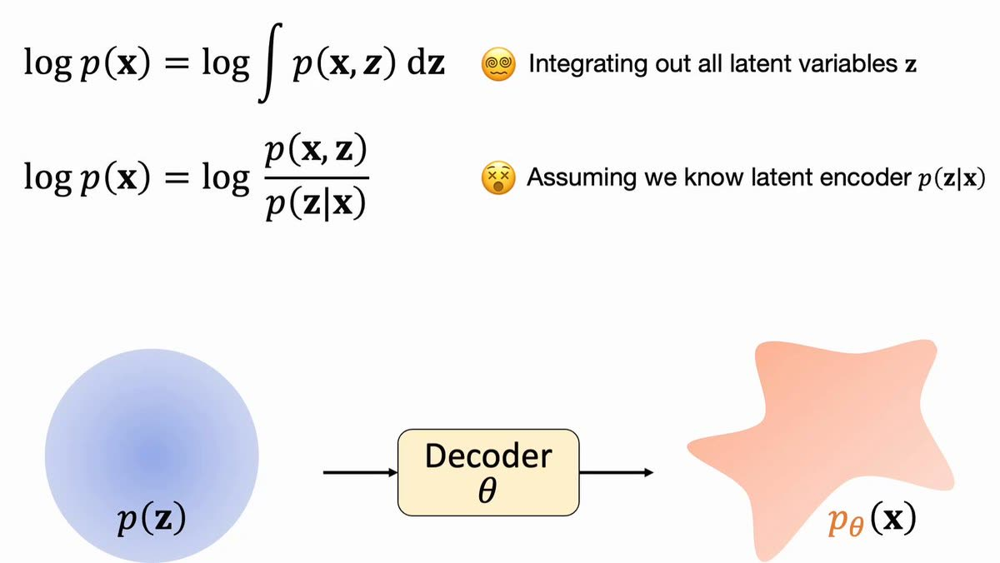](media/1752772130264014947-1.mp4)

▶ [视频（点击播放）](media/1752772130264014947-1.mp4)

相关链接：
- <https://youtu.be/i2qSxMVeVLI>

*Use visual pointers*

When your frames are cluttered with many visual elements, it's helpful to point out what you are talking about.

Example: https://youtu.be/i2qSxMVeVLI

[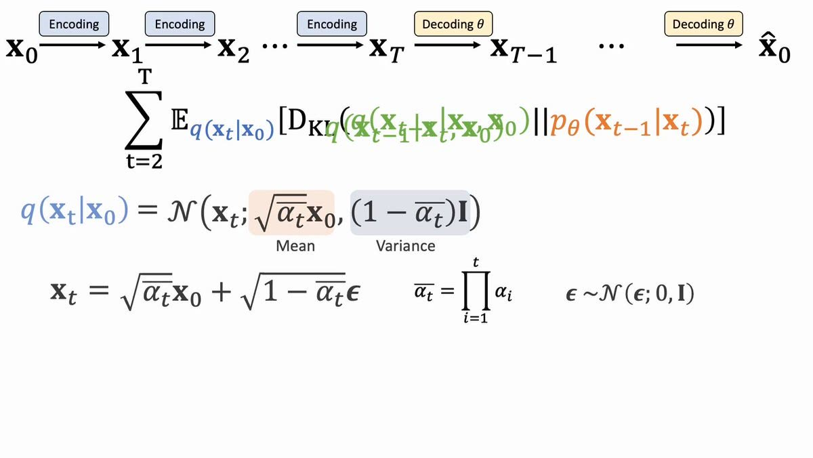](media/1752772131694199021-1.mp4)

▶ [视频（点击播放）](media/1752772131694199021-1.mp4)

相关链接：
- <https://youtu.be/i2qSxMVeVLI>

*Sound effects - Actions*

Adding simple sound effects to your video improves the clarity of your messages.

Here is an example showing the sound effects of the "trim" action.

Example: https://youtu.be/8vi5K8pTM3c

[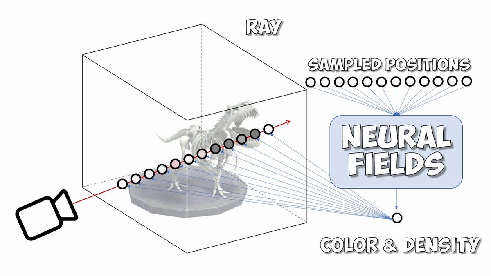](media/1752772132956737752-1.mp4)

▶ [视频（点击播放）](media/1752772132956737752-1.mp4)

相关链接：
- <https://youtu.be/8vi5K8pTM3c>

*Sound effects - Semantics*

Sound effects can also be helpful to reinforce the semantics of the visual elements (e.g., moooo~~~).

Example: https://youtu.be/i2qSxMVeVLI

[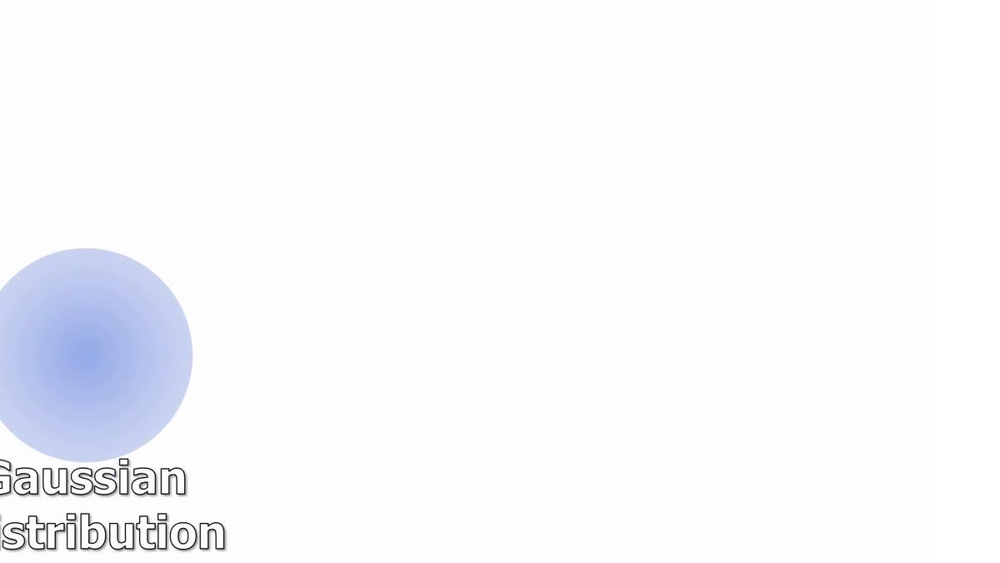](media/1752772690803318814-1.mp4)

▶ [视频（点击播放）](media/1752772690803318814-1.mp4)

相关链接：
- <https://youtu.be/i2qSxMVeVLI>

Sound effects - Expressing emotion*

Nobody cheers for you? Cheer yourself up!

Example: https://youtu.be/VizL7q9o-5Y

[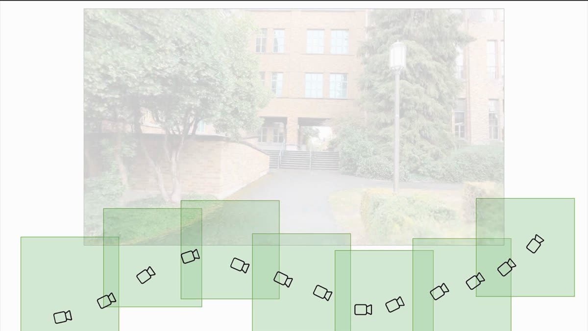](media/1752773671272190005-1.mp4)

▶ [视频（点击播放）](media/1752773671272190005-1.mp4)

相关链接：
- <https://youtu.be/VizL7q9o-5Y>

*Sound effects - Showing unexpected outcome*

Adding "glitch" effects to illustrate the unexpected.

Example: https://youtu.be/m_-mNNrhvgc

[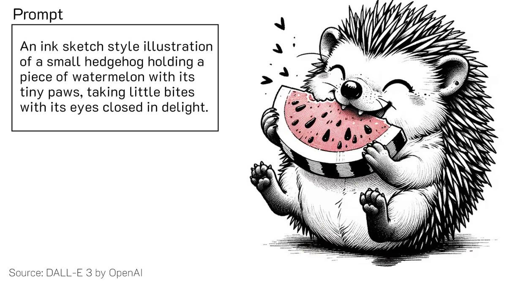](media/1752773672476049796-1.mp4)

▶ [视频（点击播放）](media/1752773672476049796-1.mp4)

相关链接：
- <https://youtu.be/m_-mNNrhvgc>

*Music - Ducking*

It's great to have background music.

But sometimes it interferes with your narratives.

Add ducking effects so that it dynamically changes the volume.

Example: https://youtu.be/Rkt2EeHHbHI

[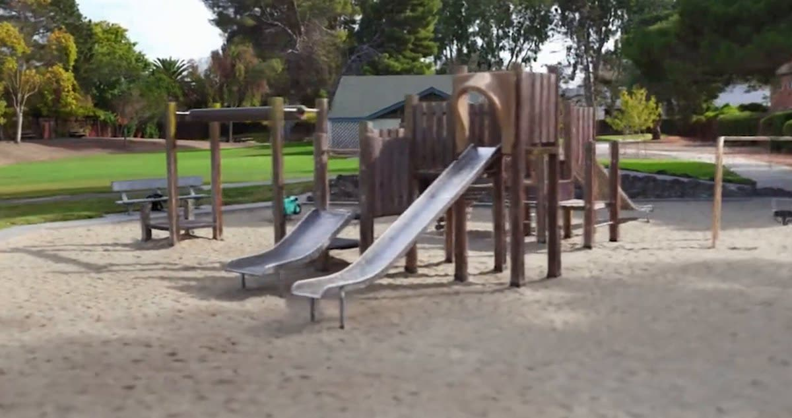](media/1752773674183131423-1.mp4)

▶ [视频（点击播放）](media/1752773674183131423-1.mp4)

相关链接：
- <https://youtu.be/Rkt2EeHHbHI>

*Music - Matching visuals with beats*

Listen to your music and match the cuts with the beats!

Example: https://youtu.be/o-tljMgkGew

[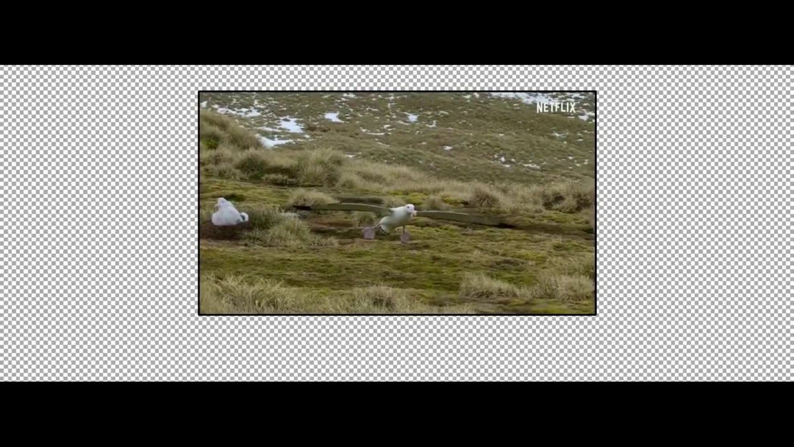](media/1752774360136348074-1.mp4)

▶ [视频（点击播放）](media/1752774360136348074-1.mp4)

相关链接：
- <https://youtu.be/o-tljMgkGew>

*Music - J-cut and L-cut*

Matching the visuals with music all the time can be boring. Try different cuts to maintain a better video flow.

J-cut: sound first, visual follows
L-cut: visual first, sound follows

Here is an example of a J-cut.

Example: https://youtu.be/VizL7q9o-5Y

[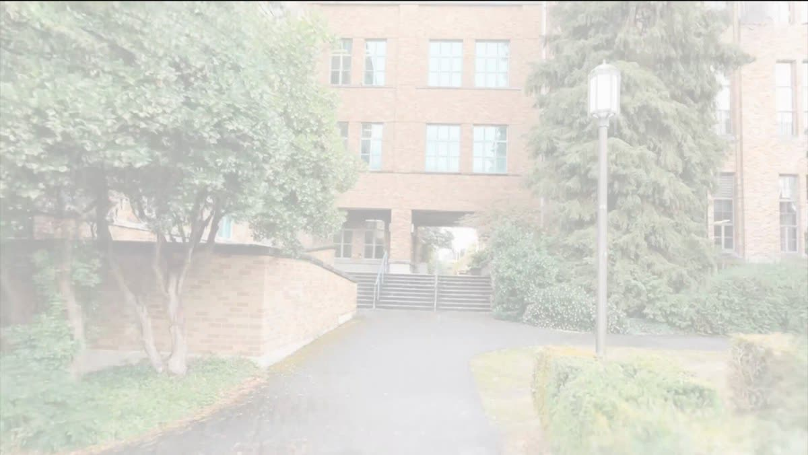](media/1752774859267178990-1.mp4)

▶ [视频（点击播放）](media/1752774859267178990-1.mp4)

相关链接：
- <https://youtu.be/VizL7q9o-5Y>

*Sound effects - Matching visuals*

Animate the text with typewriter effects?
-> Add typing sound

Animate the image?
-> Add mouse click sound

Example: https://youtu.be/ihDbAUh0LXk

[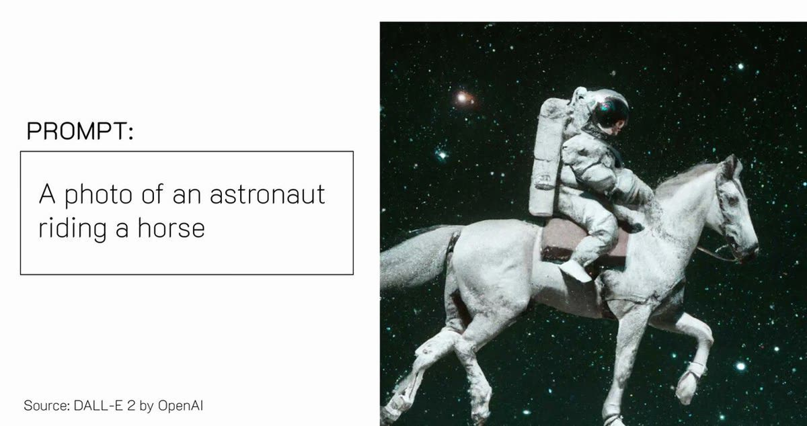](media/1752777079790145938-1.mp4)

▶ [视频（点击播放）](media/1752777079790145938-1.mp4)

相关链接：
- <https://youtu.be/ihDbAUh0LXk>

*Maintain consistency in your explanation*

Use consistent graphics/notation/color/motion to help your audience understand how things work.

Example: https://youtu.be/ljar4GAFkUk

[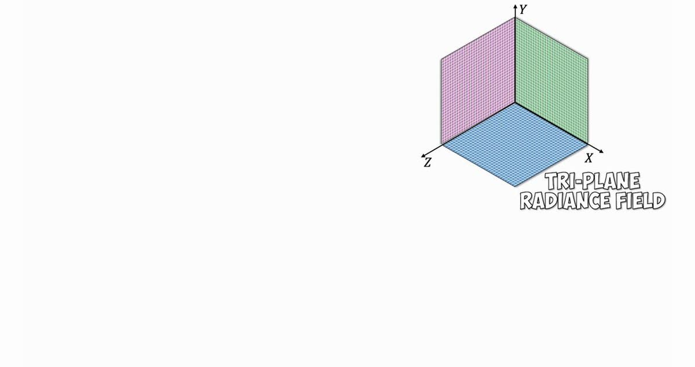](media/1752777081119711646-1.mp4)

▶ [视频（点击播放）](media/1752777081119711646-1.mp4)

相关链接：
- <https://youtu.be/ljar4GAFkUk>

## How to disseminate your research?

原帖：<https://x.com/jbhuang0604/status/1379448897823776769> · 2021-04-06 · 共 20 条串文

Sharing ideas on how to disseminate your research.

"I am THRILLED to share that our paper is accepted to ..."

Congrats! So what's next? No one is going to browse through the list of thousands of accepted papers. Ain't nobody got time for that.

Check out 🧵below for examples.

*Website*

Use memorable domain names for your project website so that people can easily find/share the link. No university account? That's okay. Register a new name for GitHub pages.

Examples:
• http://oops.cs.columbia.edu/
• http://crowdsampling.io/
• http://robust-cvd.github.io/

相关链接：
- <http://oops.cs.columbia.edu/>
- <http://crowdsampling.io/>
- <http://robust-cvd.github.io/>

*Acronym*

Make it easy for people to remember and refer to your work. As David Patterson said, the vowel is important.

For example, NeRF sounds waaaaaay cooler than NRF..

[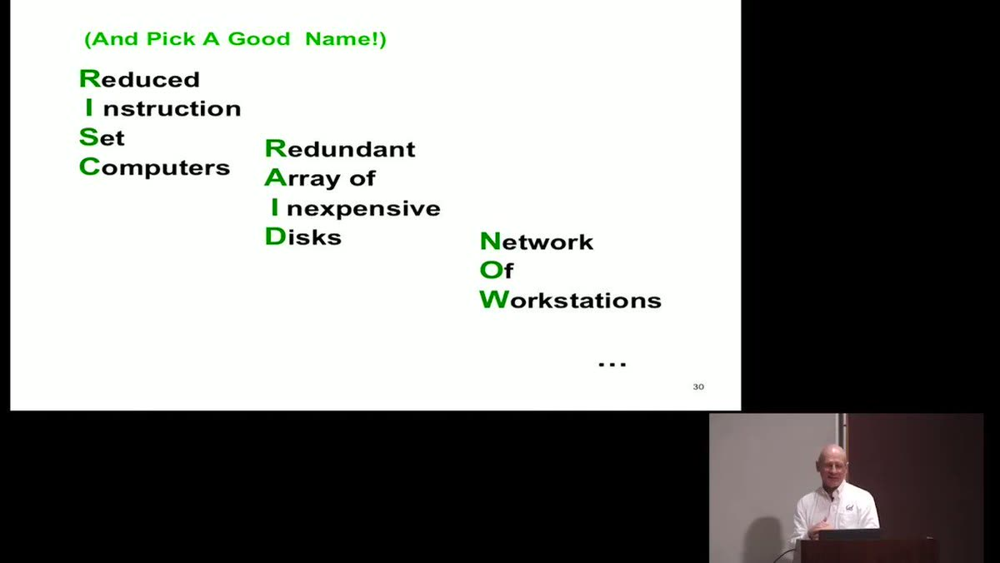](media/1379448946406346758-1.mp4)

▶ [视频（点击播放）](media/1379448946406346758-1.mp4)

*Result video*

Make a simple video showing the killer results from your work! Based on my back-of-the-envelope calculation, I would have to present this ECCV paper in the zoom poster session for 18 years straight to reach the same level of visibility.

https://x.com/jbhuang0604/status/1301899594838704128?s=20

> **引用 [@jbhuang0604](https://x.com/jbhuang0604)**：
>
> Super excited to share our work on video completion at #ECCV2020!🤩Our method seamlessly removes objects, watermarks, or expands field-of-view from casually captured videos.
>
> Paper: https://t.co/JwT9bYN85V
> Project: https://t.co/7raLq7jVQx
>
> With @gaochen315, Ayush, and @JPKopf https://t.co/eLGjINlbMC

*Paper video*

Having a short video introducing the essence of the paper is arguably THE BEST.

Examples I like
• https://www.youtube.com/watch?v=EpH175PY1A0
(@jon_barron)
• https://www.youtube.com/watch?v=K3z68mOLbNo (@AbeDavis)
• https://www.youtube.com/watch?v=sA4Za3Hv6ng (@JPKopf)

相关链接：
- <https://www.youtube.com/watch?v=EpH175PY1A0>
- <https://www.youtube.com/watch?v=K3z68mOLbNo>
- <https://www.youtube.com/watch?v=sA4Za3Hv6ng>
- <https://t.co/tQnG4k25Od> — Mip-NeRF: A Multiscale Representation for Anti-Aliasing Neural Radiance Fields

*Downloadable results*

Do not put your result videos on YouTube and then embed them on your website. Make it super easy for people to download (and share) your results. Help people help share your work.

No image/video size limits so share the highest quality possible.

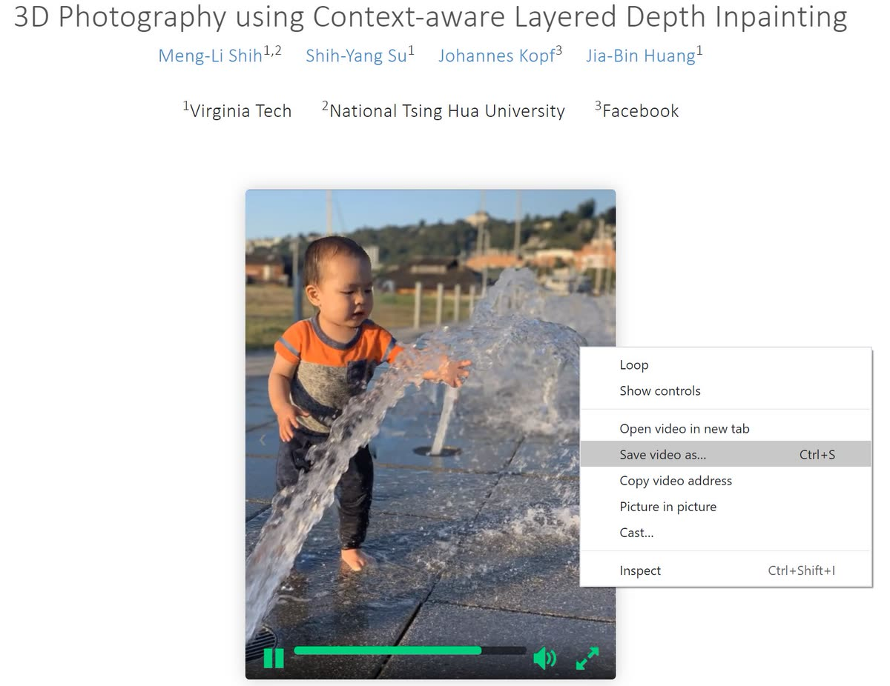

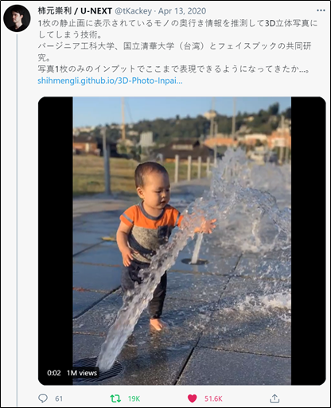

*Additional results*

Very often you need to work hard constructing the baseline results across multiple datasets. Make them available so that people can easily follow up. For example, many citations of this work are not for specific technical contributions.

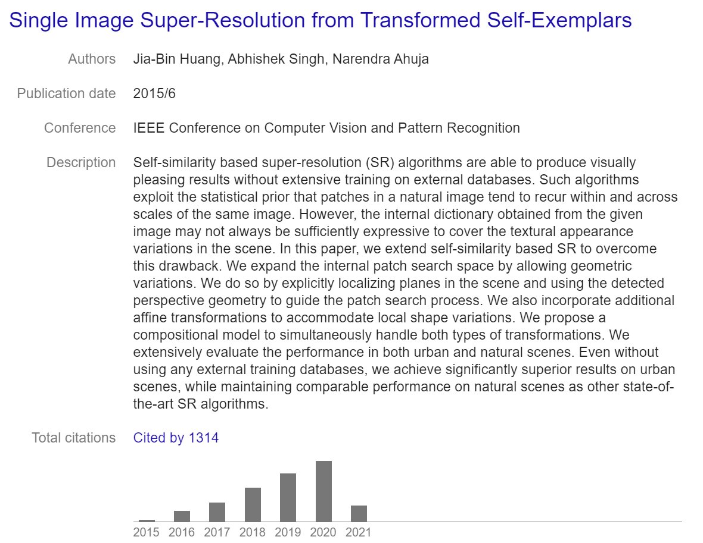

*Supplementary website*

Organize all the results across multiple datasets, methods, and ablation on a webpage. This allows EVERYONE (including myself) to interactively explore the results.

Example:
https://alex04072000.github.io/ObstructionRemoval/website/Obstruction_HTML_CameraReady/pages/reflection.html

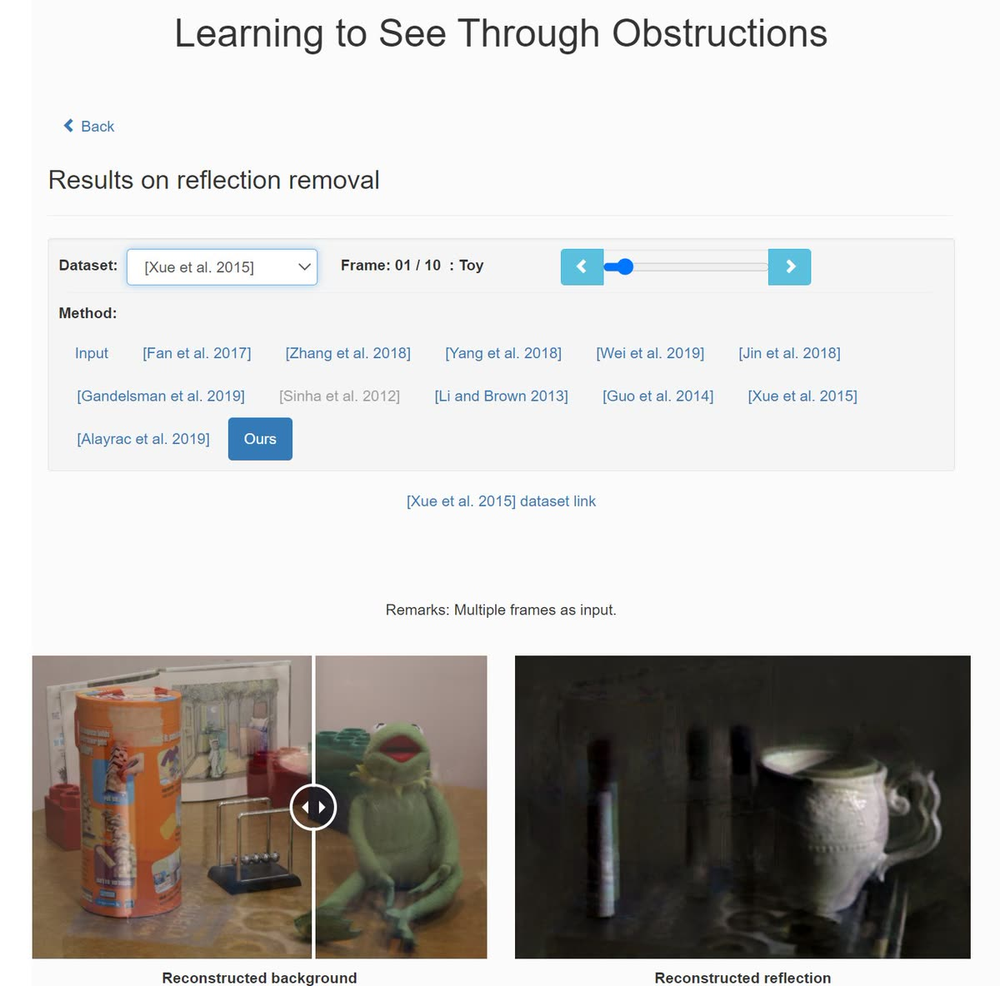

相关链接：
- <https://alex04072000.github.io/ObstructionRemoval/website/Obstruction_HTML_CameraReady/pages/reflection.html>

*GitHub*

Don't simply dump unorganized research code to GitHub. Write clear instructions and simplify the steps required to get the code running.

Examples I like:
- https://github.com/junyanz/pytorch-CycleGAN-and-pix2pix (@junyanz89)
- https://github.com/NVlabs/stylegan2

相关链接：
- <https://github.com/junyanz/pytorch-CycleGAN-and-pix2pix>
- <https://github.com/NVlabs/stylegan2>

*Colab*

Not everyone has the knowledge/resources to set up the environment required for your code on GitHub. Preparing a colab notebook demo (or other platforms) allows everyone to play around with your method.

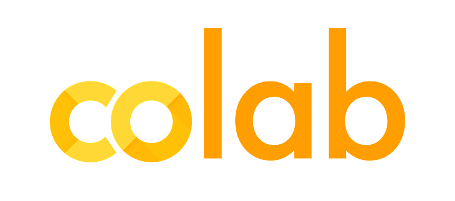

*arXiv*

Host all your papers on arXiv. It's very frustrating to papers behind the paywall. Posting your paper at a specific time further increases the visibility/readership/impact of your work.

https://x.com/jbhuang0604/status/1337985347733622788?s=20

> **引用 [@jbhuang0604](https://x.com/jbhuang0604)**：
>
> Have you ever wondered why papers from top universities/research labs often appear in the top few positions in the daily email and web announcements from arXiv?
>
> Why is that the case? Why should I care? https://t.co/BdjIs0dP8X

*Teaser image/video*

On your publication page, show teaser images/videos so that people can quickly browse through all your work. Work hard to optimize the quality of your teaser! Trust me, it's definitely worth your time.

https://filebox.ece.vt.edu/~jbhuang/#pubs

相关链接：
- <https://filebox.ece.vt.edu/~jbhuang/#pubs>

*Engagement*

When sharing on social media or other sites (e.g., Twitter, YouTube, HackerNews, Reddit...), engage with people who comment on your work even tho sometimes you may encounter comments with bad intentions. Over time, they will be your best allies.

[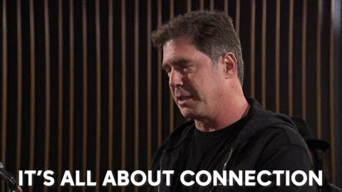](media/1379522270146793477-1.mp4)

▶ [GIF 动画（点击播放）](media/1379522270146793477-1.mp4)

* Hyperlinks*

Make sure every page has hyperlinks to every other pages. For examples, add links to authors’ pages, related projects, GitHub/Colab, datasets, YouTube videos additional results. Make it easy to navigate the contents via multiple paths.

▶ [GIF 动画（点击播放）](media/1379549674688946180-1.mp4)

*BibTeX*

Everyone knows that bibtex from google scholar is erroneous. Do your readers a favor and help people cite your paper correctly.

*Paper title*

A title should capture what is SPECIAL about the paper. Check out the talk by Jitendra Malik about the paper title.

BTW, the entire workshop is awesome. Check them out!
https://www.cc.gatech.edu/~parikh/citizenofcvpr/

▶ [视频（需在线播放）](https://x.com/jbhuang0604/status/1379653498837602309)

相关链接：
- <https://www.cc.gatech.edu/~parikh/citizenofcvpr/>

*Music*

Whaaaaat?! How is music related to my research? YES, it helps make your video more engaging and fun to watch. If possible, match the transitions with music beats.

Examples I like:
https://youtu.be/rHnOr3oZ5VI

https://youtu.be/KO3sULs4hso

https://youtu.be/VjR11gkmm3E (@holynski_)

相关链接：
- <https://youtu.be/rHnOr3oZ5VI>
- <https://youtu.be/KO3sULs4hso>
- <https://youtu.be/VjR11gkmm3E>

*Website template*

Don't know how to write HTML responsive web design? A good template is your friend!

Examples I like:
• https://nerfies.github.io/
• https://richzhang.github.io/colorization/
• https://alex04072000.github.io/ObstructionRemoval/

相关链接：
- <https://nerfies.github.io/>
- <https://richzhang.github.io/colorization/>
- <https://alex04072000.github.io/ObstructionRemoval/>

*Links to concurrent work*

Provide readers a complete landscape of concurrent work.

"Credits are not like money. Giving credit to others does not diminish the credit you get from your paper." - Simon Peyton Jones

Examples:
• https://phog.github.io/snerg/
• https://alexyu.net/plenoctrees/

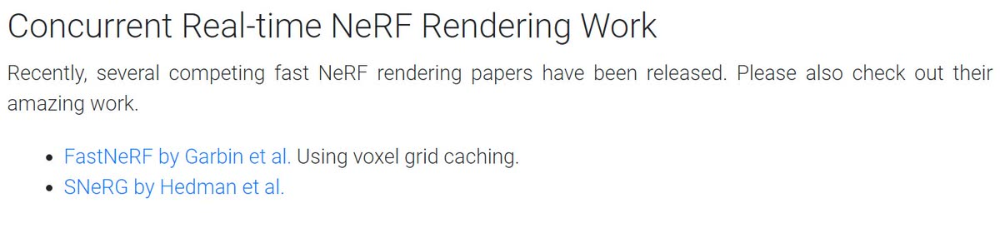

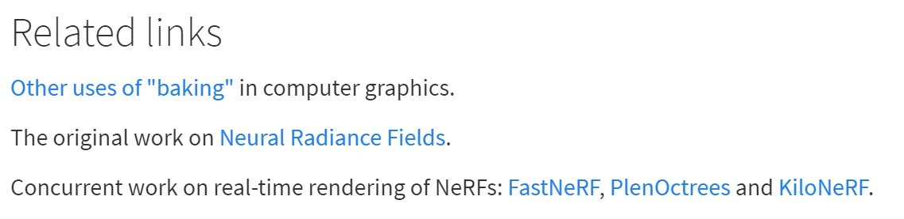

相关链接：
- <https://phog.github.io/snerg/>
- <https://alexyu.net/plenoctrees/>

*Easy installation*

The easier the installation of your work/code for others, the wider adoption it will be.

Examples:
• pip install (@rzhang88)
• PyTorch hub

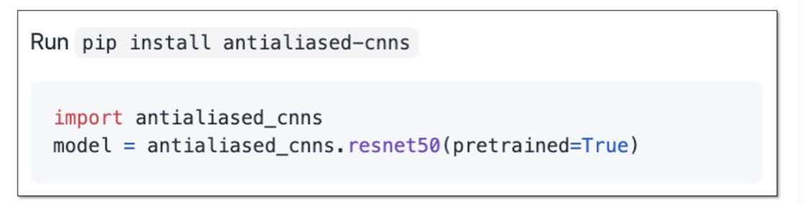

### 作者补充回复

@Samujjwal_Sam ABSOLUTELY! Think about all the countless hours on literature survey, research discussions, implementation, experiments, and writing. I would say the time spent on dissemination is the most cost-effective thing you can do to maximize your impact.

<https://x.com/jbhuang0604/status/1379531097344765953>

@LChoshen I am not an expert so take my words with a grain of salt.

The very first few seconds are important to get people's attention. Show your BEST results instead of a boring title/author/affiliation page (unless you are famous). Keep only the essence of your work.

<https://x.com/jbhuang0604/status/1384226958016356354>

## How to ask research questions?

原帖：<https://x.com/jbhuang0604/status/1472808608874352641> · 2021-12-20 · 共 7 条串文

How to ask research questions?

Zoom fatigue is real 😱. How do you provide feedback to students when you have zero idea about what their work is about (because you have been scrolling the twitter feed)? Here are some boilerplate questions that you can use. 🧵

*Why should I (or someone else) care?*

What will the field change with your work? This helps remind students of finding their core motivation of the work.

▶ [GIF 动画（点击播放）](media/1472808617472581632-1.mp4)

*When will you use it?*

Contextualizing your research work with practical applications helps identify potentially unrealistic constraints/assumptions.

▶ [GIF 动画（点击播放）](media/1472808624871428098-1.mp4)

*What other people have done and why they are not satisfactory?*

If existing methods work well already, why do you need to work on this research project?

▶ [GIF 动画（点击播放）](media/1472808632429461505-1.mp4)

*Which is the closest related work and how does yours differ?*

Articulate the core novelty of your work.

▶ [GIF 动画（点击播放）](media/1472808640532860929-1.mp4)

*How did you know it is working (better than prior work)?*

Are all the claims validated? Are the experiments fair? Are the results representative for the application domains?

▶ [GIF 动画（点击播放）](media/1472808648250466306-1.mp4)

*What would you do if you have another 3 months?*

Think about how to maximally strengthen the work with a specific time budget.

▶ [GIF 动画（点击播放）](media/1472808656093777921-1.mp4)

### 作者补充回复

@usamakhawajaa Yep, if your advisor was like that, run. (This thread was not talking about PhD advising tho)

<https://x.com/jbhuang0604/status/1473301358325424133>

## How to improve asynchronous communication?

原帖：<https://x.com/jbhuang0604/status/1515912622721355781> · 2022-04-18 · 共 8 条串文（另有 1 条已不可用）

How to improve asynchronous communication?

Two years into remote work, asynchronous communication has never been this important for work efficiency and productivity.

Some tips for effective async communication 🧵

*One topic at a time*

❌ Here are the results of the experiments we discussed. BTW, can you approve my conference travel expense?

✅ Conference travel expense - Approval required by April 20.

▶ [GIF 动画（点击播放）](media/1515912633253302274-1.mp4)

*Formatting*

❌ Writing loooong free-form paragraphs.

✅ Writing structured, concise, clear texts. Formatting tools (bold, underscore, italic, itemize, enumerate, paragraph, line breaks) are your friends.

▶ [GIF 动画（点击播放）](media/1515912642346553352-1.mp4)

> ⚠️ 此处一条推文在 X 上显示为“不可用”（可能已删除），线程内容在此处不连续。

*Inline content*

❌ I made an overview figure here <JPEG link> and wrote down the math derivation here <PDF link>.

✅ Embed the content inline.

[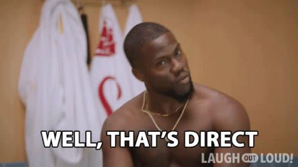](media/1515912661850066947-1.mp4)

▶ [GIF 动画（点击播放）](media/1515912661850066947-1.mp4)

*Async sharing before sync meeting*

❌ Describe your work, show results during the meeting.

✅ Summarize your work/results and send them for early feedback before the meeting. Make the best use of your favorite collaborative document platforms.

[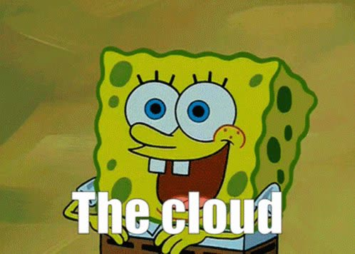](media/1515912671438290949-1.mp4)

▶ [GIF 动画（点击播放）](media/1515912671438290949-1.mp4)

*Actionable next steps after a sync meeting*

❌ Just talked. Brainstormed multiple ideas. Created a bunch of tasks.

✅ Decide WHO to do WHAT by WHEN.

▶ [GIF 动画（点击播放）](media/1515912680883769352-1.mp4)

*Give others control when setting up meetings*

❌ When will you be available next week?

✅ I am available in the following time slots. When will work best for you? Use calendar tools (calendly, google calendar) to avoid back and forth discussions.

[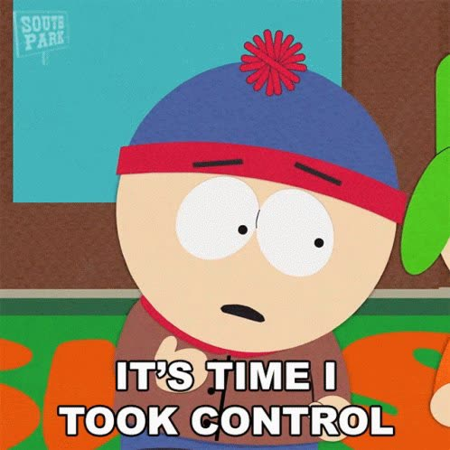](media/1515912690333585409-1.mp4)

▶ [GIF 动画（点击播放）](media/1515912690333585409-1.mp4)

*Agenda, agenda, agenda*

❌ Let's hop on a call and chat next week.

✅ Send clear meeting agenda with allocated time.

▶ [GIF 动画（点击播放）](media/1515912703453376514-1.mp4)

## How to communicate clearly?

原帖：<https://x.com/jbhuang0604/status/1520615196498214913> · 2022-05-01 · 共 7 条串文

How to communicate clearly?

Majority of our time goes into emails, slack messages, and loads of meetings.

Yet, as a student, no one taught me how to communicate well. (I must have annoyed a lot of people along the way ...😬)

Here is a template for organizing your message.

*(1) What?*

What's your key point? Please don't tell a convoluted story that graaaadually leads to your main point. Ain't nobody got time for that!

👉 Identify your main message and put them up front.

▶ [GIF 动画（点击播放）](media/1520615204777832449-1.mp4)

*(2) So What?*

Why is it relevant or important for your work/project/team? Why should your audience care? 🤷‍♂️🤷‍♀️

👉 Tell me why?

▶ [GIF 动画（点击播放）](media/1520615212474273793-1.mp4)

*(3) Now What?*

What are the *actionable* steps next?
e.g., Set up another meeting? Ask for feedback? Outline a plan for a new task?

👉 Call for specific action!

▶ [GIF 动画（点击播放）](media/1520615220271538176-1.mp4)

Example: Research

1⃣ What?
Here are the results of a toy problem A.

2⃣ So what?
This is important because the experiment helps us  study only problem A and not get distracted by problem B/C.

3⃣ Now what?
I will move on to study problem B and C.

Example: Opportunity

1⃣ What?
I am interested in working with you.

2⃣ So what?
I have relevant skills, experiences, and specific ideas on how to extend your recent work X to Y and Z.

3⃣ Now what?
When would you be available so I can present these specific directions?

Happy communicating!

Having the What/So What/Now What template in mind when writing and speaking about ANYTHING has been very helpful for keeping my messages clear and concise!

Hope this helps yours too! 👍

## How to set up a good calendar invite?

原帖：<https://x.com/jbhuang0604/status/1528566229505650691> · 2022-05-23 · 共 6 条串文

How to Set Up a Good Calendar Invite?

Our days are filled with events on the calendar (e.g., project meetings, roundtable, committee, 1:1s) 🗓️

But, most calendar invites are awfully vague and lead to unproductive meetings.

Five tips on writing a good calendar invite 👇

*1⃣ Specific Title*

Nobody knows what "project update" or "internship meeting weekly" are. 🙄

Labeling your event with a specific title helps everyone!

[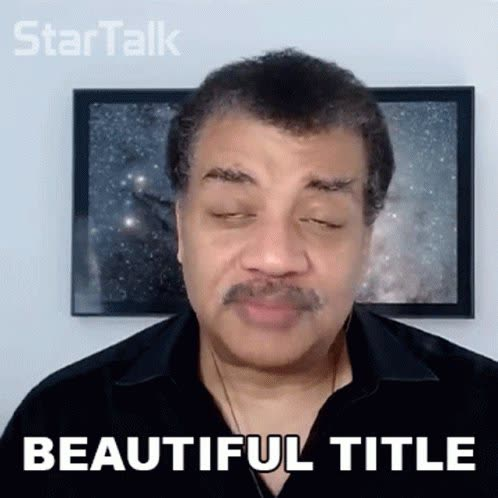](media/1528566243871141893-1.mp4)

▶ [GIF 动画（点击播放）](media/1528566243871141893-1.mp4)

*2⃣ Goal*

Write down specific goals of the meeting!

You are asking people's time. In the calendar invite, tell them what do you want to achieve from the meeting.

Make sure to review the goal near the end of each meeting.

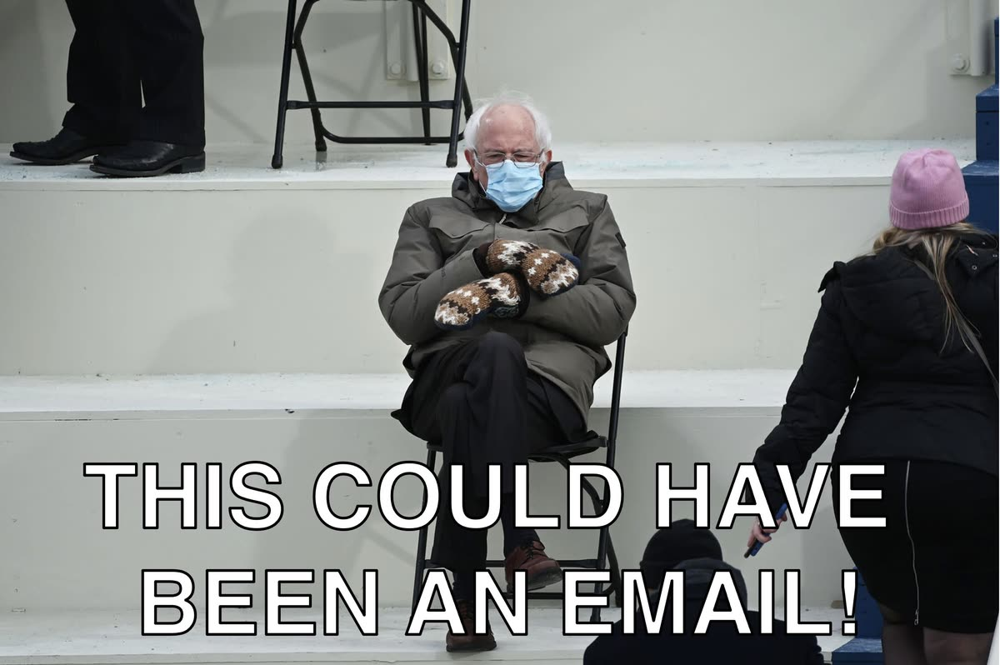

*3⃣ Agenda*

Have multiple topics to discuss?

Write them down and allocate specific time required for each topic.

Don't attend a meeting without an agenda.

▶ [GIF 动画（点击播放）](media/1528566257733275654-1.mp4)

*4⃣ Meeting Pre-work*

List the tasks you want your attendee to complete PRIOR to the meeting.

When everyone is ready, the meeting will be a lot more effective.

▶ [GIF 动画（点击播放）](media/1528566265836670977-1.mp4)

*5⃣ Easy-to-Access Information*

❌ zoom meeting ID
✅ zoom meeting link

❌ "I just sent my slides in the chat."
✅ include link (doc/slides) in the calendar invite

Everything the attendee need should be one click away in the calendar invite.

[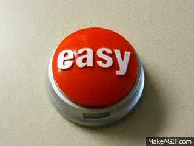](media/1528566276519493632-1.mp4)

▶ [GIF 动画（点击播放）](media/1528566276519493632-1.mp4)

## How to get remembered?

原帖：<https://x.com/jbhuang0604/status/1611588521440976898> · 2023-01-07 · 共 7 条串文

How to get remembered?

With tens of thousands of papers published each year, how can you ensure that your talk, work, or paper will be remembered? 🤔

Check out Winston’s star 💫!

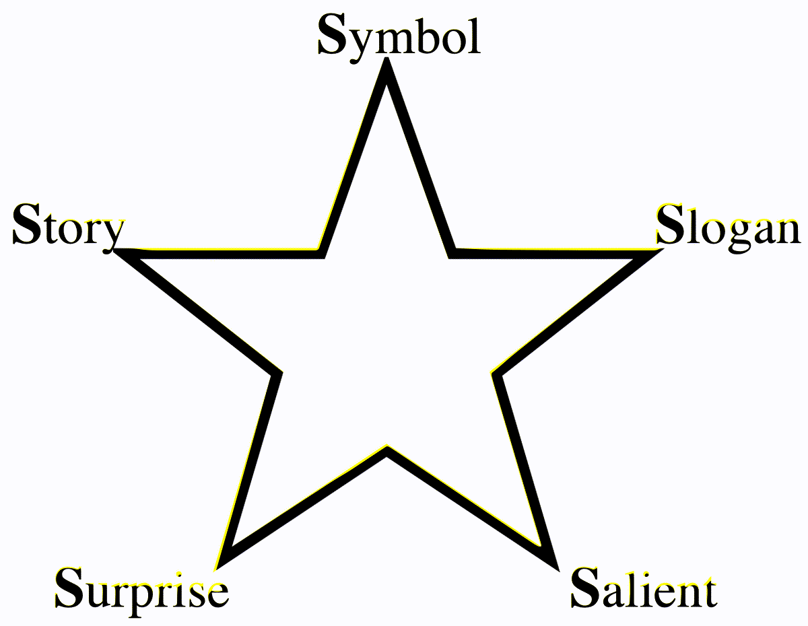

*Symbol*

Include a visual symbol that manifests the core of your work.

Polish that single logo 🦇, picture 🖼️, drawing ✏️, graph 📈, or figure 🏞️!

▶ [GIF 动画（点击播放）](media/1611588529875828736-1.mp4)

*Slogan*

Include a short, slogan-like phrase to serve as a handle for your work.

Your slogan should
• evoke the key concept,
• capture the uniqueness of your work, and
• be memorable.

▶ [GIF 动画（点击播放）](media/1611588540067897344-1.mp4)

*Salient*

Your work usually has several different ideas. Pick the idea that sticks out, not just an important idea.

Squeezing many ideas in one talk is a bad idea.

▶ [GIF 动画（点击播放）](media/1611588547286556673-1.mp4)

*Surprise*

Highlight a surprise in your work. We all love surprises!

▶ [GIF 动画（点击播放）](media/1611588557012963328-1.mp4)

*Story*

Humans are drawn to stories. Stories let us create an emotional connection and resonate with their own experience.

Describe how you did it, with whom, when, and where?

▶ [GIF 动画（点击播放）](media/1611588565212844032-1.mp4)

Want to make your work memorable? Include

🌟 Symbol
🌟 Slogan
🌟 Salient
🌟 Surprise
🌟 Story

and don't forget to watch the talk "How to Speak" by Prof. Patrick Winston! It's beyond amazing!
https://www.youtube.com/watch?v=Unzc731iCUY

相关链接：
- <https://www.youtube.com/watch?v=Unzc731iCUY>

## How to schedule a meeting?

原帖：<https://x.com/jbhuang0604/status/1866260228150337632> · 2024-12-09 · 共 6 条串文

How to schedule a meeting?

When you ask for a meeting with others, you are asking for their time. You are asking for their most valuable, finite resource to benefit yourself (e.g., for advice, networking, questions, and opportunities).

Here are some tips that I found useful.

*Provide your availability upfront*

The most annoying thing you can do is to ask:

"Can you give me a list of time slots when you are available?"

This basically asks people to put ALL their availability ON HOLD for a meeting with you.

[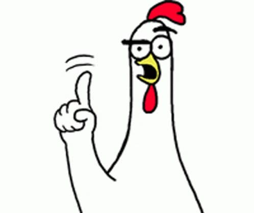](media/1866260235423265077-1.mp4)

▶ [GIF 动画（点击播放）](media/1866260235423265077-1.mp4)

*Convert the timezone for them*

When you provide your availability, make it easy for others to decide and plan their days by converting the time slots into their time zones.

[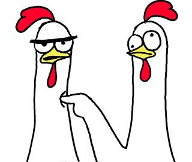](media/1866260243178725419-1.mp4)

▶ [GIF 动画（点击播放）](media/1866260243178725419-1.mp4)

*List specific goals of your meeting*

Tell them how the meeting can help you. Write down questions that you will ask. Describe the homework you have done. Provide background material on what you want to discuss.

Assure them that you will not waste their time.

▶ [GIF 动画（点击播放）](media/1866260250497524212-1.mp4)

*Send out calendar invite asap*

If an event is not on the calendar, it does not exist.

When you finalize the time, please send a calendar invite with a detailed title/content/links as soon as possible. Also, send a reminder before the meeting on what they should expect.

[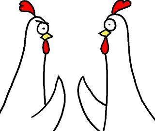](media/1866260257657483323-1.mp4)

▶ [GIF 动画（点击播放）](media/1866260257657483323-1.mp4)

Most people are generous with their time to help others.

Following these tips will increase the likelihood of people meeting you and help you achieve your goals!
