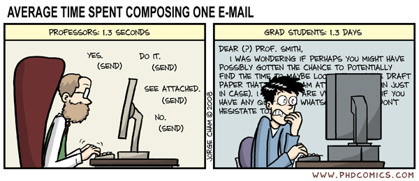
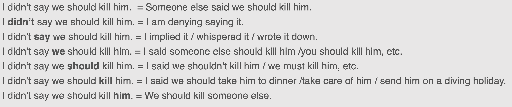
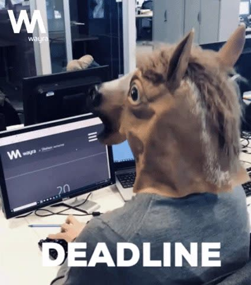

# Networking

> 完整串文归档（3 条）。返回 [线程索引](README.md)。

## How to network in a in-person conference?

原帖：<https://x.com/jbhuang0604/status/1517352789780934656> · 2022-04-22 · 共 12 条串文

How to network at a conference?

Many students will be attending their first-ever *in-person* conference this year. How exciting! 🤩

Some tips on making the best of attending a conference. 🧵

*People, Not Papers*

• All the papers are available online.
• All the talks will be recorded.

👉 Prioritize meeting new people over attending every single talk.

▶ [GIF 动画（点击播放）](media/1517352798224068608-1.mp4)

*Go Solo*

Yes, it's comfortable to walk together with people you already know and talk with your friends in your own language.

But, you will be a lot less approachable and miss out all the networking opportunities. 😱

👉 Reserve some solo time.

▶ [GIF 动画（点击播放）](media/1517352805979377664-1.mp4)

*Don't Close the Circle*

During networking sessions, be mindful of how you stand in a group. Leave some space for other people to join the conversation.

Met someone you know? Don't forget to introduce them to your new friends.

👉 Build bridges for others

▶ [GIF 动画（点击播放）](media/1517352814191779840-1.mp4)

*Leverage Context*

❌ Network only in the scheduled "networking session".
✅ Use context to start an easy conversation!

Where?
• lunch table, coffee line, seat mate, gift bag line, taxi line, elevator, restroom line, charging station

👉 Look for opportunities everywhere!

▶ [GIF 动画（点击播放）](media/1517352821523456000-1.mp4)

*Pre-conference Networking*

The conf. starts ... when you step out of your home!

You will see lots of people on the airplane, bus, taxi lines heading to the same place.

See that dude carrying a poster tube there? It's the best time to network!

👉 Networking while traveling

▶ [GIF 动画（点击播放）](media/1517352829916270594-1.mp4)

*Partially Full, Partially Empty*

Get in the talk/lunch session 5-10 mins early so you can find a partially filled seat and talk with your neighbors.

👉 Don't seat at an empty table or an empty row.

▶ [GIF 动画（点击播放）](media/1517352838204112896-1.mp4)

*Be Open*

Junior folks: Don't just try meeting senior "big shot".

Senior folks: Don't dismiss junior students from less known places. (Still remember that bad experiences being ignored myself...😬)

👉 You can always learn something new from new friends.

▶ [GIF 动画（点击播放）](media/1517352846580142080-1.mp4)

*Be Approachable*

Visual cues telling people NOT to talk with you.
❌ Check cellphone .
❌ Play candy crush.
❌ Work on your laptop.
❌ Wear an headphone/earphone.

👉 Put down your cellphone/laptop and meet people!

▶ [GIF 动画（点击播放）](media/1517352855111442438-1.mp4)

*Exit Cues*

1⃣ Compliment: "It was great talking with you."

2⃣ Follow-up item: "I will follow up with you on twitter/email." / "See you around in the party tonight."

3⃣ Elbow bumps: "See you later."

👉 All conversations end. End gracefully.

▶ [GIF 动画（点击播放）](media/1517352863424561154-1.mp4)

*Follow-up*

After the conference, don't forget to follow up with the people you meet and thank them! This simple step goes a long way!

👉 Manage and grow your network.

▶ [GIF 动画（点击播放）](media/1517352871821463552-1.mp4)

Happy networking!

The people you met in the conferences could be your good friends and collaborators for many years to come!

What are your favorite networking tips?

## How to network in a virtual conference?

原帖：<https://x.com/jbhuang0604/status/1446692346800873477> · 2021-10-09 · 共 9 条串文

How to network in a virtual conference?🕸️

Excited to attend your first (virtual) conference? How do we meet new people and expand the professional network?

Some ideas that I found useful 👇👇👇

*Establish your goals before the conference*

Check out the papers/workshops/networking sessions early. Identify the people you would really love to meet and create opportunities (cold-email, attend poster, ask questions.)

You may find many people are incredibly approachable.

▶ [GIF 动画（点击播放）](media/1446692355189452801-1.mp4)

*Attend zoom poster sessions*

Unlike in-person conferences where you barely squeeze through the crowd, zoom poster sessions are great opportunities to meet people with similar interests.

Oh, and please turn on your camera! It's not THAT awkward (maybe just a bit).

▶ [GIF 动画（点击播放）](media/1446692363481534464-1.mp4)

*Introduce yourself like Inigo Montoya*

Like writing a cold email. The Inigo style is a simple and direct way of establishing a connection.

https://x.com/jbhuang0604/status/1420611695848869892

> **引用 [@jbhuang0604](https://x.com/jbhuang0604)**：
>
> *Content*
>
> Your email should contain the following four elements.
>
> • Greeting: "Hello"
> • Introduction: "My name is Inigo Montoya."
> • Context/Connection: "You killed my father."
> • Call for action: "Prepare to die." https://t.co/VewkqaudhH

*Blame your advisor*

Homework assignment for my students attending a conference: Send me a list of 10 people (names/affiliations/research interests) that they did not know before each day. It's a good excuse for you to reach out and meet new people (in order to do your HW).

▶ [GIF 动画（点击播放）](media/1446692373237538816-1.mp4)

*Sharing interesting contents with others*

Sharing papers you like, talks you found inspiring, and quotes you found insightful.

▶ [GIF 动画（点击播放）](media/1446692381219336192-1.mp4)

*Follow-up with your new connections*

Send a short follow-up email could go a long way.

▶ [GIF 动画（点击播放）](media/1446692393256988672-1.mp4)

*Be a decent human being*

Don't discriminate, harass, and retaliate. It's really not that hard...

▶ [GIF 动画（点击播放）](media/1446692405118390273-1.mp4)

*Explore collaboration*

The best way to deepen the connection is to explore collaboration.

▶ [GIF 动画（点击播放）](media/1446699879280033795-1.mp4)

## How do I get professors to answer my emails?

原帖：<https://x.com/jbhuang0604/status/1441548826645602309> · 2021-09-24 · 共 10 条串文

How do I get professors to answer my emails?

You have sent SO MANY emails to professors for scheduling your prelim, looking for research opportunities, or asking questions about courses etc. But they just don't reply at all! 😠

How do I get things done? A few tips below 🧵

*Group scheduling*

Don't send out Doodle/When2meet with 30+ entries! Look up their (course) schedules and propose only a few (3-5) time slots.

If they need to spend 15 mins filling out your scheduling request, they will simply ignore your email.

▶ [GIF 动画（点击播放）](media/1441548836351057927-1.mp4)

*Give them the control for planning their day*

Scheduling a meeting:

Don't: When will you be available?
Do: I am available ... Will you be available in one of the time slots?

When you ask for availability, you are effectively asking for commitment for ALL of the time slots.

▶ [GIF 动画（点击播放）](media/1441548845486313472-1.mp4)

*Calendar invite*

Once you scheduled a meeting. Please do send a calendar invite with all the required information (e.g., zoom link).

Whatever that's not on their calendar does not exist.

▶ [GIF 动画（点击播放）](media/1441548854114111489-1.mp4)

*Go 90% and let them finish the 10%*

• Need a form? Pre-fill it as much as you can (you know their name and email).
• Need a cover letter? Write a draft first.
• Need a ref. letter? Send an updated CV and SOP.
• Need to ask about a course? Read the syllabus first.

▶ [视频（点击播放）](media/1441548883323064324-1.mp4)

*cc all parties involved*

Asking for some code/data/clarification? cc'ing your PI and their PI definitely helps you get a prompt reply!

*Don't cc all parties involved*

Don't send requests to MULTIPLE people in the same thread. Everyone will assume others will do it and therefore no one will do it. Send INDIVIDUAL emails instead.

▶ [GIF 动画（点击播放）](media/1441548898611482626-1.mp4)

*One email one topic*

Help your professors respond your email quickly. Make your emails simple, clear, and actionable.

*Formatting*

You are not writing in plain texts.
Formatting your email so that it's easy to read, e.g.,
• bullet points for parallel concepts
• bold font for highlighting
• bold phrase for organizing your email
• italic for sentence stress

*Timeline*

Provide specific action and specific date that the task needed to be completed. This helps them plan their schedule to make time for your requests.

▶ [GIF 动画（点击播放）](media/1441548915854254082-1.mp4)
