# Fantastic Faculty Jobs and How to Get Them

讲者：Jia-Bin Huang · 原始文件：[2022_12_05%20Academic%20Job%20workshop.pptx?dl=0](https://www.dropbox.com/s/avkflol8mx99c7e/2022_12_05%20Academic%20Job%20workshop.pptx?dl=0)
（PPTX 已下载并逐页提取为本地 Markdown 与图片，无需再访问原链接。）

## Slide 1

- Fantastic 
- Faculty Jobs 
- Jia-Bin Huang
- University of Maryland College Park
- Faculty Job Search Workshop @ UMD
- and
- How
- to
- Get Them

> 备注：1

## Slide 2

- Life after Ph.D.?

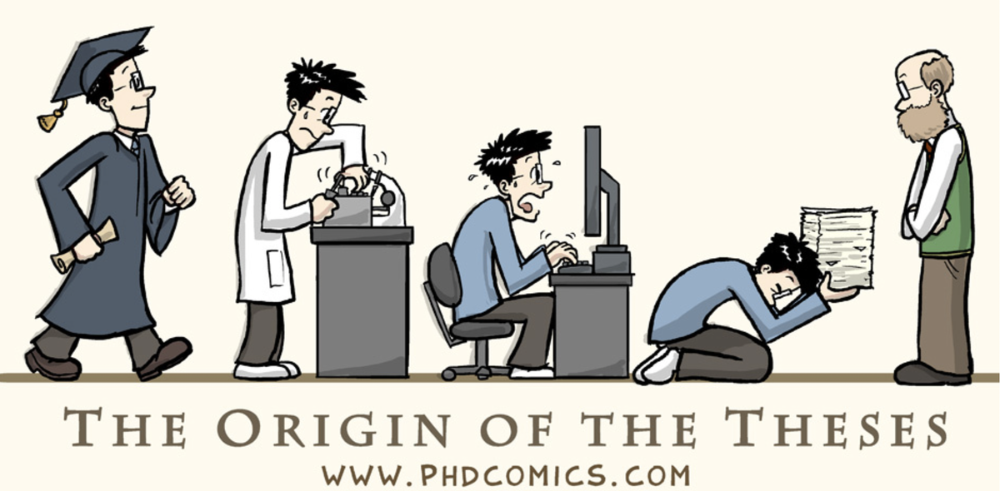

> 备注：4

## Slide 3

- Life after Ph.D.?

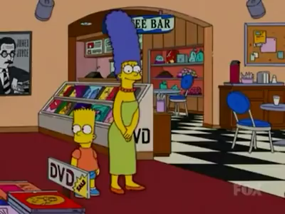

> 备注：7

## Slide 4

- The Road to Your First Academic Position
- Application
- Oct - Dec
- Phone Interviews
- January - March
- On-site Interviews
- January - April
- Post Interviews
- April - May
- I GOT A JOB!

> 备注：8

## Slide 5

- WARNING
- The following are my personal experiences. 
- Take them as a 
- giant grain of salt!

> 备注：10

## Slide 6

- Existing faculty giving advice
- (e.g., me)
- Current faculty candidates
- (e.g., you) 

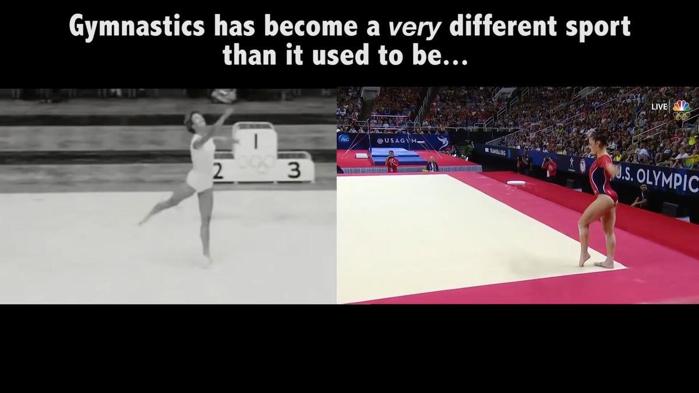

> 备注：12

## Slide 7

- The Road to Your First Academic Position
- Applications
- Oct - Dec
- Phone Interviews
- January - March
- On-site Interviews
- January - April
- Post Interviews
- April - May
- I GOT A JOB!

> 备注：18

## Slide 8

- The Road to Your First Academic Position
- Applications
- Oct - Dec
- Phone Interviews
- January - March
- On-site Interviews
- January - April
- Post Interviews
- April - May
- I GOT A JOB!

> 备注：19

## Slide 9

- Applications
- Cover letter
- CV
- Research Statement
- Teaching Statement
- Diversity Statement
- Recommendation letters
- Website
- Application follow-up

> 备注：23

## Slide 10

- Applications
- Cover letter
- CV
- Research Statement
- Teaching Statement
- Diversity Statement
- Recommendation letters
- Website
- Application follow-up
- Position (e.g., rank)
- Customize based on the advertised position
- Area of expertise (for routing)
- Strategic initiatives/programs?
- Confidential applicants?
- Two-body problem?

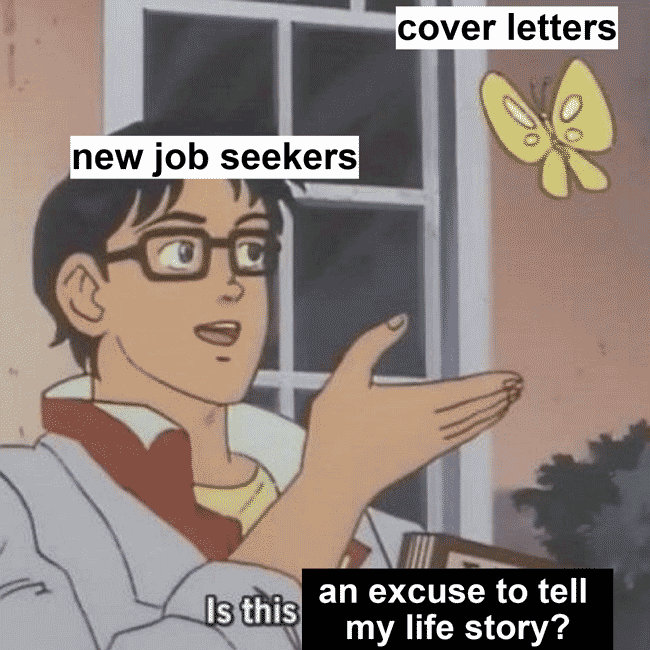

> 备注：25

## Slide 11

- Applications
- Cover letter
- CV
- Research Statement
- Teaching Statement
- Diversity Statement
- Recommendation letters
- Website
- Application follow-up

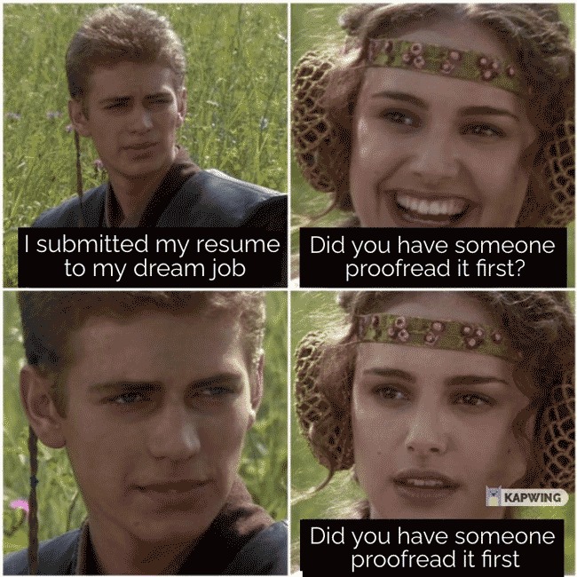

> 备注：26

## Slide 12

- Applications
- Cover letter
- CV
- Research Statement
- Teaching Statement
- Diversity Statement
- Recommendation letters
- Website
- Application follow-up
- ME EXPLAINING MY 
- RESEARCH VISION TO THE HIRING COMMITTEE
- Significance and i
- mpact
- Intellectual merit
- Research vision and agenda

> 备注：28

## Slide 13

- Applications
- Cover letter
- CV
- Research Statement
- Teaching Statement
- Diversity Statement
- Recommendation letters
- Website
- Application follow-up
- Teaching experiences and philosophy
- Advising 
- experiences
- What classes you can/wish to teach?

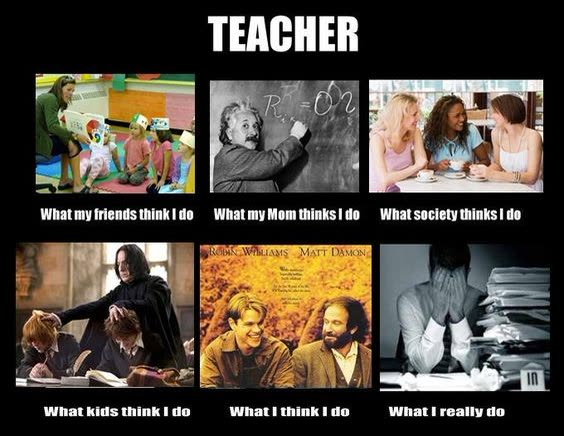

> 备注：29

## Slide 14

- Applications
- Cover letter
- CV
- Research Statement
- Teaching Statement
- Diversity Statement
- Recommendation letters
- Website
- Application follow-up
- Describe prior experiences on diversity and inclusion
- Express dedication
- Customize DEI programs/initiatives

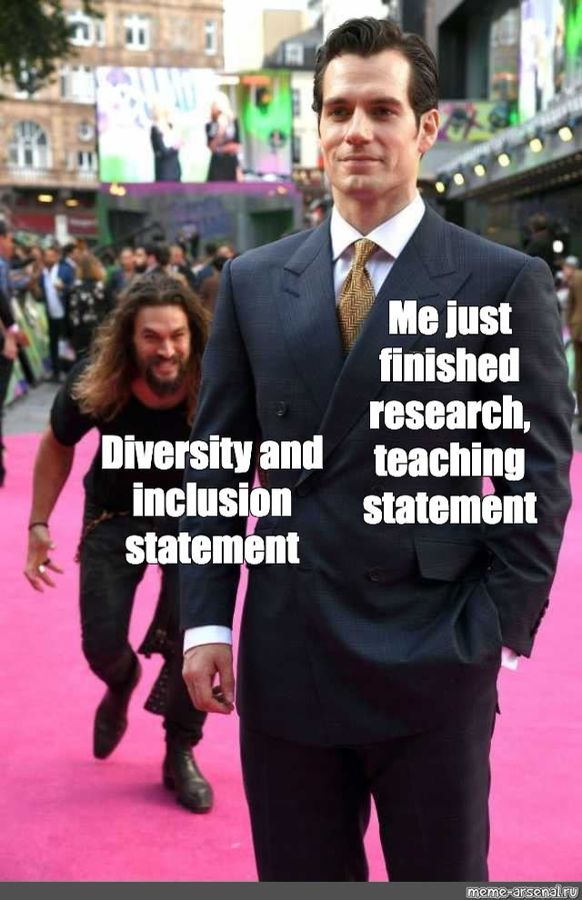

> 备注：33

## Slide 15

- Applications
- Cover letter
- CV
- Research Statement
- Teaching Statement
- Diversity Statement
- Recommendation letters
- Website
- Application follow-up
- Give letter-writers enough time
- Provide material for them to work with
- Tracking spreadsheet

> 备注：35

## Slide 16

- Applications
- Cover letter
- CV
- Research Statement
- Teaching Statement
- Diversity Statement
- Recommendation letters
- Website
- Application follow-up
- Yes, they will google you
- CV, publications, outreach, service
- Highlight your recent work

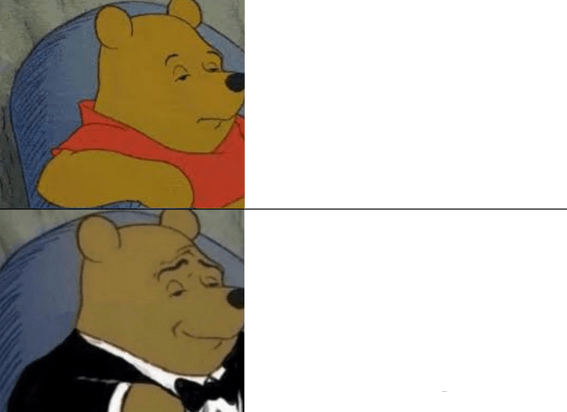

> 备注：36

## Slide 17

- Applications
- Cover letter
- CV
- Research Statement
- Teaching Statement
- Diversity Statement
- Recommendation letters
- Website
- Application follow-up
- Your application might get lost
- Email contacts that you have applied
- True story from Pratap 
- Tokekar

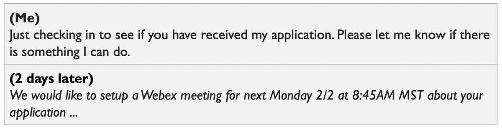

## Slide 18

- The Road to Your First Academic Position
- Applications
- Oct - Dec
- Phone Interviews
- January - March
- On-site Interviews
- January - April
- Post Interviews
- April - May
- I GOT A JOB!

## Slide 19

- Phone interview
- Congrats! You are shortlisted!
- Format: 30 mins – 1 hour, 2-4 people
- “Tell us about your research.”
- “Your teaching experiences and philosophy?”
- “Facilities and equipment to support your research?”
- “Future external funding?”
- “Why <our university/department>?”
- “Any questions for us?”

## Slide 20

- Practice, practice, practice
- 1. Write a script 
- 2. Practice by reading out loud
- 3. Revise the script
- Repeat until convergence
- More interview questions 
- https://csfaculty.github.io/

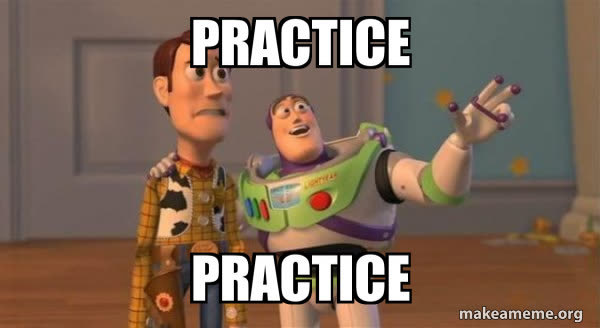

## Slide 21

- Tech setup
- Clean, uncluttered background
- Make sure that you are well-lit 
- (e.g., near a large window)
- Get a good webcam
- Get a good microphone
- Camera position (between your eye level and head)
- Microphone monitoring (hear yourself)
- Make eye contact. Look at the camera.

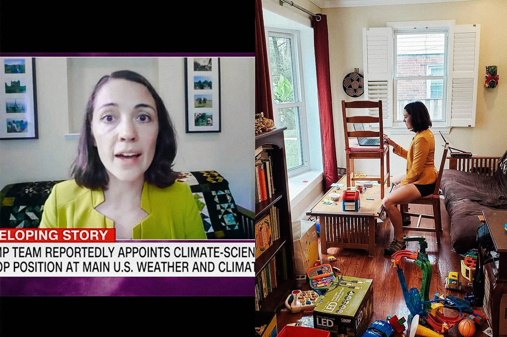

## Slide 22

- Ask questions
- Questions reflect 
- what you care about
- Don’t ask for something that you can quickly look up.
- New courses?
- Implies: you have concrete ideas on 
- creating new courses
- Advising students outside the department?
- Implies: interdisciplinary research
- University initiatives/programs?
- Implies: research fit

## Slide 23

- The Road to Your First Academic Position
- Applications
- Oct - Dec
- Phone Interviews
- January - March
- On-site Interviews
- January - April
- Post Interviews
- April - May
- I GOT A JOB!

## Slide 24

- On-site interviews
- Job talk
- Several 1-on-1 interviews
- Faculty members
- Department head
- Dean
- Students
- Staff
- Nice breakfast/lunch/dinner with faculty members
- JUST FINISHED AN 
- ON-SITE INTERVIEW

## Slide 25

- Job talk
- Attend other job talks and learn (e.g., 
- UW Allen School Colloquia
- )
- Main talk 45 mins
- Roughly 10 min intro; 20-25 min technical; 5-10 min future
- Communicate, not impress
- W
- hat are they looking for in a faculty job talk? [
- link
- ]
- Practice and ask for feedback (Stay tuned next Spring!)

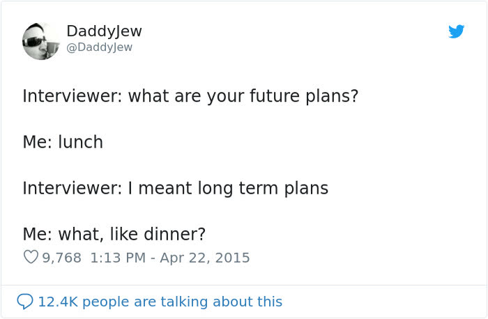

## Slide 26

- 1-on-1 meetings
- Many faculty may not be able to attend your talk.
- Prepare a 1-min pitch of your research.
- Ask questions (and listen)!
- Tell me about your research.
- Research, teaching, tenure process
- Student recruiting, quality of life
- Ask new faculty about their experiences.
- You are also interviewing them. 
- Be kind and respectful. 
- Especially to staff and students

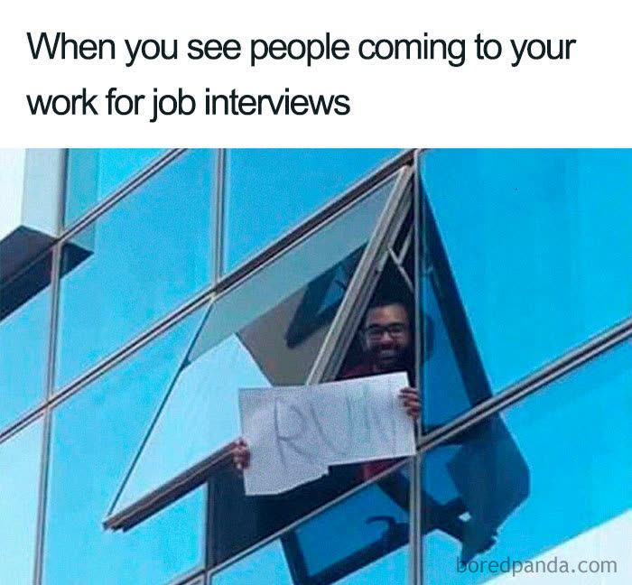

## Slide 27

- Exit interview
- Usually, the last meeting is either with 
- the department chair or search committee head
- Ask about: 
- search timeline, potential lab space, 
- typical start-up package, the tenure process, 
- course load
- Be prepared to answer
- “What are your requirements?”
- “What courses will you teach?”
- “Do you have any offers?” or “What other places are you interviewing at?”
- Slide credit: Pratap 
- Tokekar

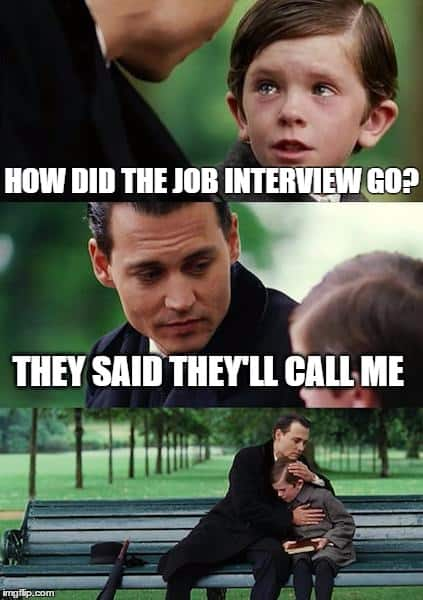

## Slide 28

- Thank you note
- It’s easy to do. 
- But it’s also easy not to do.
- Send the note 
- within a day 
- while you still have a fresh memory of your interaction

## Slide 29

- The Road to Your First Academic Position
- Applications
- Oct - Dec
- Phone Interviews
- January - March
- On-site Interviews
- January - April
- Post Interviews
- April - May
- I GOT A JOB!

## Slide 30

- Offer
- Oral offer (from department or committee chair), then on paper
- Make sure to have all the offer details on paper
- Negotiation, usually two weeks 
- (but you can try to extend)

## Slide 31

- Second visit
- Do a second visit if you can. 
- Chat with more people. 
- Are they genuinely excited about you joining?
- Housing, school district, and nearby activities.

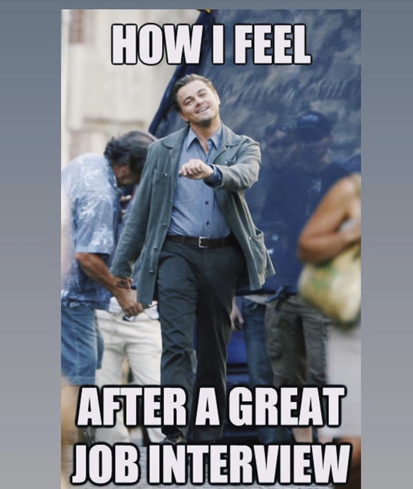

## Slide 32

- Negotiation
- Typical offer
- $ salary (9 months) - salary information in public universities are public.
- Summer salary, e.g., 3-4 months
- $ start-up fund for equipment, travel.
- $ student support
- Lab space
- Teaching load (e.g., 1 per semester)
- What to negotiate?
- Your department chair is your 
- ally
- Think what you will need 
- to build a successful career! 

## Slide 33

- The Road to Your First Academic Position
- Applications
- Oct - Dec
- Phone Interviews
- January - March
- On-site Interviews
- January - April
- Post Interviews
- April - May
- I GOT A JOB!

## Slide 34

- Resources
- Tips for Computer Science Faculty Applications
- Yisong
-  Yue, Caltech
- Include several excellent examples of research/teaching/diversity statement
- Computer Science Graduate Job and Interview Guide
- Wes Weimer, Claire Le 
- Goues
- , 
- Zak Fry, Kevin Leach, Yu Huang, and Kevin 
- Angstadt
- The academic job search for computer scientists in 10 questions
- Nicolas 
- Papernot
-  and Elissa M. 
- Redmiles
- Faculty jobs: Why and how to get them.
- Frédo
-  Durand, MIT EECS
- Academic job search advice 
-  Matt Might
- My Experience Getting an Academic Job
-  Pratap 
- Tokekar

## Slide 35

- The Road to Your First Academic Position
- Applications
- Oct - Dec
- Phone Interviews
- January - March
- On-site Interviews
- January - April
- Post Interviews
- April - May
- I GOT A JOB!

## Slide 36

- Questions for Panel
- Transitioning from Industry to Academia (How hard/easy is it? 
- Etc
- )
- Can you talk about the responsibilities faculty members have and how they manage their time/efforts, please? (e.g., at a research-oriented university vs a more teaching-oriented university) Thanks!
- Credentials that are valued most by the search committee (maybe different for PhDs and Postdocs?) 

## Slide 37

- Recent hires at R1 universities sometimes have 50+ publications and thousands of citations. Is it possible/probable to be hired without that level of credential? How much does being the “right fit” for a department matter versus papers/citations?
- Is it a bad idea to apply for a post-doc and faculty position simultaneously at the same institution? 

## Slide 38

- How many institutions would you recommend us to apply to?
- How do you ask the hard questions or find out the hard answers (e.g., What aspects of the department are unsatisfactory? Do you feel there is discrimination?)?
- What can we expect from our PhD advisors if we decide to apply to academic jobs, besides the obvious (rec letters, etc.)?

## Slide 39

- Can you apply to a US faculty position if you are an international Ph.D. student?
