# 成为 AI 忍者之路（哈佛客座讲座）

讲者：Jia-Bin Huang · 原始文件：[2022_11_18%20Guest_lecture_Harvard.pptx?dl=0](https://www.dropbox.com/s/2s0wt4uxv9vk3gb/2022_11_18%20Guest_lecture_Harvard.pptx?dl=0)
（PPTX 已下载并逐页提取为本地 Markdown 与图片，无需再访问原链接。）

## 第 1 页

- 成为 AI 忍者之路
- Jia-Bin Huang
- 马里兰大学学院市分校

## 第 2 页

- 「我最近在筹建一门 AI 研究课程。我一直很喜欢你关于研究的推文线程，想约你聊聊是否有兴趣在秋季来客座讲一次课。」
- Pranav | Jia-Bin | 「没问题！」

## 第 3 页

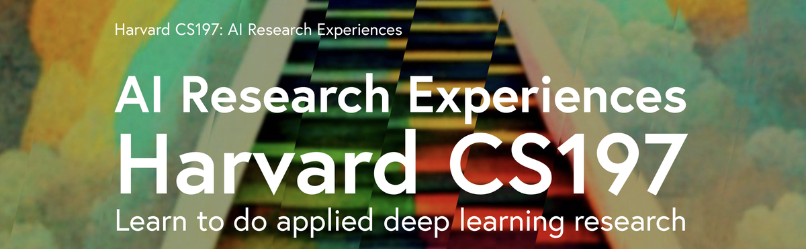

## 第 4 页

- AI 研究经验
- 「AI 忍者」

## 第 5 页

- AI 研究经验
- 「AI 忍者」
- 工具：软件工程、Python/PyTorch、Transformer
- 方法论：想法、实验、评估
- 论文：摘要/引言、方法/结果、图表
- 传播：演讲、部署模型

## 第 6 页

- 成为 AI 忍者之路
- 「AI 忍者」
- 工具 / 方法论 / 传播 / 论文

## 第 7 页

- 成为 AI 忍者之路
- 工具 / 方法论 / 传播 / 论文
- 找出研究空白！
- 「AI 忍者」

## 第 8 页

- 成为 AI 忍者之路
- 工具 / 方法论 / 传播 / 论文
- 如何稳步推进研究？
- 如何创造更大的影响力？
- 「AI 忍者」

## 第 9 页

- 成为 AI 忍者之路
- 方法论 / 论文
- 如何稳步推进研究？
- 如何创造更大的影响力？

## 第 10 页

- 成为 AI 忍者之路
- 方法论 / 论文
- 如何稳步推进研究？
- 如何创造更大的影响力？

## 第 11 页

- 如何稳步推进研究？
- 导师/顾问 · 研究技能

## 第 12 页

- 导师/顾问
- 如何稳步推进研究？

## 第 13 页

- （1）导师是一台「输入-输出机器」
- ❌ 只输入：你做完一切，只汇报最终结果。
- ❌ 只输出：导师让你做什么你就做什么。
- ✅ 有进有出：频繁同步、频繁反馈。

## 第 14 页

- （2）展示你的工作过程
- ❌ 只展示成功
- ✅ 展示工作：
- 做了什么？为什么做？怎么做的？发现了什么？为什么你认为它说得通？

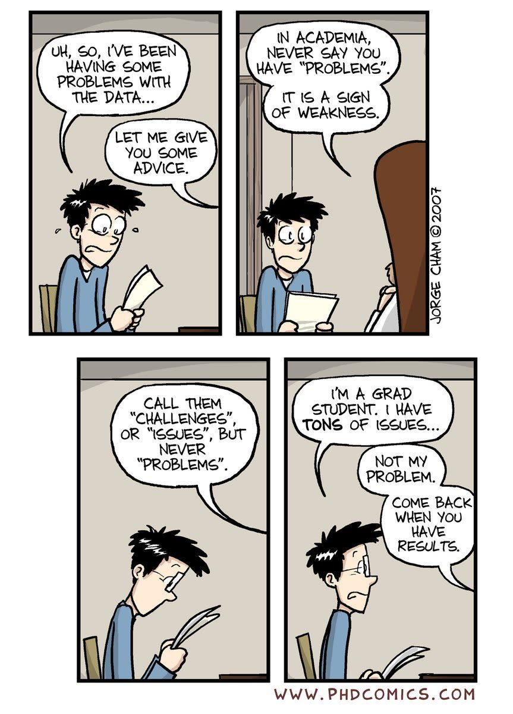

## 第 15 页

- （3）呈现失败
- ❌「它跑不通。」
- ✅ 呈现失败：「我已把问题缩小到步骤 B。到步骤 A 为止都正常，输入 X 得到预期的 Y。可以看到它在 B 处怎么失败。我已排除 W 和 Z 作为原因。」
- 出处：Bill Freeman《How to do research》

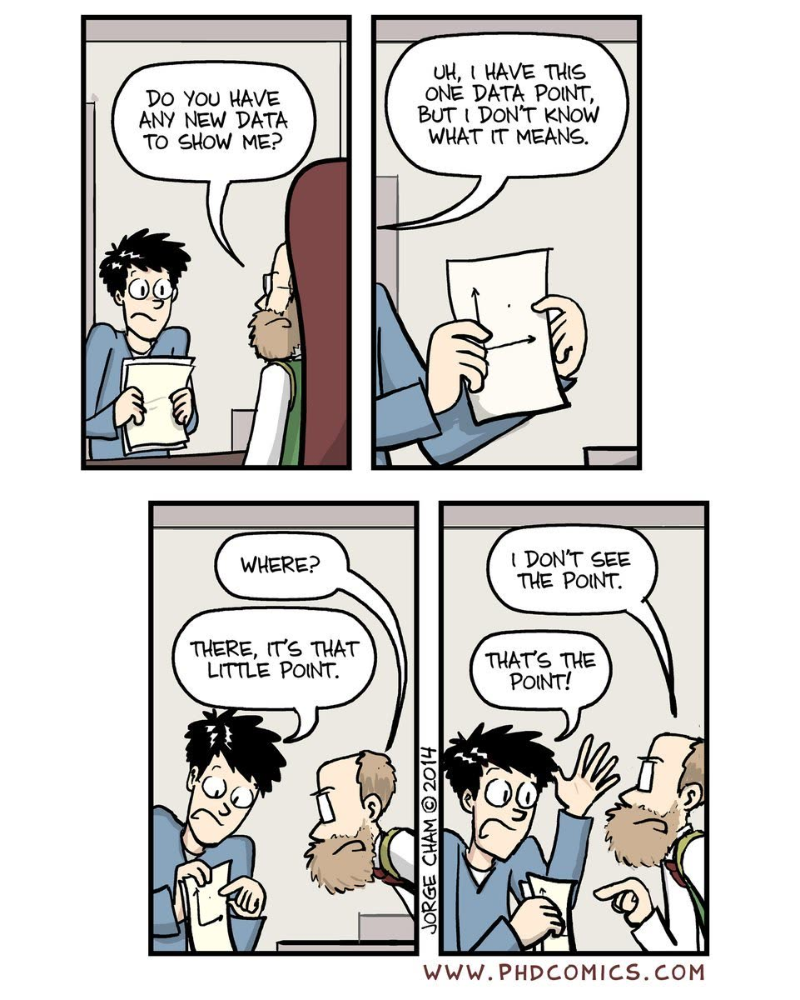

## 第 16 页

- （4）提供背景
- ✅ 把导师当金鱼
- ✅ 维护详细的会议纪要
- ✅ 从「为什么」讲起

## 第 17 页

- （5）设定预期
- ❌ 我会尽快完成。
- ✅ 我会在 YYY 之前完成 XXX。

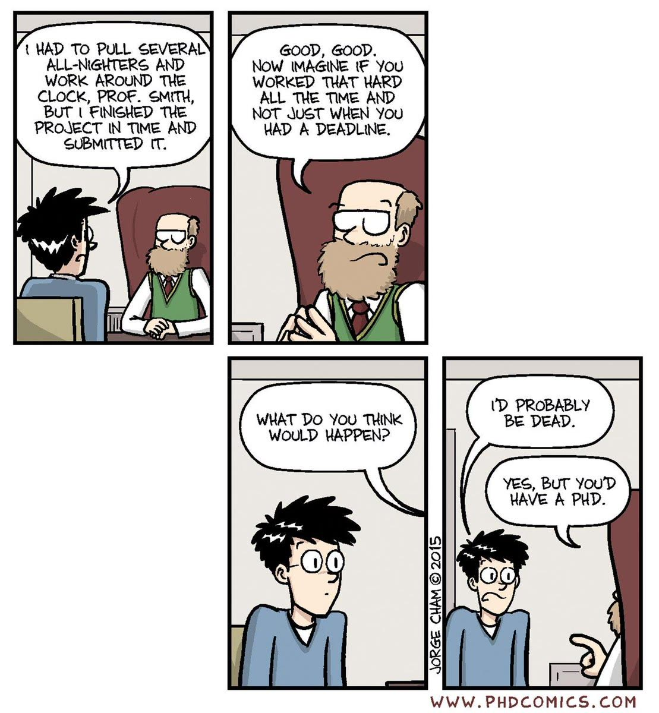

## 第 18 页

- 如何稳步推进研究？
- 导师/顾问 · 研究技能

## 第 19 页

- 如何稳步推进研究？
- 研究技能

## 第 20 页

- （1）想象成功
- 起点 → 目标：研究项目路线图
- 项目目标「太棒了？」→ 是！/ 一般般

## 第 21 页

- （1）想象成功
- 「如果你做的事不重要，也不认为它能带来重要的成果，你为什么还要在贝尔实验室做它？」……那次之后我就不受欢迎了。
- 「如果你不做重要的问题，就不太可能做出重要的工作。」——Richard Hamming

## 第 22 页

- （2）从终点倒推
- 起点 → 目标
- 正向：A→B→C→D→E
- 倒推：D→E；C→D；B→C；A→B

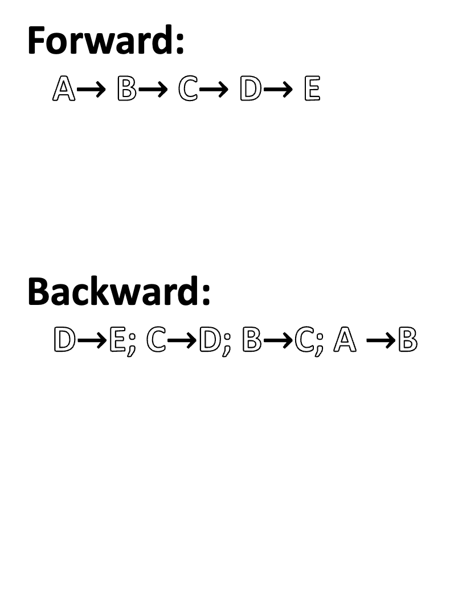

## 第 23 页

- 正向：A→B→C→D→E
- 倒推：D→E；C→D；B→C；A→B
- 尽早看到最终结果
- 尽早看到性能上限
- 在「输入完美」的前提下专注每一步
- 明确每一步真正需要什么

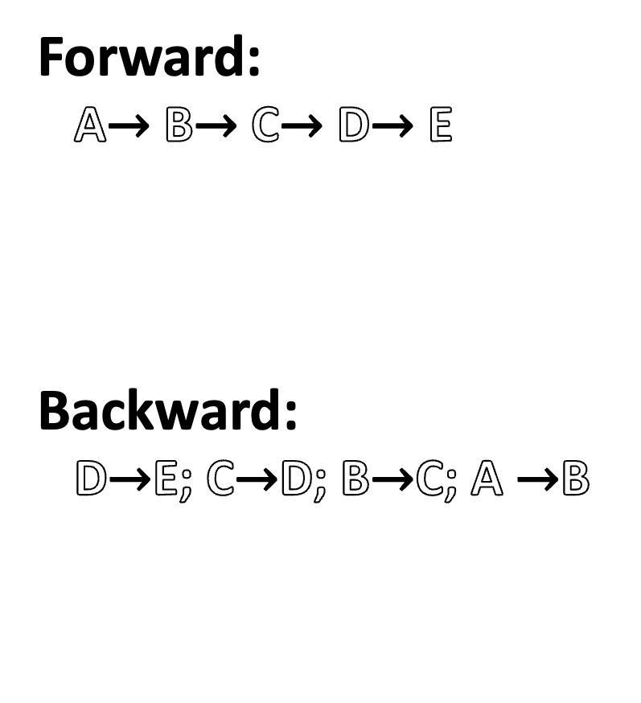

## 第 24 页

- （3）玩具例子
- 找出最简玩具模型！
- The Simplest Toy Model That Captures The Main Idea（抓住核心想法的最简玩具模型）
- 出处：Bill Freeman
- 颜色恒常性问题 / 3D 视频

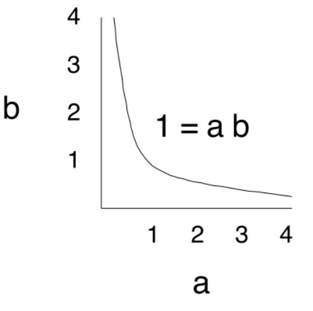

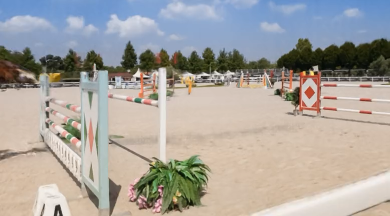

## 第 25 页

- （4）先做简单的事
- 我们来做一个数羊器！

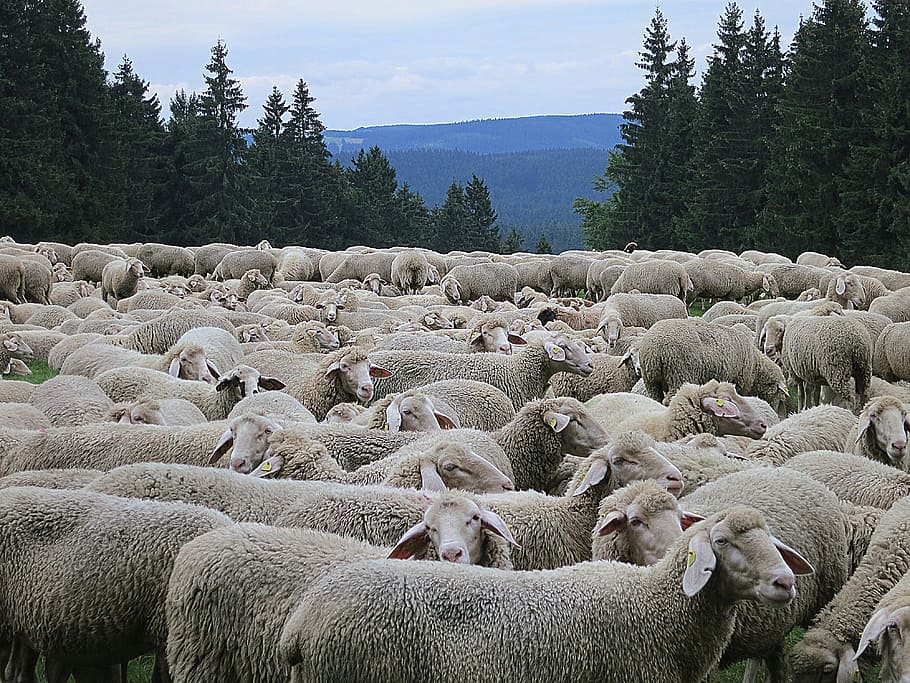

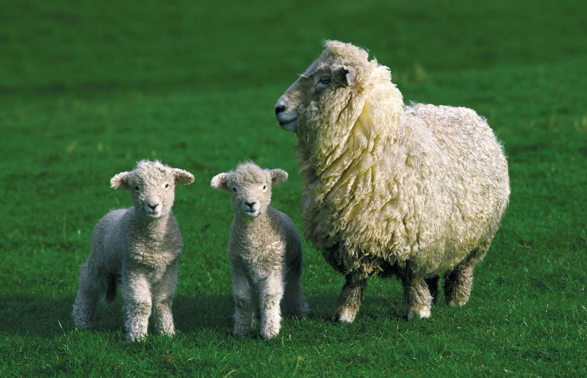

## 第 26 页

- （5）一次只改一件事
- batch_size = 4 → 16
- learning_rate = 1e-3 → 1e-5
- use_abc_loss = False → True
- 糟糕，结果变差了！！我们学到了什么？

## 第 27 页

- 如何稳步推进研究？
- 导师/顾问 · 研究技能
- 输入-输出机器 / 展示工作过程 / 呈现失败 / 提供背景 / 设定预期
- 想象成功 / 从终点倒推 / 玩具例子 / 先做简单的事 / 一次只改一件事

## 第 28 页

- 成为 AI 忍者之路
- 方法论 / 论文
- 如何稳步推进研究？
- 如何创造更大的影响力？

## 第 29 页

- 个人故事
- 在 ECCV 2020 展示（虚拟）海报
- 海报：2.5 小时内只有 5 人访问
- 推文：50.8 万次曝光
- 要达到同样的曝光量，需要在海报前站 29 年！

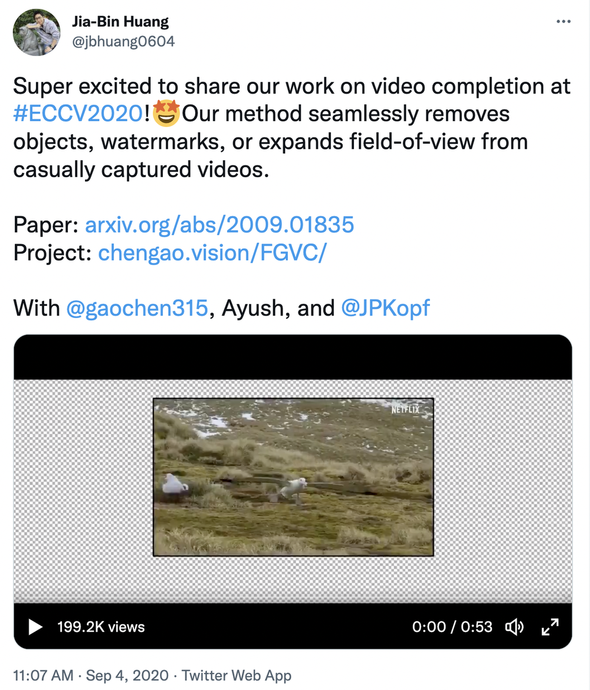

## 第 30 页

- （1）起一个好名字
- David Patterson

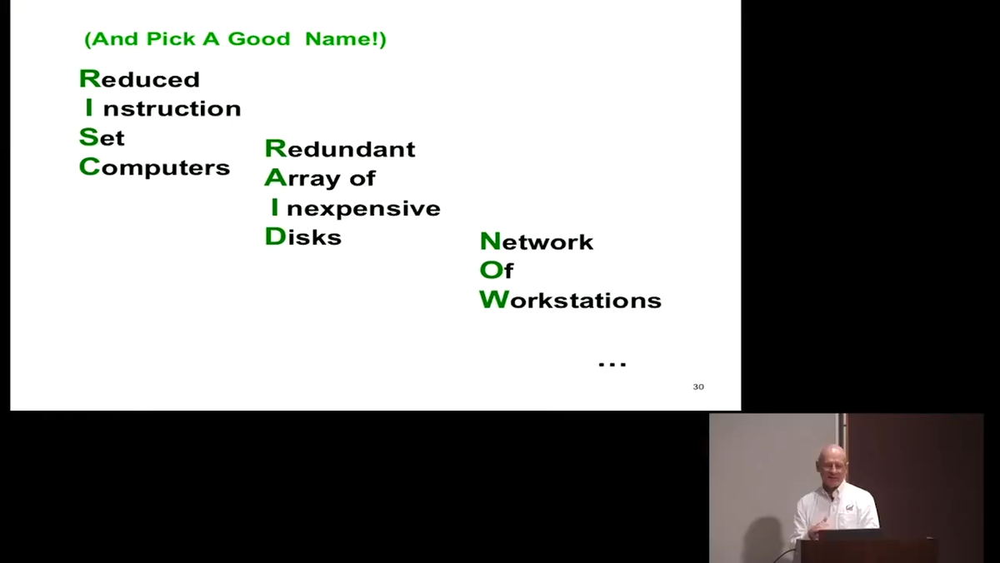

## 第 31 页

- （2）公开你的所有结果

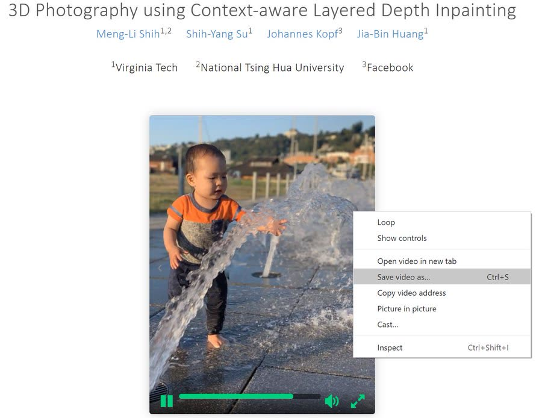

## 第 32 页

- （3）降低别人跟进的门槛
- GitHub / Google Colab / Hugging Face / PyTorch Hub

## 第 33 页

- （4）让别人更省事
- 基线实现？评测脚本？数据预处理？新数据集？

## 第 34 页

- （5）展示你的工作！
- 个人网站、YouTube、Twitter
- 培育你的品牌，建立你的受众。
- 「可我还没有好的论文可以展示。」
- 「展示你的工作。这不是自我推销，而是自我发现。」

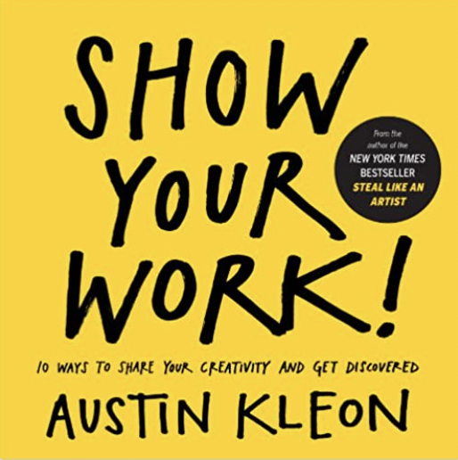

## 第 35 页

- 成为 AI 忍者之路
- 工具 / 方法论 / 传播 / 论文
- 如何稳步推进研究？
- 如何创造更大的影响力？
- 「AI 忍者」
- 网站：https://jbhuang0604.github.io/
- Twitter：https://twitter.com/jbhuang0604
- 欢迎提问和反馈！

