# Working with your mentors

> 完整串文归档（5 条）。返回 [线程索引](README.md)。

## How to share progress with your mentors/collaborators?

原帖：<https://x.com/jbhuang0604/status/1453378296608137229> · 2021-10-27 · 共 7 条串文

How to share your progress with your mentors/collaborators?

Throughout your research project, 99% of the time your approach DOESN'T WORK (yet). 😬

How could we share these "failed results" and have productive conversations with your mentors/collaborators? 👇

*Design: Why do we want do this experiment?*

Plz treat your mentors as goldfishes 🐟. Remind them WHY you did a particular experiment or implement a particular thing. This will provide the contexts for them to help interpret the results and steer the direction of your research.

▶ [GIF 动画（点击播放）](media/1453378305550397442-1.mp4)

*Hypothesis: What do we expect to see?*

Before showing your results, comment on what should have happened (if everything is correct)?

▶ [GIF 动画（点击播放）](media/1453378318699573250-1.mp4)

*Observation: What did we see?*

Show the (failed) results. Don't just say "It doesn't work." Describe HOW it fails.

▶ [GIF 动画（点击播放）](media/1453378327742402563-1.mp4)

*Interpretation: Is this expected/working?*

After showing your results, comment on how do the results align with or deviate from your expectations.

▶ [GIF 动画（点击播放）](media/1453378339868184579-1.mp4)

*Visualization: Any better ways to see the results?*

Seeing the results with a good visualization helps deepen our understanding and spot the issues.

▶ [GIF 动画（点击播放）](media/1453378348164554752-1.mp4)

*Actionable next steps: What steps would you do?*

Remember to proactively propose the next steps so that we can make progress on the project. Remember that you are the main DRIVER of the project. Don't just wait for instructions.

▶ [GIF 动画（点击播放）](media/1453378356934754304-1.mp4)

## How to meet with your advisor?

原帖：<https://x.com/jbhuang0604/status/1653614931202195458> · 2023-05-03 · 共 8 条串文

How to meet with your advisors/mentors?

If you are a grad student, having effective regular meetings with advisors or mentors is absolutely crucial for your success!

Here are some tips on how to make the most of it! 🧵

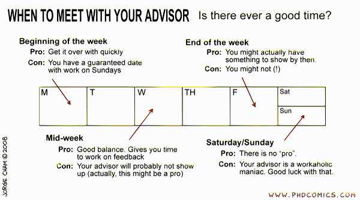

*Present results*

❌ Collect and present the results you got in the last week? Terrible idea! 😱

Your advisor sees your results for the first time in the meeting? It means they don't have time to understand and think about them.

✅ Share and discuss results async FREQUENTLY.

*Make an agenda*

❌ Dive into technical details too quickly.

✅ Make an agenda. Manage the meeting to ensure you cover all the topics you want to discuss.

*Start with a summary*

❌ "Look at this table full of numbers."

✅ "Last week, we agreed to examine hypotheses A and B. I will show my experiments later. In sum, ..."

*Interpret your results*

❌ "Here are the results. Look at this table."

✅ Contextualize your results.
• What did you do?
• Why did you do it?
• How did you do it?
• What did you find?
• Does it make sense (match your expectation)?

*Propose next steps*

❌ "That's all my progress. What do you suggest to do next?"

✅ "That's all my progress. Based on what we see in the results, here are the prioritized tasks A, B, C (and why)."

*Summarize your meeting*

❌ "Memorize" the discussions in the meeting without note.

✅ Summarize the meeting and the next steps mutually agreed on. Send an email/post on slack right away.

Happy meetings!

If you like this, please like & share the thread for the Twitter algorithm!

https://x.com/jbhuang0604/status/1653614931202195458

I used to be stressed about the meeting with my advisor as a student. Now I'm still learning how to run more effective meetings.

What's your favorite advice?

> **引用 [@jbhuang0604](https://x.com/jbhuang0604)**：
>
> How to meet with your advisors/mentors?
>
> If you are a grad student, having effective regular meetings with advisors or mentors is absolutely crucial for your success!
>
> Here are some tips on how to make the most of it! 🧵 https://t.co/kr3ncyhu0B

### 作者补充回复

@KristineJonson I used to think that way. But later I found that the process of preparing a detailed report and in general writing stuffs down is so helpful to get a clear picture of what I am doing.

Do it for yourself, not for your mentors.

<https://x.com/jbhuang0604/status/1653857556408745986>

## How to work with your advisor?

原帖：<https://x.com/jbhuang0604/status/1546361365778022400> · 2022-07-11 · 共 7 条串文

How to work with your advisor(s)?

Working effectively with your advisor is the no doubt the key to success of your research! However, junior grad students often don't have a clear idea on how to do so.

Sharing some tips that I found useful. 👇

*Know the Role of Your Advisor*

Your advisor is an *INPUT-OUPUT MACHINE*.

You throw them sth in and get sth out.

❌ In-only: You do everything and report final results.
❌ Out-only: You do everything they told you to do.
✅ In&out: You get frequent and valuable guidance.

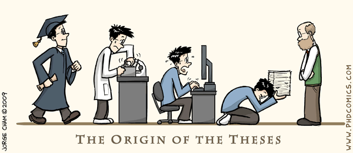

*Show Your Work*

How do you get the best guidance from your advisor?
❌ Show your success only!
✅ Show your work!

Describe the detailed process you went through, the reasoning you , the methodology you adopt, and the interpretations of the results you got.

*Present Failures*

❌ "It doesn't work."
✅ "Here is HOW it fails. I feed X but somehow did not get Y. I believe the core issues lie in steps Z and W. I have ruled out W as the cause. Next, I will design experiments to isolate the step Z."

*Leverage Async Discussions*

❌ Wait for weekly meeting to present everything.
✅ Send frequent and concise updates along the way.

Keep your advisor engaged and excited about your research.

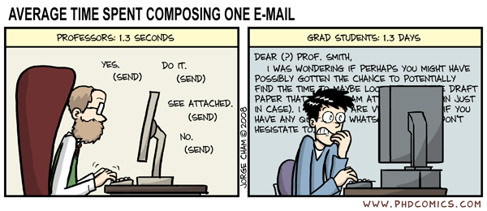

*Provide Contexts*

Your advisor will forget everything you discuss the moment you step out the door.

👉 Treat your advisor as goldfish. Always provide high-level contexts first.
👉  Maintain meeting minutes that everyone agrees upon so you have consistent guidance.

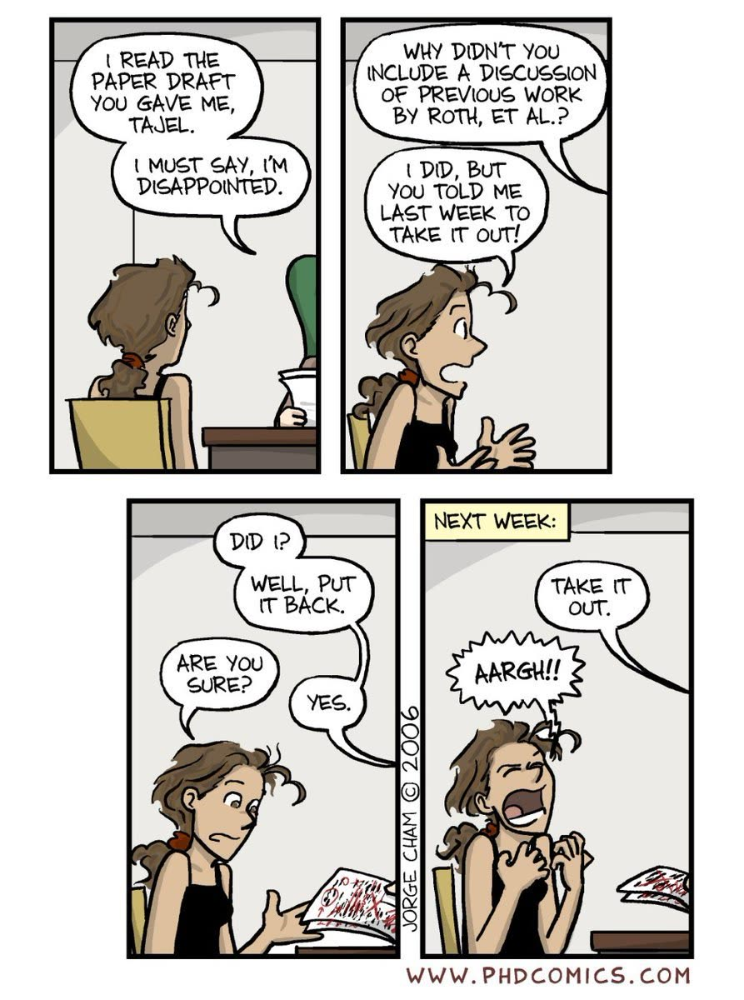

*Set Expectation*

❌ No plan/timeline. Just try to finish everything as soon as possible.
✅ Set realistic timeline for your research progress. Tell your advisor you will do what by when.

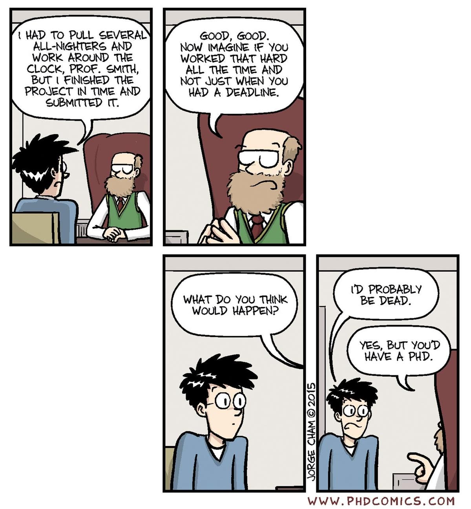

## How to work with a busy advisor?

原帖：<https://x.com/jbhuang0604/status/1665183152887808000> · 2023-06-04 · 共 8 条串文

How to work with a busy advisor?

Your advisor constantly needs to juggle many tasks 🤹 (family/teaching/research/service).

In some cases, students only get to meet with their advisor once/twice a semester and thus struggle to make progress. 😬

Some tips I found helpful. 🧵

*Collaborate with your peers or senior students*

Feel free to reach out to other students in your lab (especially if you share similar interests). 🤝

Having someone to discuss with helps tremendously! They can provide valuable insights and guidance.

▶ [GIF 动画（点击播放）](media/1665183165084827653-1.mp4)

*Do an internship and continue the collaboration*

Find summer internship opportunities! 💰

When you find good mentors, DO NOT LET GO! 🤝

Ask your advisor if you can continue collaboration with them.

[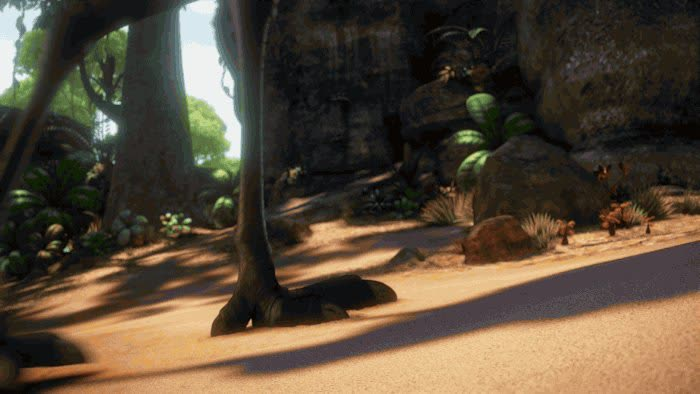](media/1665183171837677575-1.mp4)

▶ [GIF 动画（点击播放）](media/1665183171837677575-1.mp4)

*Try ad hoc meetings*

Try to find a few minutes to meet with your advisor after their class or during office hours. ⏰

Be prepared, concise, and respectful of their time.

▶ [GIF 动画（点击播放）](media/1665183178624061440-1.mp4)

*Make them excited about your work*

Share frequent updates on your progress or exciting findings.

Show enthusiasm and make them excited!

▶ [GIF 动画（点击播放）](media/1665183185670492161-1.mp4)

*Communicate effectively with your advisor*

Be open to feedback. Ask for clarification whenever needed.

Strong communication builds a solid working relationship.

▶ [GIF 动画（点击播放）](media/1665183196751835136-1.mp4)

*Explore different advisors or co-advisors*

If working with your current advisor is consistently challenging, consider exploring other advisors who align better with your research interests.

▶ [GIF 动画（点击播放）](media/1665183205027201024-1.mp4)

While working with a busy advisor is challenging, you could frame it as an excellent opportunity for growth and autonomy.

After all, it's YOUR Ph.D. Best of luck!

▶ [GIF 动画（点击播放）](media/1665183213503885313-1.mp4)

### 作者补充回复

@cthorrez Unfortunately, it’s somewhat common in academia (I used to meet with my advisor once a semester when I was a PhD student).

This happens when faculty has large group or senior faculty who focus on other responsibilities.

<https://x.com/jbhuang0604/status/1665367453742899211>

@chen_fuxiang They are usually very active (on other things). It’s just that working closely with students is not their top priorities.

<https://x.com/jbhuang0604/status/1665367876214181903>

@joe_hellerstein I completely agree with you!

But unfortunately many students don’t really have a choice. I learned about many of these stories from students coming to my office hours. I am trying to help those who are in those situations.

<https://x.com/jbhuang0604/status/1665395646445092868>

## How to work with your senior advisor?

原帖：<https://x.com/jbhuang0604/status/1563740402657775618> · 2022-08-28 · 共 9 条串文

How to work with your senior advisor(s)?

Many students find it challenging to navigate grad school when working with senior professors as they are often extremely busy and hands-off in research.

Check out below for some tips. 🧵

*Pre-process Your Input*

Your advisor is an INPUT-OUTPUT machine. https://x.com/jbhuang0604/status/1546361369469001728

Senior professors won't keep track of all the latest papers. But they sure know the fundamentals.

Pre-process/abstract/simplify your work so that they can give you great feedback.

> **引用 [@jbhuang0604](https://x.com/jbhuang0604)**：
>
> *Know the Role of Your Advisor*
>
> Your advisor is an *INPUT-OUPUT MACHINE*.
>
> You throw them sth in and get sth out.
>
> ❌ In-only: You do everything and report final results.
> ❌ Out-only: You do everything they told you to do.
> ✅ In&out: You get frequent and valuable guidance. https://t.co/8URQp9ZNjF

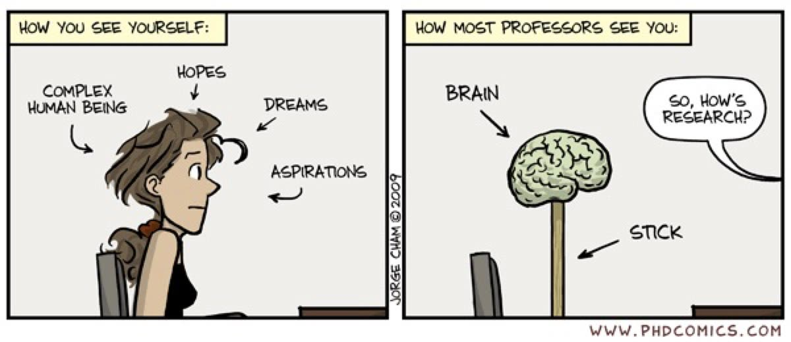

*Post-process Their Output*

Senior professors may have deep insights to your research problem. But, they don't have the modern toolboxs you are familiar with.

Instead of taking their suggestions as is (e.g., implement some heuristics), map them into modern frameworks.

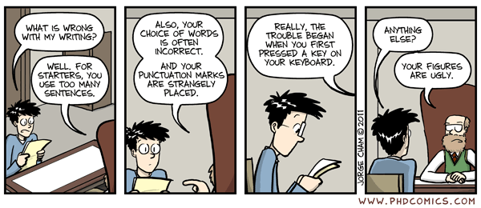

*Find Hands-on Collaborators*

When you are just getting started your first project, make sure to find hands-on collaborators (other assistant prof, post-doc or senior students in the lab). You will learn valuable skills from them!

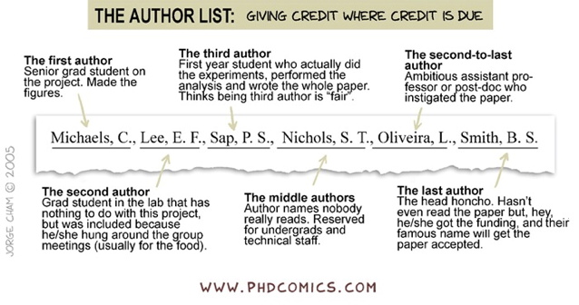

*Be Transparent*

Senior professors are busy. Sometimes you may not get to interact with them for months!

Nevertheless, keep them posted with your plan regularly (what have you done? what you will do? when you will be on vacation?).

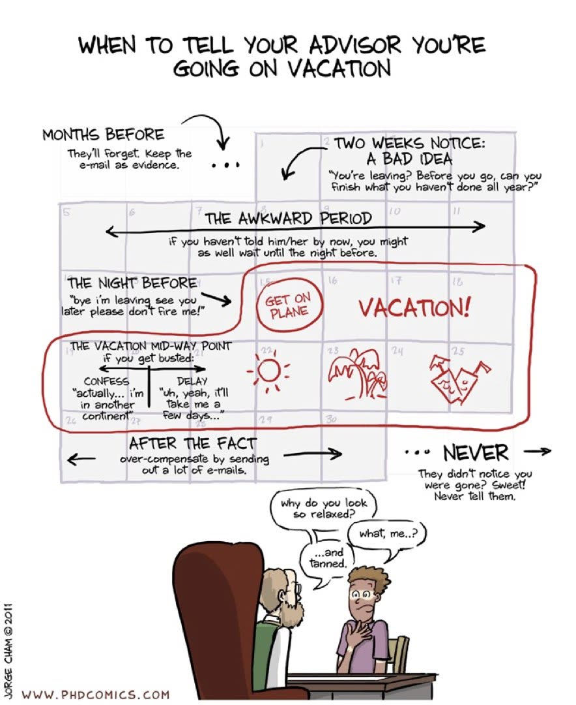

*Be Specific*

Follow up with your professor's "I will review your paper soon." and ask for a specific date.

✅ Helps your advisor include this task into their to-do.
✅ You get to know when to follow up again.

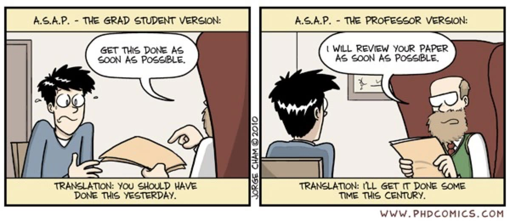

*Share Progress Early and Frequently*

Many students feel intimidated about sharing results that are "not ready". It often leads to a vicious cycle of "not ready" -> "no feedback" -> "build up more stress".

Break that cycle and keep engaging with your advisor.

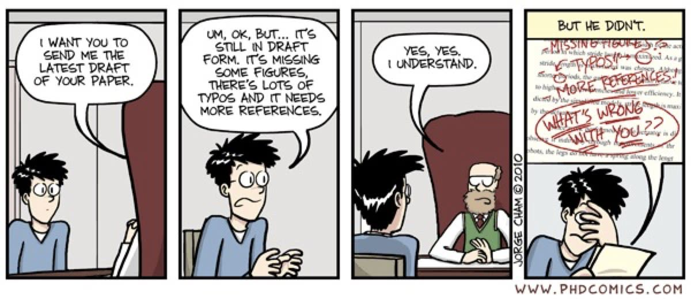

*Explore Common Interests*

Senior professors don't have tenure pressure and may be open to various explorations. Work closely with your advisor to find common interests so that they can provide their best support.

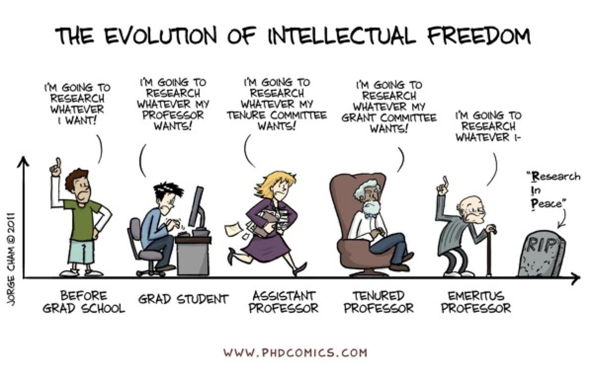

That's all! Senior advisors have great vision, excellent research taste, and are resourceful! Working with them definitely can be very rewarding!

Hope this thread give you some more ideas on how to work effectively with your senior advisor! Good luck!
