# Awesome Tips：X/Twitter 线程完整合集（中文版）

按 [README](../README.md) 分类整理的完整串文中译（含配图）。

# 做研究

## 如何做实验？

原帖：<https://x.com/jbhuang0604/status/1647098218172252160> · 2023-04-15 · 共 11 条串文

如何做实验？

低年级学生常常在每周与导师开会前感到压力山大，因为实验进展不顺利。😩😰😱

以下分享一些关于为什么做实验、做什么实验、以及如何做实验的建议。🧵

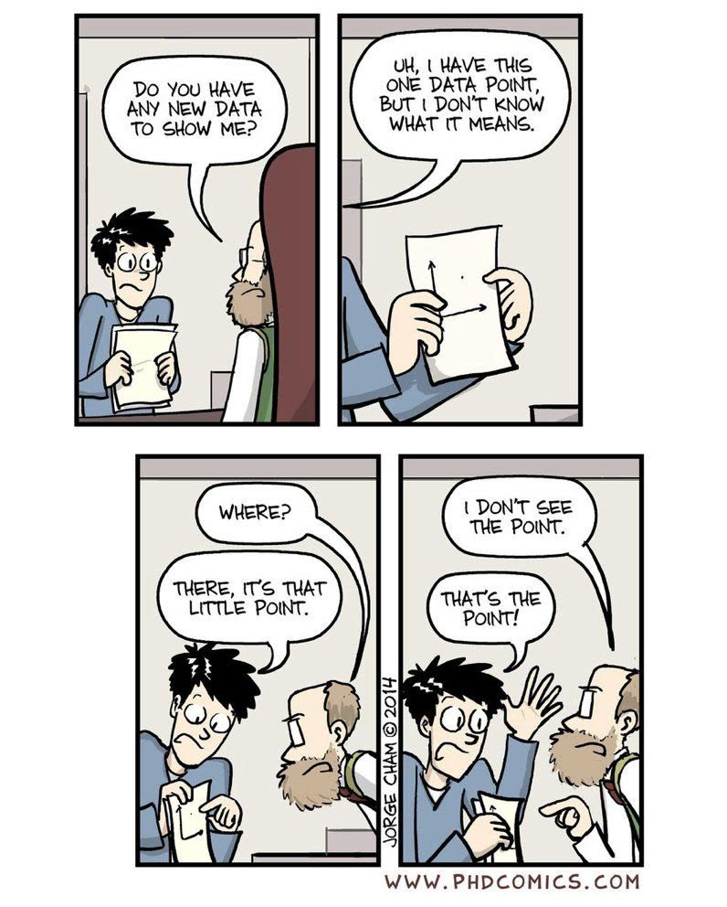

*为什么？🤔*

❌  做实验是为了得到更好的性能。
✅  做实验是为了检验假设。

很多学生试图用实验展示性能提升，其实没有抓住重点。

实验的目标应该是验证/检验你的研究问题。

▶ [GIF 动画（点击播放）](../media/1647098226196004864-1.mp4)

*做什么？🤔*

我们应该做哪些实验？

这包括三个主要步骤：
1⃣ 找出关键的研究问题
2⃣ 把它们拆解成一个个小步骤
3⃣ 设计最能回答这些问题的实验

▶ [GIF 动画（点击播放）](../media/1647098233330491392-1.mp4)

*怎么做？🤔*

好了，现在我们知道为什么做、做什么了，那怎么做呢？

这没有放之四海而皆准的答案，但以下是我觉得有用的一些原则。

▶ [GIF 动画（点击播放）](../media/1647098240632758273-1.mp4)

*一次只改一件事*

还记得吗，实验的目标是检验假设？

如果你一次改动多个因素，就等于在验证一个包含多个变量的复杂假设。

这样得到的实验结果价值不大。

▶ [GIF 动画（点击播放）](../media/1647098253056327682-1.mp4)

*预判结果*

学会在做实验*之前*预测结果。

如果加入 X / 去掉 Y / 在 Z 上测试，你预期会看到什么？

这有助于你解读结果、发现错误。

▶ [GIF 动画（点击播放）](../media/1647098260413202435-1.mp4)

*先跑基线*

很多时候，你做实验是为了观察某种「变化」（正向或负向）。

如果没有一个扎实的基线，后面就会陷入麻烦。

▶ [GIF 动画（点击播放）](../media/1647098272056475649-1.mp4)

*记录一切*

用你的大脑去思考、推理，而不是储存繁琐的信息。

用 Hydra 之类的框架来组织你的实验。https://hydra.cc/

[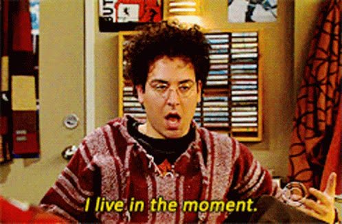](../media/1647098283980988417-1.mp4)

▶ [GIF 动画（点击播放）](../media/1647098283980988417-1.mp4)

相关链接：
- <https://hydra.cc/>

*两个方案都合理？那就都做！*

学生经常问：「我应该做 A 还是 B？」

我：你不用问我。如果 A 和 B 都是合理的选择，那就两个都做，让结果说话。

▶ [GIF 动画（点击播放）](../media/1647098291849494529-1.mp4)

*主动寻求反馈*

你的导师/合作者就是为了帮你成功而存在的。

不要犹豫，向他们求助！

▶ [GIF 动画（点击播放）](../media/1647098298988101633-1.mp4)

这些建议在应对复杂问题时给了我极大的帮助。希望它们也能帮到你的工作！

如果你觉得这个线程有用，请点赞、转发并关注！https://x.com/jbhuang0604/status/1647098218172252160

祝实验顺利！

你最喜欢的做实验技巧/建议是什么？😄

> **引用 [@jbhuang0604](https://x.com/jbhuang0604)**：
>
> 如何做实验？
>
> 低年级学生常常在每周与导师开会前感到压力山大，因为实验进展不顺利。😩😰😱
>
> 以下分享一些关于为什么做实验、做什么实验、以及如何做实验的建议。🧵

### 作者补充回复

@zhizhid

[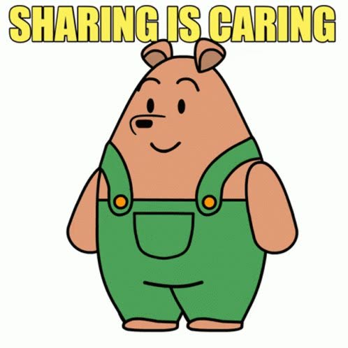](../media/1647680118540607489-1.mp4)

▶ [GIF 动画（点击播放）](../media/1647680118540607489-1.mp4)

<https://x.com/jbhuang0604/status/1647680118540607489>

## 如何摆脱卡壳状态？

原帖：<https://x.com/jbhuang0604/status/1717381151508054029> · 2023-10-26 · 共 11 条串文

如何摆脱卡壳状态？

「它跑不起来。」🤷‍♀️🤷‍♂️

在大多数研究项目中，约 99% 的时间里你的实验都跑不通。该怎么办才能让自己脱困？🤔

分享一些我觉得有用的建议。🧵

*帮助导师更好地帮助你*

告诉他们：
1⃣ 你为什么要做这些实验？
2⃣ 你是怎么做的实验？
3⃣ 你从结果中看到了什么？

你的导师比你有经验，也愿意帮忙。

但你得帮他们更好地帮助你。

▶ [GIF 动画（点击播放）](../media/1717381158755860585-1.mp4)

*让实验容易理解*

如果只靠口头描述为什么/怎么做/做了什么，别人很难完全理解整个过程。

👉 把流程可视化
👉 记录细节

导师更有可能从中发现各种问题。

▶ [GIF 动画（点击播放）](../media/1717381170399166661-1.mp4)

*展示「怎么失败的」*

❌ 它跑不起来。

✅ 这是输入和我们预期的结果，而这是目前的实际结果。如果换成更难一点的输入，它失败得更彻底。

[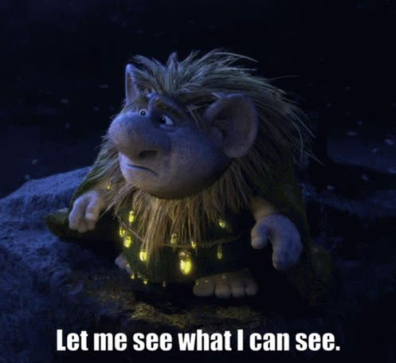](../media/1717381182260645942-1.mp4)

▶ [GIF 动画（点击播放）](../media/1717381182260645942-1.mp4)

*把任务简化到能跑通为止*

逐步简化任务，直到任务变得足够简单、必须能跑通。

例如：
- 多个 ➡️ 单个
- 一般 ➡️ 特定
- 大 ➡️ 小
- 稀疏 ➡️ 稠密
- 复杂 ➡️ 简单

▶ [GIF 动画（点击播放）](../media/1717381189978214801-1.mp4)

*引入特权信息*

需要估计任务中的 A 和 B？

如果已知 B，只需估计 A，会怎样？

如果已知 A，只需估计 B，又会怎样？

引入特权信息是推进研究的一个强有力技巧。

▶ [GIF 动画（点击播放）](../media/1717381197007896752-1.mp4)

*去网上找答案*

LMGTFY

世界上有没有人遇到过和你类似的卡点？

很可能答案只有一次点击之遥！

▶ [GIF 动画（点击播放）](../media/1717381204087865825-1.mp4)

*向他人学习*

读一读解决类似任务的相关论文。

他们的方法为什么有效？你漏掉了什么差异？

- 预处理步骤？
- 超参数设置？
- 实现技巧？

[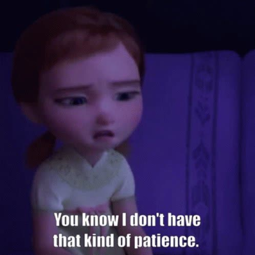](../media/1717381215785799683-1.mp4)

▶ [GIF 动画（点击播放）](../media/1717381215785799683-1.mp4)

*调试想法本身*

我从来没有遇到过第一次冒出的想法就「直接跑通」的情况。

当你把代码/实验都调试完还是不 work 时，退一步，去调试想法本身。

▶ [GIF 动画（点击播放）](../media/1717381222983233940-1.mp4)

*快速迭代*

寻找玩具例子和代理任务，缩短反馈周期。

迭代得越快，就能取得越多的进展。

▶ [GIF 动画（点击播放）](../media/1717381230675534079-1.mp4)

希望这能帮你摆脱困境！你可以的！

相关线程：
- 关于设计实验：https://x.com/jbhuang0604/status/1647098218172252160

- 关于推进研究：https://x.com/jbhuang0604/status/1419880122006519809

- 关于同步进展：https://x.com/jbhuang0604/status/1453378296608137229

> **引用 [@jbhuang0604](https://x.com/jbhuang0604)**：
>
> 如何与导师/合作者同步研究进展？
>
> 在整个研究项目中，99% 的时间里你的方法都「不 work」（暂时）。😬
>
> 怎样才能把这些「失败的结果」讲清楚，并与导师/合作者进行高效的讨论？👇

▶ [GIF 动画（点击播放）](../media/1717381239072600419-1.mp4)

## 如何决定研究课题？

原帖：<https://x.com/jbhuang0604/status/1628521223838654464> · 2023-02-22 · 共 7 条串文

如何决定研究课题？

激动人心的想法那么多，时间却那么少！怎样才能收敛到一个具体的研究方向上？🤔

分享一些我觉得有用的策略。🧵

*找准自己的位置*

理解你相对他人的独特优势、社区关心的问题，以及你能做出什么最好的贡献。

避免扎堆（也就是追着领域里最热的问题跑）。

[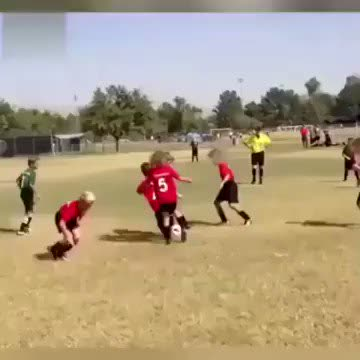](../media/1628521225059201026-1.mp4)

▶ [视频（点击播放）](../media/1628521225059201026-1.mp4)

*找到内在动机*

去做你真正在意的课题和真实应用。

▶ [GIF 动画（点击播放）](../media/1628521233783394304-1.mp4)

*预判颠覆性技术*

不要只盯着大家「现在」在做什么，而要预判当颠覆性技术（例如新的传感器、算法、模型、数据）出现「之后」会产生哪些重大问题。

▶ [GIF 动画（点击播放）](../media/1628521244432662529-1.mp4)

*想象成功*

在项目开始时，像业余爱好者一样大胆做梦！先不要被各种技术挑战吓倒。

「像业余者一样思考，像专家一样执行」——Takeo Kanade。

[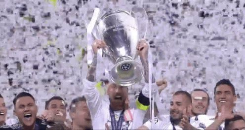](../media/1628521256948465665-1.mp4)

▶ [GIF 动画（点击播放）](../media/1628521256948465665-1.mp4)

*快速验证想法*

不是所有想法都能走通。设计小规模实验来验证你的假设和前提。

如果要失败，就快点失败！

▶ [GIF 动画（点击播放）](../media/1628521269309079556-1.mp4)

这些策略对我在多个想法之间排优先级很有帮助。

希望它们也能帮你认清自己该做什么。

### 作者补充回复

@nisarg0812 可以看看之前的一个线程，里面有一些思路 😉：https://x.com/jbhuang0604/status/1423499757591400448

<https://x.com/jbhuang0604/status/1628601890421280769>

## 如何跟进文献？

原帖：<https://x.com/jbhuang0604/status/1426039195542360070> · 2021-08-13 · 共 10 条串文

如何跟进研究文献？

刚开始做研究，却每年被成千上万篇论文淹没？怎样才能保持清醒地跟进文献？😱

以下是我觉得有用的一些技巧。🧵

*关注人，而不是论文*

真正推动领域前进的关键人物，数量远比论文少得多。读论文时留意作者是谁，时间一长你就能认出那些重要的人。

▶ [GIF 动画（点击播放）](../media/1426039204560113664-1.mp4)

*读相关工作写得好的论文*

一篇好的相关工作章节能清晰、有条理地梳理前人工作，为你节省大量时间。

顺便说一句：请认真写好相关工作，帮别人节省时间 https://x.com/jbhuang0604/status/1417117742302433286?s=20

> **引用 [@jbhuang0604](https://x.com/jbhuang0604)**：
>
> 撰写相关工作
>
> 我很喜欢读/写论文的相关工作部分。它有助于梳理已有研究，并把本文的贡献放在恰当的位置。
>
> 但具体怎么写？看下面的线程👇

[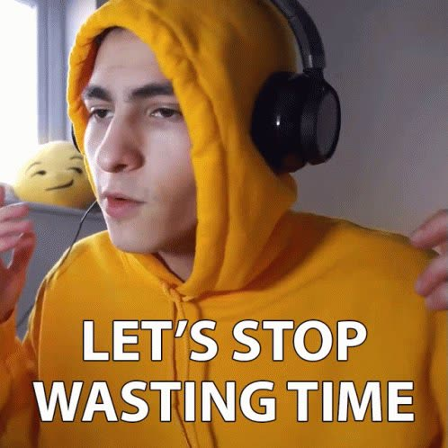](../media/1426039217176653824-1.mp4)

▶ [GIF 动画（点击播放）](../media/1426039217176653824-1.mp4)

*把论文组织起来*

不要孤立地读论文，要思考它们之间有什么联系（某些方面相似，另一些方面不同）。用一张表格列出各种「属性」往往很有帮助。

有了这张表，读新论文就变得简单了（往表里加行即可）。

[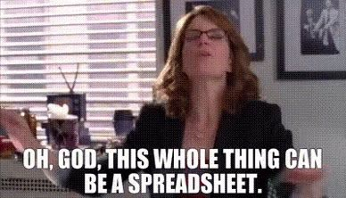](../media/1426039225686896642-1.mp4)

▶ [GIF 动画（点击播放）](../media/1426039225686896642-1.mp4)

*试着「不读」论文*

与其花时间读原文，不如找一些更容易消化的材料，比如演讲、YouTube 视频、teaser 结果、介绍视频或概览图。

很多时候，理解论文的核心要点就够了。

▶ [GIF 动画（点击播放）](../media/1426039233660309504-1.mp4)

*带着目的去读*

在投入时间读一篇论文之前，先想想自己「为什么」要读它。是为了实验设置、组织结构、故事线、写作风格、方法，还是可视化？

你几乎从来不需要从头到尾读完一篇论文。

▶ [GIF 动画（点击播放）](../media/1426039246171815938-1.mp4)

*识别趋势*

用你喜欢的工具找出当下热门的方向，例如：
http://www.arxiv-sanity.com/
https://paperswithcode.com/
https://x.com/

▶ [GIF 动画（点击播放）](../media/1426039253977423872-1.mp4)

相关链接：
- <http://www.arxiv-sanity.com/>
- <https://paperswithcode.com/>

希望这些对你有帮助！在这样一个快速发展的领域里，你最喜欢用什么方式跟进文献？

@tzumaoli 的精彩观点！

> **引用 [@tzumaoli](https://x.com/tzumaoli)**：
>
> 读一读更老的论文（2000 年之前）。很多重要洞见早在几十年前就已经出现了。不要只读某些课题组的工作，那样容易看不到整体图景。读更广泛领域的东西：统计学、机器人学、物理学、应用数学、图形学、编程语言、数据库、语言学、人机交互。

补充 @VRAdithya 提出的许多好建议！

https://x.com/VRAdithya/status/1426264585435181060?s=20

> **引用 [@VRAdithya](https://x.com/VRAdithya)**：
>
> 再补充两点到这个精彩的线程：
> 1. 用 Google Scholar 关注最高产的作者。如今几乎每个人都有一个（自动生成的）主页。同时也要关注关键出版物。

### 作者补充回复

@vikataravi @ak92501 @ak92501 太棒了！如果你对 CV/ML/CG/AI 感兴趣，一定要关注 AK。这里我尽量用不依赖具体领域的方式来写。

<https://x.com/jbhuang0604/status/1426241459381051397>

## 如何想出研究点子？

原帖：<https://x.com/jbhuang0604/status/1423499757591400448> · 2021-08-06 · 共 9 条串文

如何想出研究点子？

对开始做研究感到兴奋却毫无头绪？🤷‍♂️🤷🏻‍♀️ 以下是我在寻找初始方向时觉得有用的一些简单方法。

看看下面的线程 👇

*换一个维度*

刚从别人那里学到一个很酷的想法？想想你可以把它扩展到另一个维度上。

例如：文本 / 音频 / 图像 / 视频 / 图结构

▶ [GIF 动画（点击播放）](../media/1423499766969901057-1.mp4)

*放宽假设*

找出已有工作的隐含假设，尝试放宽它们，使其能在更少约束的场景下工作。

▶ [GIF 动画（点击播放）](../media/1423499775433920512-1.mp4)

*增加假设*

拿一个通用方法过来，把它定制到你的「特定」问题上。这样你就能利用全部领域知识（也就是增加更多假设）来改进方法。

[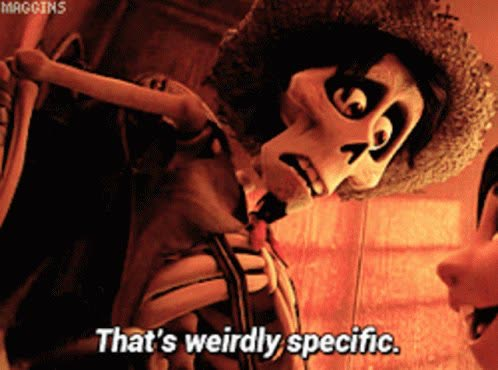](../media/1423499783713480706-1.mp4)

▶ [GIF 动画（点击播放）](../media/1423499783713480706-1.mp4)

*把两个想法/问题结合起来*

「从一个人那里偷想法是抄袭。从很多人那里偷想法是研究。」——Wilson Mizner

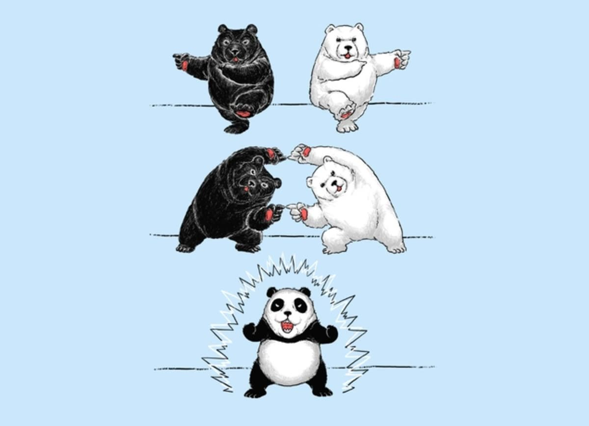

*拿起一把强大的锤子，去找所有的钉子*

关注社区里新出现的工具，把它们应用并适配到你的问题上。

[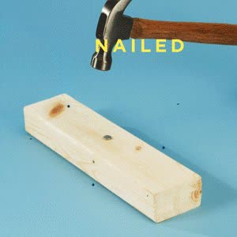](../media/1423499796430602241-1.mp4)

▶ [GIF 动画（点击播放）](../media/1423499796430602241-1.mp4)

*加一个形容词*

给定一个现有的想法 X，加一个形容词让它变成：
- 慢 ➡️ 快
- 批处理 ➡️ 在线
- 敏感 ➡️ 鲁棒
- 中心化 ➡️ 分布式
- 单步 ➡️ 渐进式
- 单层级 ➡️ 层次化
- 固定 ➡️ 自适应、感知某某
- 吃数据 ➡️ 数据高效
等等

[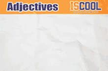](../media/1423499804433391619-1.mp4)

▶ [GIF 动画（点击播放）](../media/1423499804433391619-1.mp4)

*对当前最好方法做压力测试*

不要只在固定、无聊的基准数据集上跑。试试各种多样、无约束的例子，看看它是怎么失败的。这是发现已有工作局限性的绝佳方式，也正是你的工作可以填补空白的地方。

▶ [GIF 动画（点击播放）](../media/1423499812549300234-1.mp4)

就这些！我很想听听你想出点子的方法。

### 作者补充回复

@FILWD 这太棒了！我很好奇你会怎么平衡，避免过度专注于增量式的想法？

<https://x.com/jbhuang0604/status/1424907719589470209>

@domoritz 太对了！！有时我发现和社区*之外*的人聊聊也很有帮助！

<https://x.com/jbhuang0604/status/1424909199121735683>

## 如何应对论文被拒？

原帖：<https://x.com/jbhuang0604/status/1443248831102136333> · 2021-09-29 · 共 7 条串文

如何应对论文被拒？

被拒糟透了！几个月的努力没有回报，感觉非常难受。😭 面对拒稿，我们怎样保持积极的心态？

一些（从许多次被拒中学到的）经验教训 🧵

*难过是正常的*

拒稿真的会伤人。被拒绝会激活与身体疼痛相同的脑区。所以感到难过完全没问题。和朋友/实验室伙伴/导师聊聊。休息一天，然后满血复活。

▶ [GIF 动画（点击播放）](../media/1443248839314530307-1.mp4)

*这是常态*

对低年级学生来说，论文被拒可能像是重大挫折。但这只是过程的一部分。

「砖墙是有存在理由的。砖墙不是为了把我们挡在外面，而是为了证明我们有多想要。」——Randy Pausch

▶ [GIF 动画（点击播放）](../media/1443248847011069964-1.mp4)

*这不是针对你个人*

不要把拒稿当成针对个人。它针对的是你的想法、实现、实验和写作。把审稿意见列成待办清单，确保修改稿妥善回应了这些问题。

▶ [视频（点击播放）](../media/1443248872877445130-1.mp4)

*它没那么重要*

绝大多数论文长期来看都无关紧要。你的职业生涯只会由少数几篇好论文塑造。与其让一篇「还凑合」的论文被接收，不如借机修改强化，这可能是因祸得福。

图片致谢：Bill Freeman

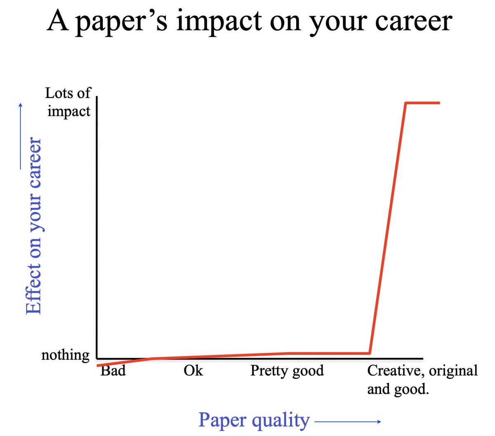

*准备一份失败简历*

你失败是因为你尝试过！做一份失败简历，把所有这些挫折常态化。

示例：https://jbhuang0604.github.io/Huang_CV_Failure.pdf

▶ [GIF 动画（点击播放）](../media/1443248888392163337-1.mp4)

相关链接：
- <https://jbhuang0604.github.io/Huang_CV_Failure.pdf>

*庆祝沿途每一个小成功*

庆祝小胜利能在你追求目标（无论是什么目标）的过程中保持动力。让你的旅程尽可能有趣。

▶ [GIF 动画（点击播放）](../media/1443248897862869009-1.mp4)

## 如何获得引用？

原帖：<https://x.com/jbhuang0604/status/1997882311790968896> · 2025-12-08 · 共 11 条串文

如何获得引用？

「引用不重要」，说这话的人引用量是天文数字。

「我们相信慢科学」，说这话的是每周发一篇论文的课题组。

喜欢也好，不喜欢也罢，这个体系就是用引用量来评价研究者。

以下是给低年级同学的一些实操建议 🧵

三个关键点：

1⃣ 让你的工作容易被找到

2⃣ 让你的工作令人印象深刻

3⃣ 让你的工作可以被使用

下面逐一展开。

*如何让你的工作更容易被获取？*

👉 通过动态、有吸引力的媒介传播你的工作，而不是只依赖一份静态、无聊的 PDF。

但具体怎么做？

做个网站、写一条社交媒体线程、写一篇博客、做一个讲解视频。

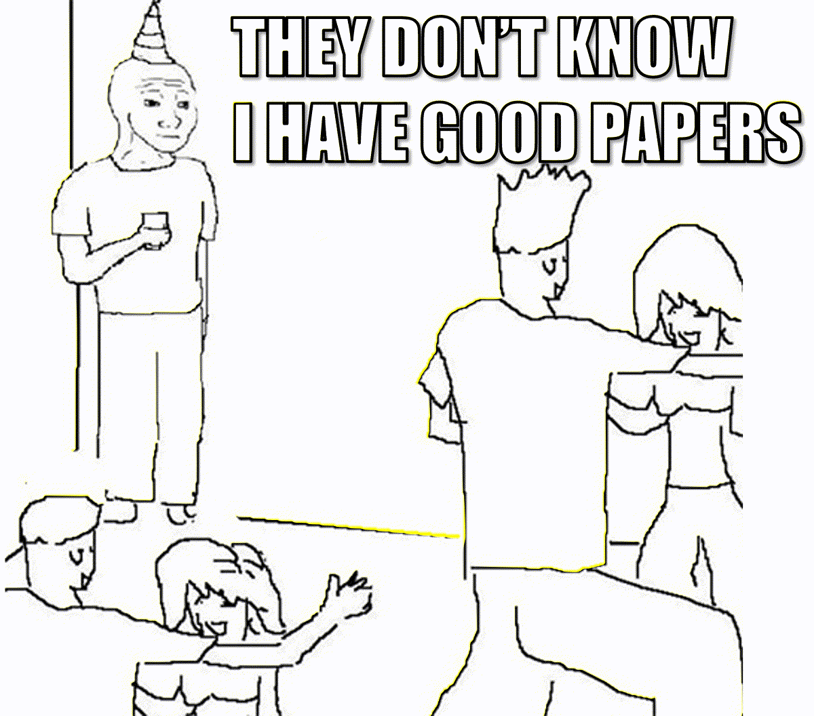

*如何让工作令人印象深刻？*

有几个可操作的步骤。

最简单的？起一个好名字！

[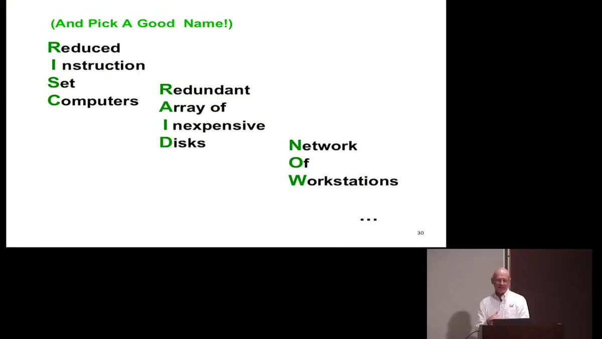](../media/1997882342313210033-1.mp4)

▶ [视频（点击播放）](../media/1997882342313210033-1.mp4)

不用多说，论文标题极其重要！

花时间设计一个独特、好记的标题。

来源：Good Citizen of Computer Vision（https://deviparikh.com/citizenofcvpr/）

[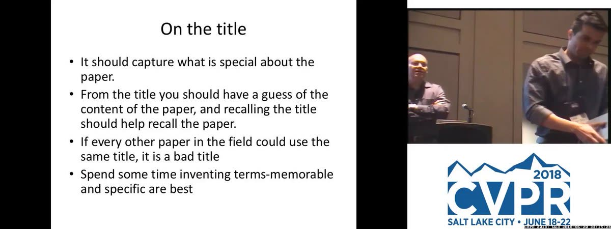](../media/1997882344586232152-1.mp4)

▶ [视频（点击播放）](../media/1997882344586232152-1.mp4)

相关链接：
- <https://deviparikh.com/citizenofcvpr/>

当你能讲一个清晰的故事，*把工作放在已有研究的背景中*时，人们会更容易记住你的工作。

把核心想法提炼成一张简洁的图。

例如：

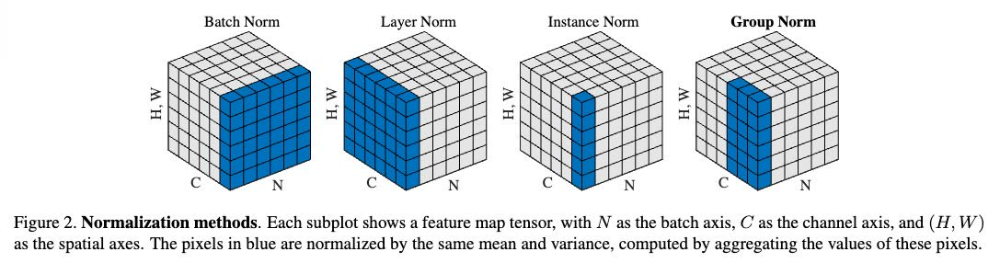

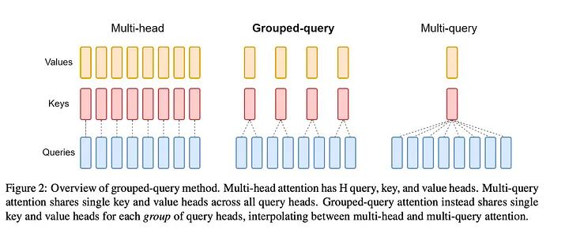

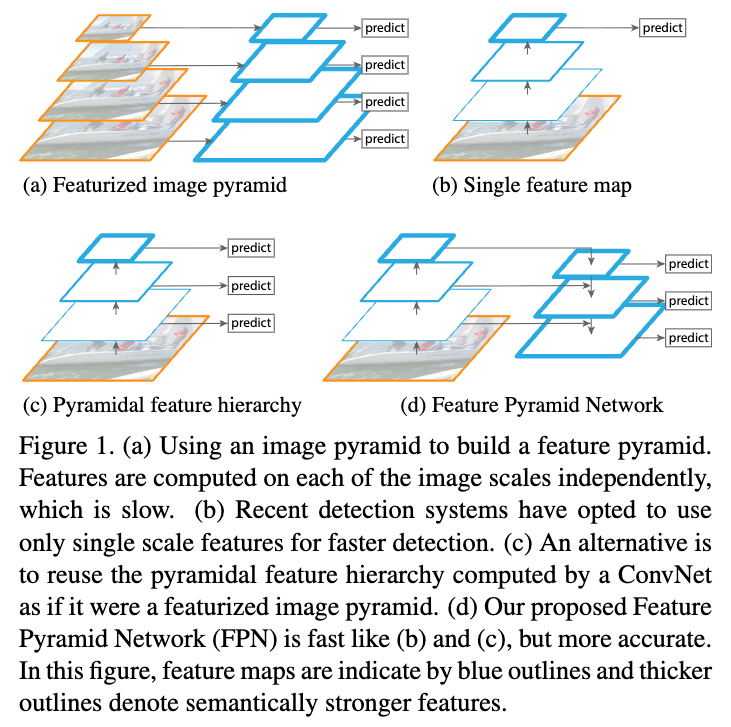

*如何让工作可以用起来？*

你的工作被引用，是因为它让别人能做出他们的工作。

不要简单地把乱七八糟的代码库扔到网上。花功夫把它打磨、组织好，让别人能轻松地在你的工作之上继续构建。

想进一步提升研究影响力，可以看看这条我觉得特别有洞见的帖子：

「构建你需要的，使用你构建的。」——@Michael_J_Black
 https://x.com/Michael_J_Black/status/1782284444537090114

> **引用 [@Michael_J_Black](https://x.com/Michael_J_Black)**：
>
> 构建你需要的，使用你构建的。这是我研究的核心理念。它把焦点从发表「论文」转移到真正重要的东西——影响力。这个线程解释了为什么我认为这是成功的科学方法。1/10 或者参见：
> https://t.co/p3iWJ9LCzf

分享你工作的方方面面。

要把工作做完，你通常需要：
- 写评测脚本
- 实现自定义 kernel
- 复现基线
- 处理脏数据、清理标注
- 可视化结果

这些都有价值。慷慨分享，帮助他人。

当然，把引用量最大化当作目标是错误的。

把重点放在做出真正有影响力的研究上。随着时间推移，你的工作会自然被欣赏和认可。

让它们容易获取、令人印象深刻、并且有用！

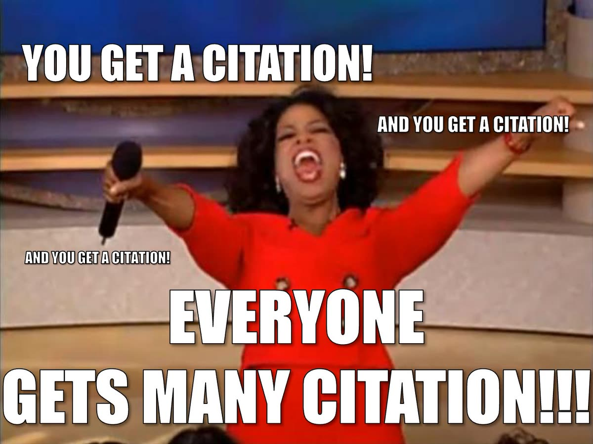

# 与导师共事

## 如何与导师/合作者同步进展？

原帖：<https://x.com/jbhuang0604/status/1453378296608137229> · 2021-10-27 · 共 7 条串文

如何与导师/合作者同步研究进展？

在整个研究项目中，99% 的时间里你的方法都「不 work」（暂时）。😬

怎样才能把这些「失败的结果」讲清楚，并与导师/合作者进行高效的讨论？👇

*设计：我们为什么要做这个实验？*

请把导师当金鱼 🐟。提醒他们你为什么做某个实验或实现某个东西。这能提供背景，让他们帮你解读结果、把控研究方向。

▶ [GIF 动画（点击播放）](../media/1453378305550397442-1.mp4)

*假设：我们预期看到什么？*

在展示结果前，先说明（如果一切正确）本应该发生什么？

▶ [GIF 动画（点击播放）](../media/1453378318699573250-1.mp4)

*观察：我们看到了什么？*

展示（失败的）结果。不要只说「它不 work。」要描述它是怎么失败的。

▶ [GIF 动画（点击播放）](../media/1453378327742402563-1.mp4)

*解读：这是预期内/正常吗？*

展示结果后，说明结果与你的预期是一致还是偏离。

▶ [GIF 动画（点击播放）](../media/1453378339868184579-1.mp4)

*可视化：有没有更好的方式看结果？*

用好的可视化来看结果有助于加深理解、发现问题。

▶ [GIF 动画（点击播放）](../media/1453378348164554752-1.mp4)

*可执行的下一步：你会怎么做？*

记得主动提出下一步建议，让项目能向前推进。记住你是项目的主要「驱动者」，不要只等着指令。

▶ [GIF 动画（点击播放）](../media/1453378356934754304-1.mp4)

## 如何与导师开会？

原帖：<https://x.com/jbhuang0604/status/1653614931202195458> · 2023-05-03 · 共 8 条串文

如何与导师/导师们开会？

如果你是研究生，与导师定期进行高效的会议对你的成功至关重要！

以下是一些让会议价值最大化的建议！🧵

*展示结果*

❌ 把上周得到的结果收集起来、开会时才展示？糟糕的主意！😱

导师在会上第一次看到你的结果，意味着他们没有时间理解和思考。

✅ 高频率地异步分享、讨论结果。

*准备议程*

❌ 直接一头扎进技术细节。

✅ 制定议程。把控会议节奏，确保覆盖所有你想讨论的话题。

*先做总结*

❌ 「看这张满是数字的表格。」

✅ 「上周我们商定检验假设 A 和 B。稍后我会展示实验。总的来说，……」

*解读你的结果*

❌ 「这是结果。看这张表。」

✅ 给结果提供背景。
• 你做了什么？
• 为什么做？
• 怎么做的？
• 发现了什么？
• 合理吗（符合预期吗）？

*提出下一步*

❌ 「我的进展就这些，你觉得接下来该做什么？」

✅ 「我的进展就这些。根据结果来看，以下是按优先级排的任务 A、B、C（以及原因）。」

*总结会议*

❌ 不记笔记，靠脑子「记住」会上的讨论。

✅ 总结会议和双方商定的下一步，会后就立刻发邮件/在 slack 上发出。

祝开会顺利！

如果你喜欢这个线程，请点赞并转发，帮 Twitter 算法推一推！

https://x.com/jbhuang0604/status/1653614931202195458

当学生时，我曾对与导师开会感到压力。现在我也还在学习如何把会开得更高效。

你最喜欢的建议是什么？

> **引用 [@jbhuang0604](https://x.com/jbhuang0604)**：
>
> 如何与导师/导师们开会？
>
> 如果你是研究生，与导师定期进行高效的会议对你的成功至关重要！
>
> 以下是一些让会议价值最大化的建议！🧵

### 作者补充回复

@KristineJonson 我以前也这么想。但后来发现，写一份详细报告、把东西写下来的过程，对看清自己在做什么非常有帮助。

为自己写，而不是为导师写。

<https://x.com/jbhuang0604/status/1653857556408745986>

## 如何与导师合作？

原帖：<https://x.com/jbhuang0604/status/1546361365778022400> · 2022-07-11 · 共 7 条串文

如何与导师合作？

与导师高效合作无疑是研究成功的关键！但低年级研究生往往不清楚该怎么做。

分享一些我觉得有用的建议。👇

*认清导师的角色*

你的导师是一台*输入-输出机器*。

你扔东西进去，得到东西出来。

❌ 只输入：你什么都自己做完，只汇报最终结果。
❌ 只输出：导师让你做什么你就做什么。
✅ 有进有出：你得到频繁且有价值的指导。

*展示你的工作过程*

如何从导师那里获得最好的指导？
❌ 只展示成功！
✅ 展示你的工作！

描述你经历的详细过程、你的推理、采用的方法，以及对结果的解读。

*呈现失败*

❌ 「它不 work。」
✅ 「它是这样失败的。我输入 X，却没有得到 Y。我认为核心问题在步骤 Z 和 W。我已排除 W。接下来我会设计实验来隔离步骤 Z。」

*利用异步讨论*

❌ 等每周开会时再一次性汇报所有东西。
✅ 过程中频繁发送简洁的更新。

让导师持续参与并对你的研究保持兴奋。

*提供背景*

你一出门，导师就会把讨论的内容忘光。

👉 把导师当金鱼。永远先给高层背景。
👉 维护一份大家认可的会议纪要，保证指导保持一致。

*设定预期*

❌ 没有计划/时间表，只想着尽快做完所有事。
✅ 为研究进展设定现实的时间表。告诉导师你会在什么时候之前完成什么。

## 如何与很忙的导师合作？

原帖：<https://x.com/jbhuang0604/status/1665183152887808000> · 2023-06-04 · 共 8 条串文

如何与很忙的导师合作？

你的导师总是在杂耍般同时处理许多任务 🤹（家庭/教学/科研/服务）。

有些情况下，学生一学期只能和导师见一两次面，因此很难推进。😬

分享一些我觉得有用的建议。🧵

*与同辈或高年级学生合作*

大胆联系实验室里的其他同学（尤其是兴趣相近的）。🤝

有人一起讨论帮助巨大！他们能提供宝贵的见解和指导。

▶ [GIF 动画（点击播放）](../media/1665183165084827653-1.mp4)

*去实习，并延续合作*

寻找暑期实习机会！💰

遇到好导师，千万别放手！🤝

问问你的导师，能否继续和他们合作。

▶ [GIF 动画（点击播放）](../media/1665183171837677575-1.mp4)

*试试临时约见*

在导师下课或答疑时间找几分钟聊聊。⏰

做好准备、简洁，并尊重他们的时间。

▶ [GIF 动画（点击播放）](../media/1665183178624061440-1.mp4)

*让他们对你的工作感到兴奋*

频繁分享你的进展或令人兴奋的发现。

展现热情，让他们也兴奋起来！

▶ [GIF 动画（点击播放）](../media/1665183185670492161-1.mp4)

*与导师高效沟通*

对反馈保持开放。需要时就请求澄清。

良好的沟通是稳固合作关系的基础。

▶ [GIF 动画（点击播放）](../media/1665183196751835136-1.mp4)

*考虑换导师或联合导师*

如果和现任导师合作一直很困难，可以考虑寻找与你研究兴趣更契合的其他导师。

▶ [GIF 动画（点击播放）](../media/1665183205027201024-1.mp4)

与忙碌的导师合作虽然有挑战，但也可以把它看作培养成长与自主性的绝佳机会。

毕竟，这是「你的」博士。祝好运！

▶ [GIF 动画（点击播放）](../media/1665183213503885313-1.mp4)

### 作者补充回复

@cthorrez 很遗憾，这在学术界相当常见（我读博时也是一学期才见导师一次）。

当教师团队很大，或者资深教授把精力放在其他职责上时，就会出现这种情况。

<https://x.com/jbhuang0604/status/1665367453742899211>

@chen_fuxiang 他们通常非常活跃（在其他事情上）。只是与学生紧密合作不是他们的首要任务。

<https://x.com/jbhuang0604/status/1665367876214181903>

@joe_hellerstein 我完全同意你！

但遗憾的是，很多学生并没有真正的选择。我这些故事大多是从来我答疑时间的同学那里听来的。我想帮助那些处于这种处境的人。

<https://x.com/jbhuang0604/status/1665395646445092868>

## 如何与资深导师合作？

原帖：<https://x.com/jbhuang0604/status/1563740402657775618> · 2022-08-28 · 共 9 条串文

如何与资深导师合作？

很多学生发现，与资深教授合作读研颇具挑战，因为他们往往极其忙碌、在研究中处于「放手」状态。

看下面的建议。🧵

*预处理你的输入*

你的导师是一台输入-输出机器。https://x.com/jbhuang0604/status/1546361369469001728

资深教授不会跟踪所有最新论文，但他们非常懂基本原理。

把你的工作预处理/抽象/简化，让他们能给出好的反馈。

> **引用 [@jbhuang0604](https://x.com/jbhuang0604)**：
>
> *认清导师的角色*
>
> 你的导师是一台*输入-输出机器*。
>
> 你扔东西进去，得到东西出来。
>
> ❌ 只输入：你什么都自己做完，只汇报最终结果。
> ❌ 只输出：导师让你做什么你就做什么。
> ✅ 有进有出：你得到频繁且有价值的指导。

*后处理他们的输出*

资深教授对你的研究问题可能有很深的见解，但他们没有你熟悉的那套现代工具箱。

不要原样照搬他们的建议（比如实现某种启发式），而是把它们映射到现代框架里。

*找到「动手型」合作者*

刚开始做第一个项目时，一定要找到动手的合作者（其他助理教授、博后或实验室的高年级学生）。你会从他们身上学到宝贵的技能！

*保持透明*

资深教授很忙，有时你可能几个月都和他们说不上话！

即便如此，也要定期同步你的计划（做了什么？打算做什么？什么时候去休假？）。

*具体一点*

当教授说「我很快会看你的论文」时，追问一个具体日期。

✅ 帮导师把这件事列进待办。
✅ 你也知道什么时候该再跟进。

*尽早、频繁地分享进展*

很多学生不好意思分享「还没准备好」的结果，这常常导致恶性循环：「没准备好」→「没反馈」→「压力更大」。

打破这个循环，持续与导师互动。

*探索共同兴趣*

资深教授没有终身教职的压力，可能对各种探索持开放态度。和导师一起找到共同兴趣，让他们能给出最好的支持。

就这些！资深导师视野广阔、品味极佳、资源丰富！与他们合作绝对收获满满！

希望这个线程能给你更多思路，让你与资深导师合作得更高效！祝好运！

# 写作

## 如何写引言？

原帖：<https://x.com/jbhuang0604/status/1638029709073166336> · 2023-03-21 · 共 20 条串文

如何写引言？

对低年级学生来说，写研究论文的引言大概是最令人头疼的部分。😱

这里有一个我觉得好用的简单模板：

3 张图 🖼️ + 5 个问题 🤔

*🖼️ WHAT 图*

论文开头先放一张 WHAT 图（也就是「teaser」）。

这张图只展示两件事。
1⃣ 输入
2⃣ 输出

这能帮读者理解你的工作是什么。以下是我最喜欢的几个例子。

WHAT 示例 1：

Mask R-CNN 在开头就展示关键结果，而不是等到结果章节。

1⃣ 输入：单张图片
2⃣ 输出：实例分割掩码

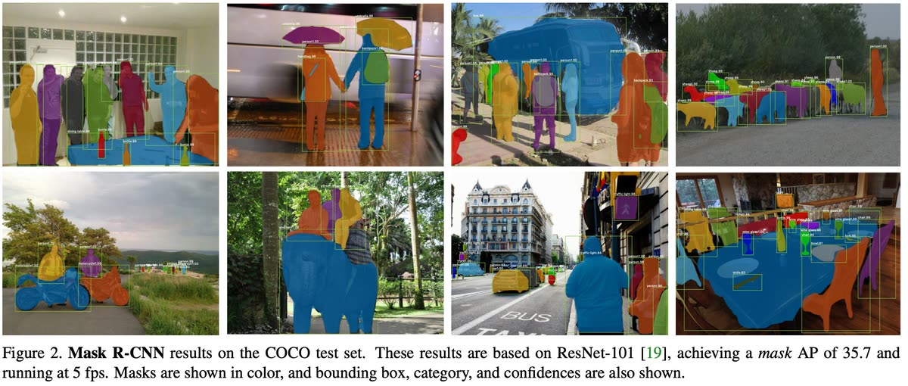

WHAT 示例 2：

CycleGAN 展示了它解决各种非配对图像到图像翻译问题的能力。

1⃣ 输入：域 A 的图像
2⃣ 输出：域 B 的图像

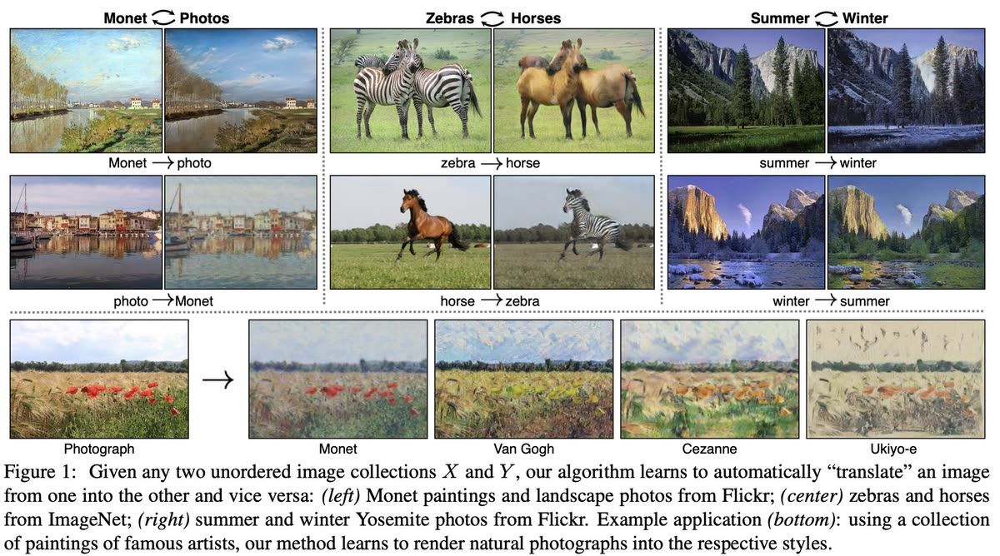

WHAT 示例 3：

去除遮挡的论文（https://alex04072000.github.io/SOLD/）展示了

1⃣ 输入：有遮挡的图像（反光、栏杆、雨滴）
2⃣ 输出：干净的图像

因为图像是对齐的，可以用分屏来 1) 节省空间 2）突出对比。

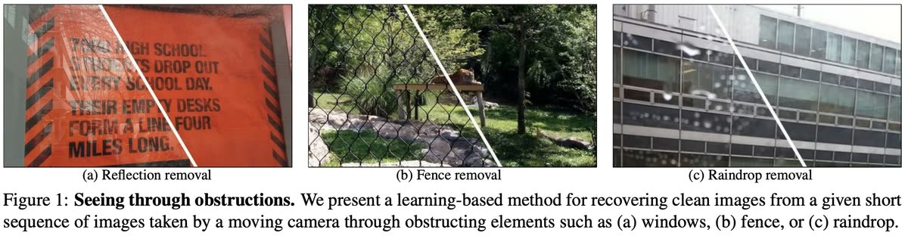

相关链接：
- <https://alex04072000.github.io/SOLD/>

*🖼️ WHY 图*

这张图给出你工作的「动机」。

最好的 WHY 图会用具体例子说明已有工作的核心问题。

以下是我最喜欢的几个例子。

WHY 示例 1：

Shiftable Multiscale Transforms 这篇论文用具体例子展示了平移不变性的「必要性」。

(a) 输入信号
(b-d) 小波表示的系数

(e) 把输入信号平移「一个」采样点
(f-h) 看！系数完全不同

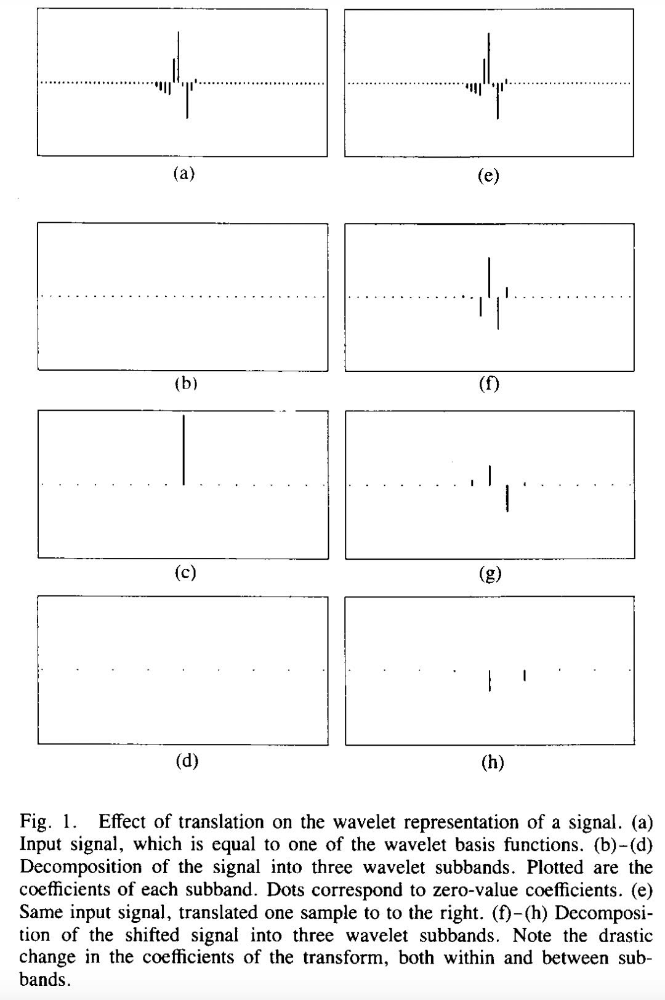

WHY 示例 2：

Relative Attributes 这项工作用具体例子强调：我们需要更富信息量、更直观的描述，也就是相对属性。

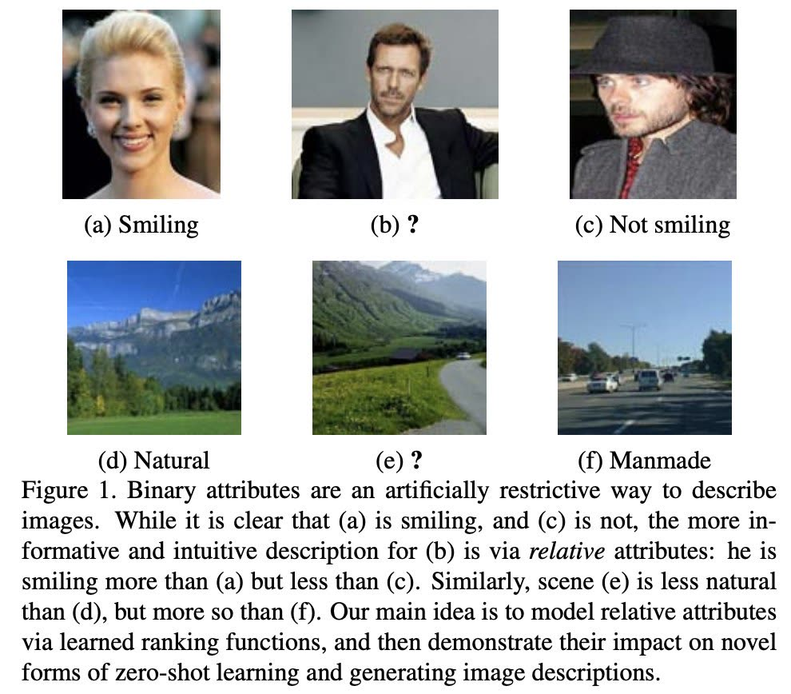

WHY 示例 3：

Feature Pyramid Networks 展示了若干备选设计（a-c）及其缺点。这为「采用他们的设计来得到快速且准确的模型」提供了动机。

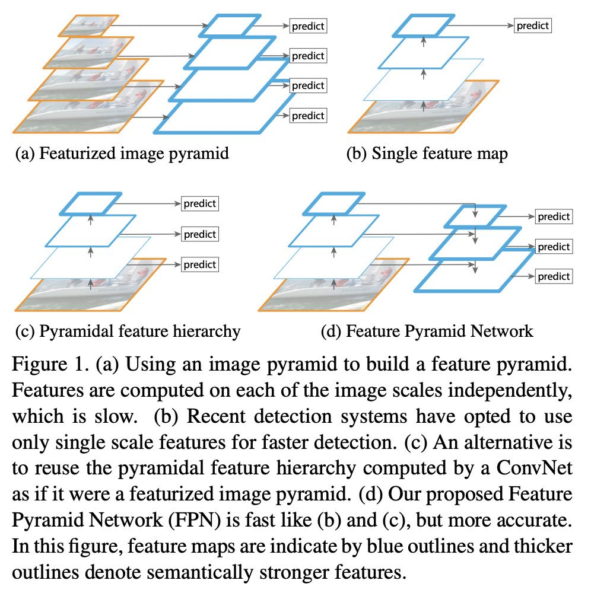

*🖼️ HOW 图*

这张图描述你的方法如何工作。

一些建议：
✅ 串联所有章节
✅ 使用一致的记号
✅ 图注自包含
✅ 可视化变量
✅ 小单元的级联：「输入 -> 一些处理 -> 输出」（想想计算图）。

HOW 示例 1：

HyperReel 论文（https://hyperreel.github.io/）可视化了四个主要算法步骤。

注意数学记号、名称，以及详细、自包含的图注。

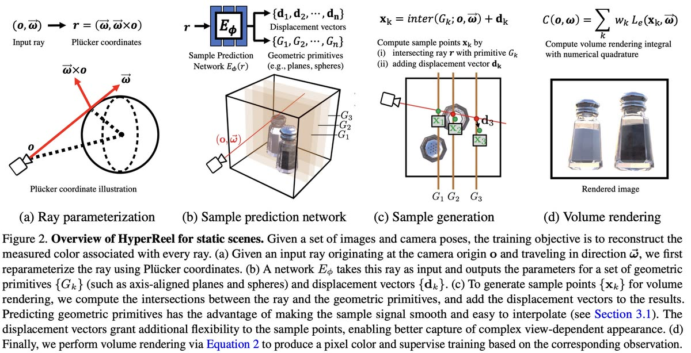

相关链接：
- <https://hyperreel.github.io/>

HOW 示例 2：

我博士期间的视频补全工作 https://filebox.ece.vt.edu/~jbhuang/project/vidcomp/ 展示了每次迭代中的处理步骤。

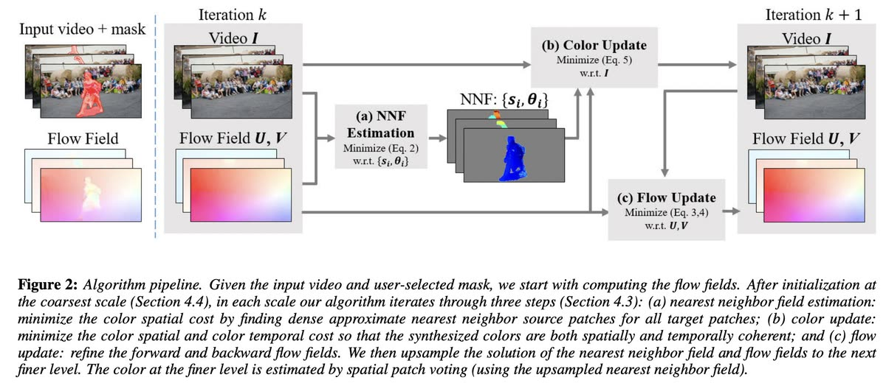

相关链接：
- <https://filebox.ece.vt.edu/~jbhuang/project/vidcomp/>

HOW 示例 3：

Robust Dynamic Radiance Fields 论文（https://robust-dynrf.github.io/）用这张 HOW 图展示了所有数学记号和变量如何互相连接。注意富有描述性的图注。

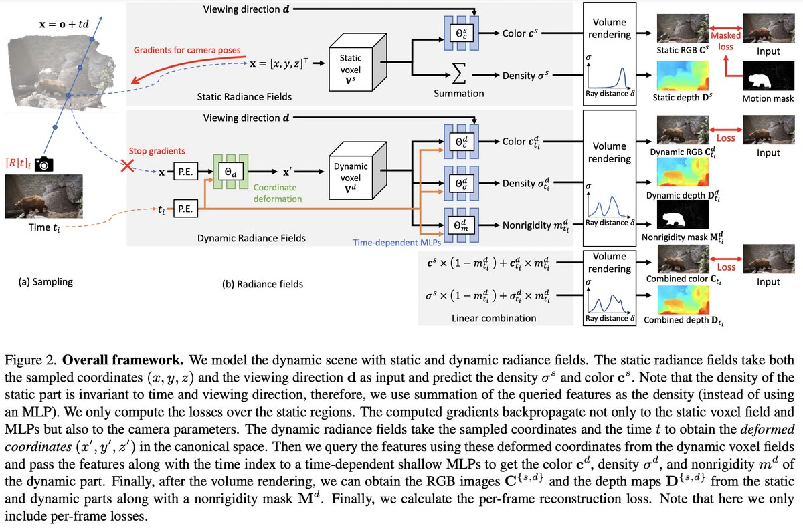

相关链接：
- <https://robust-dynrf.github.io/>

有了 WHAT-WHY-HOW 三张图，我们就可以回答下面五个问题了！

🤔 问题是什么？
🤔 别人做了什么？
🤔 空白在哪里？
🤔 你做了什么？
🤔 你的贡献是什么？

*🤔 Q1：问题是什么？*

✅ 清楚说明你要解决什么问题。

✅ 明确告诉读者他们为什么要关心这个问题（例如应用价值）。

🖼️ 用你的 WHAT 图做视觉参照。

*🤔 Q2：别人做了什么？*

✅ 描述针对你的问题还有哪些（SOTA）方案。

✅ 通常按历史脉络展开，例如经典几何方法做了 X，基于学习的方法做了 Y，最近的混合方法做了 Z。

*🤔 Q3：空白在哪里？*

✅ 解释为什么这些已有方案（在某些方面）不尽如人意。这很重要，因为你的工作往往正是针对已有工作的某个缺口/缺陷/不足。

🖼️ 用 WHY 图中的例子来说明这个*空白*。

*🤔 Q4：你做了什么？*

✅ 在这一段开头加上「In this paper, ...」（本文……）。这有助于干净地区分过去的工作和当前工作。

✅ 谈三件事：a) 任务，b) 高层思路，c) 评估

🖼️ 用你的 HOW 图来支撑讨论。

*🤔 Q5：你的贡献是什么？*

✅ 你做的一切并非都是「新颖的」，比如很大一部分工作可能建立在已有方法之上。因此，明确列出你的贡献是个好习惯。

✅ 列成清单，这样懒审稿人可以直接用在评审意见里 😜

总之，引言部分会是这样：

🤔 问题是什么？（见 🖼️ WHAT 图）

🤔 别人做了什么？

🤔 空白在哪里？（见 🖼️ WHY 图）

🤔 你做了什么？（见 🖼️ HOW 图）

🤔 你的贡献是什么？

希望有帮助！

## 如何写出看起来就不错的论文？

原帖：<https://x.com/jbhuang0604/status/1437443017510621185> · 2021-09-13 · 共 11 条串文

如何写出看起来就不错的论文？

你非常努力，做出了出色的研究，但审稿人 2 就是不买账。为什么？🤔

很可能是因为你的论文在*视觉上*不像一篇好论文。🙄

怎么做？👇👇👇 #AcademicTwitter

*图 1：你做了什么？*

最让人抓狂的莫过于读到第 5 页还不知道这篇论文在讲什么。😠在第一页就放一张 TEASER 图，突出输入/输出/关键发现。

▶ [GIF 动画（点击播放）](../media/1437443026461265924-1.mp4)

*图 2：你为什么做这个？*

为你工作的关键洞见/想法提供动机和论证。通常有两招很有效：
1）用一个玩具例子来简化，
2）结合前人工作提供背景。

▶ [GIF 动画（点击播放）](../media/1437443034384408579-1.mp4)

*图 3：你是怎么做的？*

放一张方法如何工作的*概览*图。给所有东西加标注，让它成为整篇论文的清晰路线图。

▶ [GIF 动画（点击播放）](../media/1437443042747822081-1.mp4)

*把图表移到页面顶部*

给图表加上「[!t]」参数，让 LaTeX 尽量把它们放在页面顶部。为什么？

图表比纯文字容易理解得多。放在顶部能帮读者快速理解你的工作。

[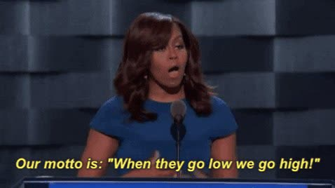](../media/1437443054353461252-1.mp4)

▶ [GIF 动画（点击播放）](../media/1437443054353461252-1.mp4)

*图表标题要自包含*

你想对图表说的话，都写进标题里。让读者在正文里找对应文字、再和图对上，是很烦人的。

关于避免「心智配对」的更多内容：https://x.com/jbhuang0604/status/1279992087497314305

> **引用 [@jbhuang0604](https://x.com/jbhuang0604)**：
>
> 分享一个我觉得对论文写作很有用的想法：
>
> 不要让别人去解决「对应关系」问题。
>
> 下面是一些 Do 和 Don't 的例子：
>
> *图*：不要让别人把 (a)、(b)、(c)……和图注中的描述一一配对。

[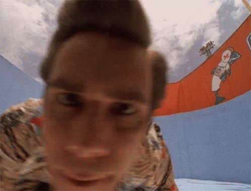](../media/1437443062653927425-1.mp4)

▶ [GIF 动画（点击播放）](../media/1437443062653927425-1.mp4)

*简洁的记号*

数学记号用「单个字母」。例如：
• Color_j -> C_j
• Net -> F(\cdot)

其他描述性内容应该放在 \mathrm 里

▶ [GIF 动画（点击播放）](../media/1437443075173912584-1.mp4)

*短标题*

给图表标题和正文加上标题（例如用 \paragraph）。它们让论文更有结构、更条理，帮读者轻松浏览。

[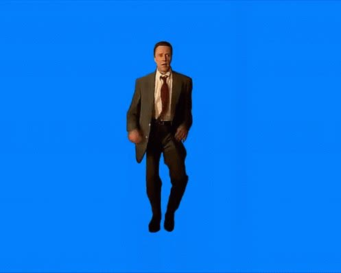](../media/1437443083612868613-1.mp4)

▶ [GIF 动画（点击播放）](../media/1437443083612868613-1.mp4)

*干净的表*

遵循简单原则做出干净的表：
• 不用 \hline，用 \toprule、\midrule、\bottomrule
• 不要竖线
• 文字左对齐
• 数字居中
• 用 multirow/multicol 分组、去掉重复

[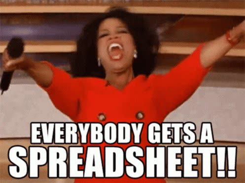](../media/1437443092114706432-1.mp4)

▶ [GIF 动画（点击播放）](../media/1437443092114706432-1.mp4)

*避免空白*

把论文填满页数上限。这会让读者觉得论文是「打磨过的」，而不是「赶出来的」。

关于 Deep Paper Gestalt 的更多内容：https://arxiv.org/abs/1812.08775

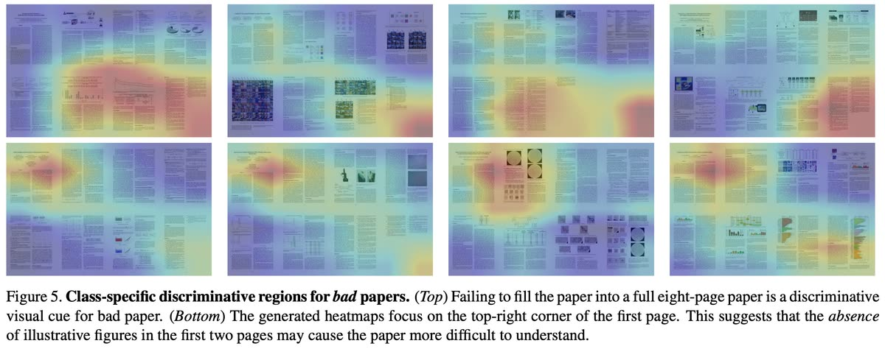

相关链接：
- <https://arxiv.org/abs/1812.08775>

希望有帮助！如果你的论文看起来像好论文、读起来像好论文，那它很可能就是一篇好论文。

祝写作顺利！

你还有什么让论文更好看的技巧吗？

### 作者补充回复

@Alberto_H9 三种图我各加了一个例子。

图 1 WHAT：https://x.com/jbhuang0604/status/1437560146612441089

图 2 WHY：https://x.com/jbhuang0604/status/1437562132279738372

图 3 HOW：https://x.com/jbhuang0604/status/1437563329455824905

<https://x.com/jbhuang0604/status/1437564308674781185>

@MattHemsley3 很高兴你喜欢！

▶ [GIF 动画（点击播放）](../media/1437564600946397184-1.mp4)

<https://x.com/jbhuang0604/status/1437564600946397184>

@themintsv 哦不……

▶ [GIF 动画（点击播放）](../media/1437564898071007234-1.mp4)

<https://x.com/jbhuang0604/status/1437564898071007234>

## 如何写出清晰简洁的句子？

原帖：<https://x.com/jbhuang0604/status/1437931004451250176> · 2021-09-15 · 共 15 条串文

如何写出清晰简洁的句子？

准备写你的第一篇研究论文了？写论文可能很吓人，对非英语母语者尤其如此。😬😬😬 技术写作中怎样避免常见错误？

看看下面的线程！🧵

*主动语态*

朋友不会让朋友用被动语态！

被动语态隐藏主语，句子含糊、间接、啰嗦。事情不会自己「被完成」。对自己做的事负责，尽量用主动语态。

▶ [视频（点击播放）](../media/1437931021706612736-1.mp4)

*用肯定形式陈述*

告诉读者「是什么」，而不是「不是什么」。

not honest ➡️ dishonest
did not remember ➡️ forgot
did not pay any attention to ➡️ ignored
did not have much confidence in ➡️ distrusted

▶ [GIF 动画（点击播放）](../media/1437931029759766534-1.mp4)

*Which（非限定）与 That（限定）*

WHICH 引导的形容词从句是可有可无的、非限定性的，所以你可以来一场「which 大扫除」，把长句拆成更简单的句子。

关于限定/非限定形容词从句的更多内容：https://youtu.be/NjTM4booWHo

▶ [GIF 动画（点击播放）](../media/1437931037372395522-1.mp4)

相关链接：
- <https://youtu.be/NjTM4booWHo>

*Respectively*

不要让你的读者去解决「心智配对」问题。改写句子，去掉「respectively」。

示例：https://x.com/jbhuang0604/status/1279992094577352704?s=20

> **引用 [@jbhuang0604](https://x.com/jbhuang0604)**：
>
> *Respectively*
>
> 以「respectively」结尾的句子很难分辨谁对应谁（读者要解决一个长距离的配对问题）。把它们拆开，让一句话只讲一件事。

[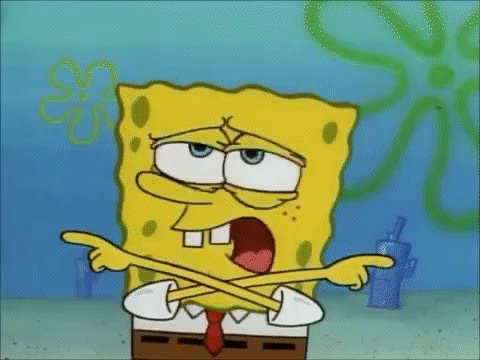](../media/1437931050278309888-1.mp4)

▶ [GIF 动画（点击播放）](../media/1437931050278309888-1.mp4)

*花哨的词*

我以前觉得用花哨的词让论文更「学术」，但现在的我更喜欢简单和清晰。

utilize ➡️ use
initiate ➡️ begin
terminate ➡️ end
ascertain ➡️ find out
constitute ➡️ make up
disintegrate ➡️ break down

[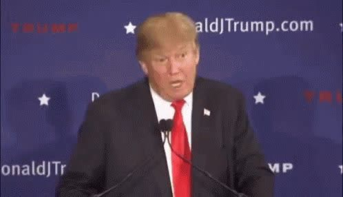](../media/1437931059048501249-1.mp4)

▶ [GIF 动画（点击播放）](../media/1437931059048501249-1.mp4)

*多余的词*

用简单的词替换多余的表达！

at the time when ➡️ when
owing to the fact that ➡️ since
in spite of the fact that ➡️ though
the reason why is that ➡️ because
this is a subject that ➡️ this subject
the question as to whether or not ➡️ whether

▶ [GIF 动画（点击播放）](../media/1437931071446847496-1.mp4)

*消除含糊的代词指代*

找出并删除论文里所有含糊的代词指代，例如 that、this、it、these、those。

把这些模糊指代替换为具体的名词或名词短语。

▶ [GIF 动画（点击播放）](../media/1437931079286116352-1.mp4)

*Few / A few / Quite a few*

清楚地表达你想描述的数量。

A few = 一些（不多，但有几个）
Few = 「只有」几个（数量很少）
Quite a few = 很多

▶ [GIF 动画（点击播放）](../media/1437931087548780544-1.mp4)

*Note that*

避免「Note that」和「It should be noted that」。读者不喜欢被频繁提醒「注意」。

▶ [GIF 动画（点击播放）](../media/1437931095589326852-1.mp4)

*资源*

网上有很多极好的写作建议！

http://www.jlakes.org/ch/web/The-elements-of-style.pdf

https://vision.sjtu.edu.cn/writing.html

https://taoxie.cs.illinois.edu/advice.htm

相关链接：
- <http://www.jlakes.org/ch/web/The-elements-of-style.pdf>
- <https://vision.sjtu.edu.cn/writing.html>
- <https://taoxie.cs.illinois.edu/advice.htm>

就这些（目前）！

很想听听你们最喜欢的「清晰简洁写作」技巧！

*Case*

往往是多余的！

改写前：In many cases, the rooms lacked air conditioning.
改写后：Many of the rooms lacked air conditioning.

改写前：It has rarely been case that any mistake has been made.
改写后：Few mistakes have been made.

来源：The Elements of Style

▶ [GIF 动画（点击播放）](../media/1437986944257036290-1.mp4)

*However*

论文里我们常用「however」表示「nevertheless/in spite of that」（然而）。不要用 however 开头来避免歧义。为什么？

句首的 however 意思是「无论以何种方式」，或「无论到什么程度」。

▶ [GIF 动画（点击播放）](../media/1437986953262141443-1.mp4)

*过渡词*

用过渡词连接句子。

• 空间：above, below, inside

• 因果：as a result, because, since

• 相似：as, likewise, similarly

• 对比：although, however, on the other hand, in contrast

来源：https://stanford.edu/class/ee267/WIM/writing_style_guide.pdf

[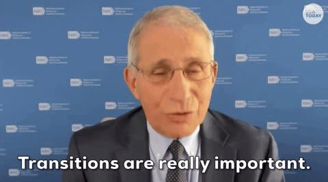](../media/1437986960921042948-1.mp4)

▶ [GIF 动画（点击播放）](../media/1437986960921042948-1.mp4)

相关链接：
- <https://stanford.edu/class/ee267/WIM/writing_style_guide.pdf>

## 如何画方法概览图？

原帖：<https://x.com/jbhuang0604/status/1665738070002483201> · 2023-06-05 · 共 14 条串文

如何画方法概览图？

画出一张清晰、信息量足的概览图，对说明你的方法「如何工作」至关重要。

但怎么画？🤔 让我们跟着 🐢 一起深入看看

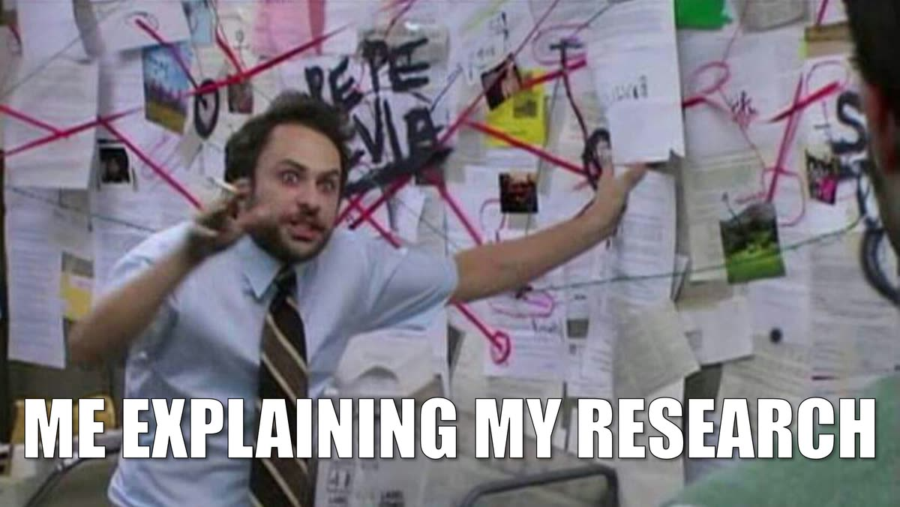

*选择合适的抽象层次*

简化复杂流程有助于提升清晰度。

问问自己：你想传达的关键信息是什么。不要用不必要的细节淹没读者。

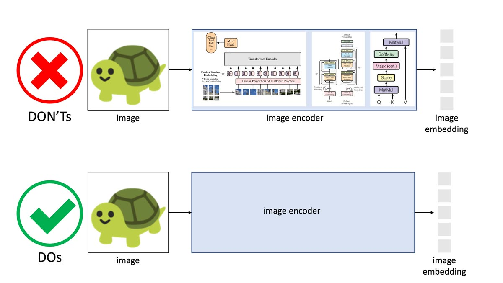

*以计算图的方式思考*

大多数方法都是对某些「输入」做某些「计算」，产生某些「输出」。

用「计算图」来可视化这个流程。

• 节点：计算
• 箭头：依赖关系

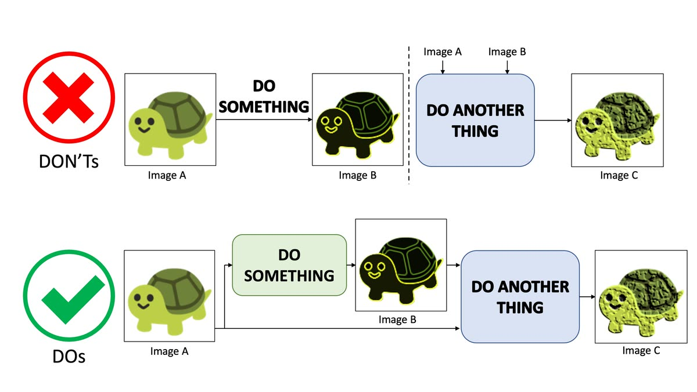

*用一个例子*

概览图展示的是*抽象*流程，用*具体*例子把中间变量/数据可视化出来，会更容易理解。

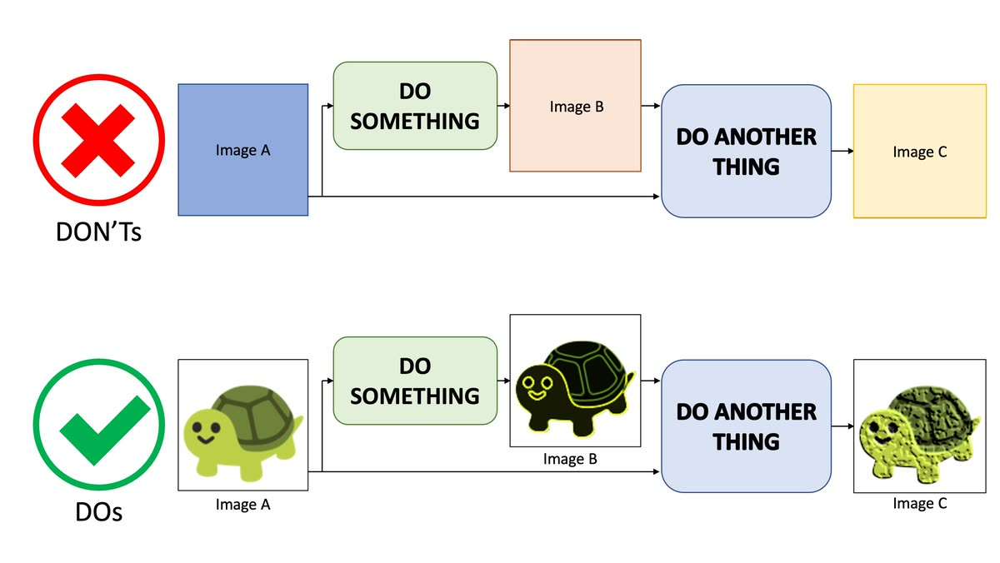

*遵循从左到右的方向*

大多数语言都是从左到右阅读。⏩⏩

遵循这个方向能让你的图更好「读」。

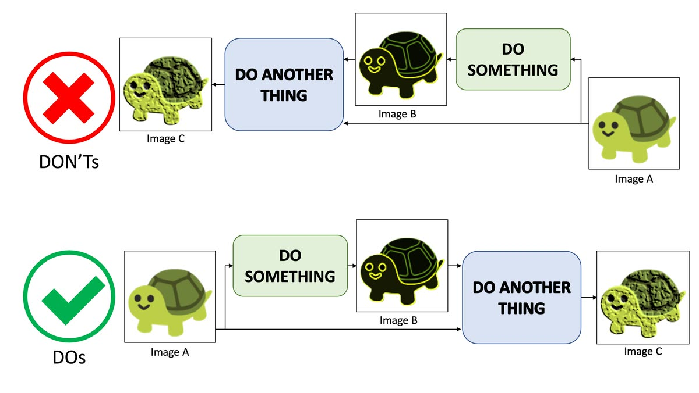

*有策略地使用格式*

用格式来突出相似性、分组和对比时，要有明确目的。

注意不要用力过猛。

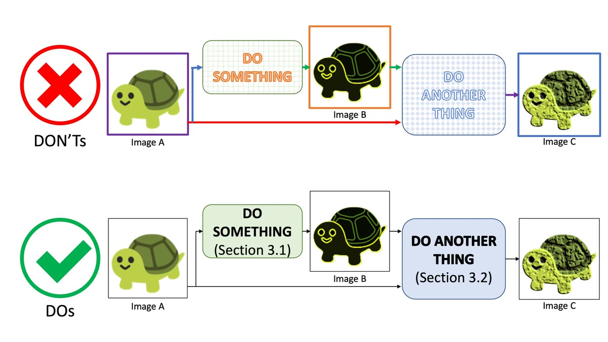

*使用合适的字号*

字号要一致且清晰可见。

别让概览图变成视力测试。🧐

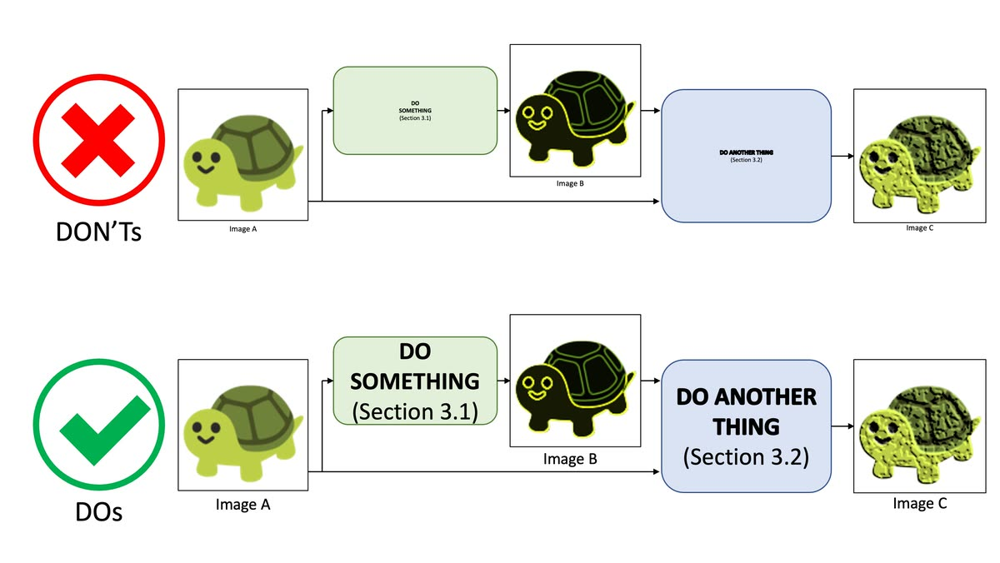

*使用一致的格式*

• 首个单词首字母大写？
• 每个单词首字母大写？
• 全部大写？
• 全部小写？

选一种，然后坚持用它。

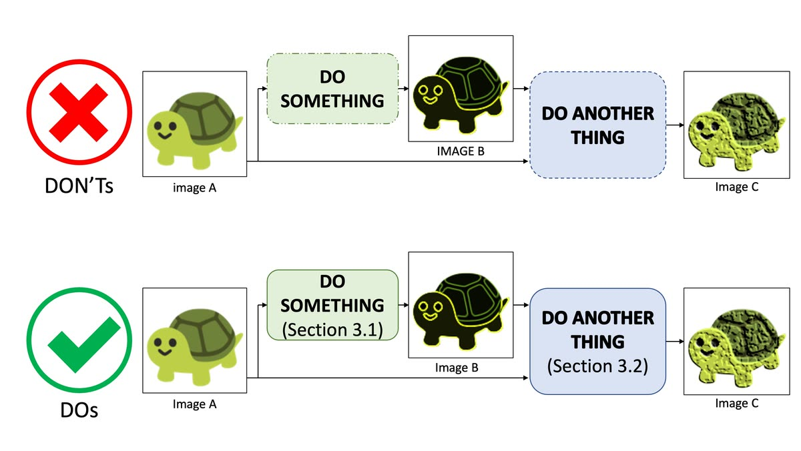

*对齐所有元素*

这里一点、那里一点的对齐偏差会分散读者注意力。（看看这有多难受！）

对齐位置、间距和大小。

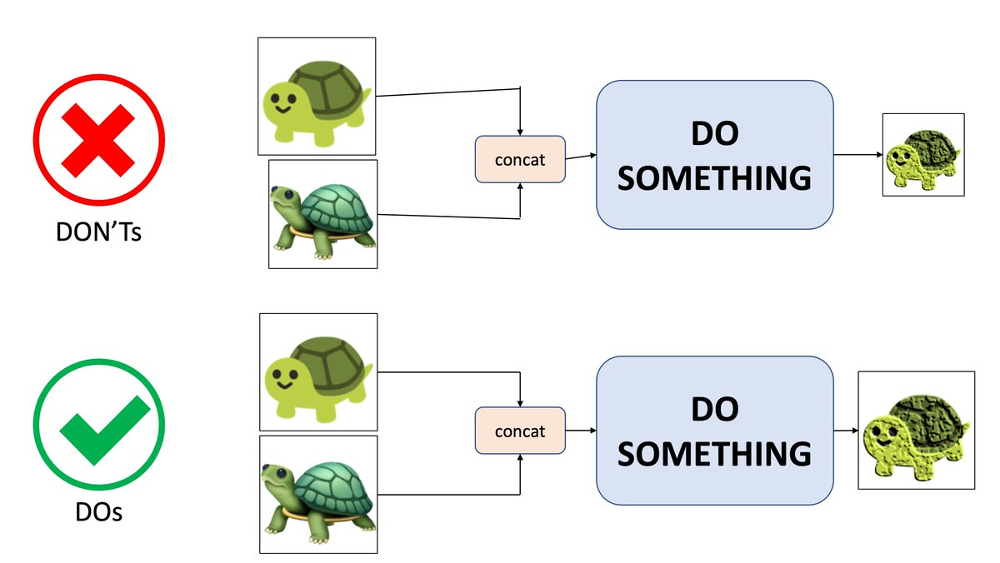

*使用一致的样式*

标签放在
• 图片下方？
• 图片上方？
• 图片内部？
• 图片右侧？

选一种并保持一致。

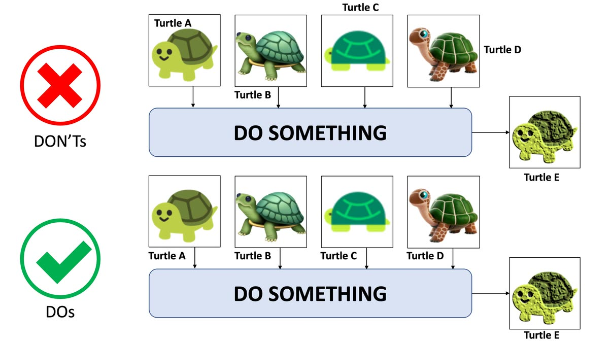

*为论文提供路线图*

给章节、公式和图表加上标签，为论文提供一张路线图。

*明确写出依赖/计算*

把两个箭头合并时，中间发生了什么并不清楚。

是相加/相减/相乘/max/min，还是别的？还是说 DO SOMETHING 模块其实接收两个独立输入？写清楚！

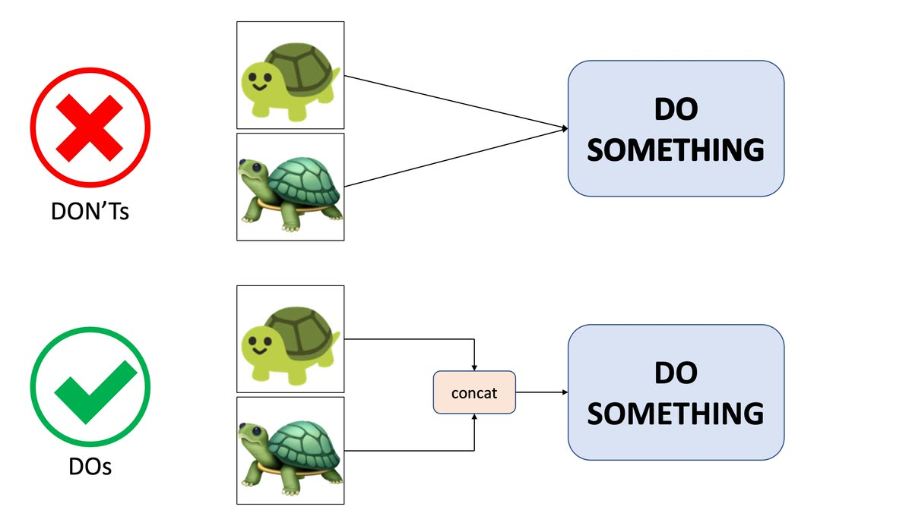

*避免让接口超载*

这里 DO SOMETHING 模块只接收「一个」输入。

上面的例子掩盖了这个过程（看起来像模块同时接收两个输入）。

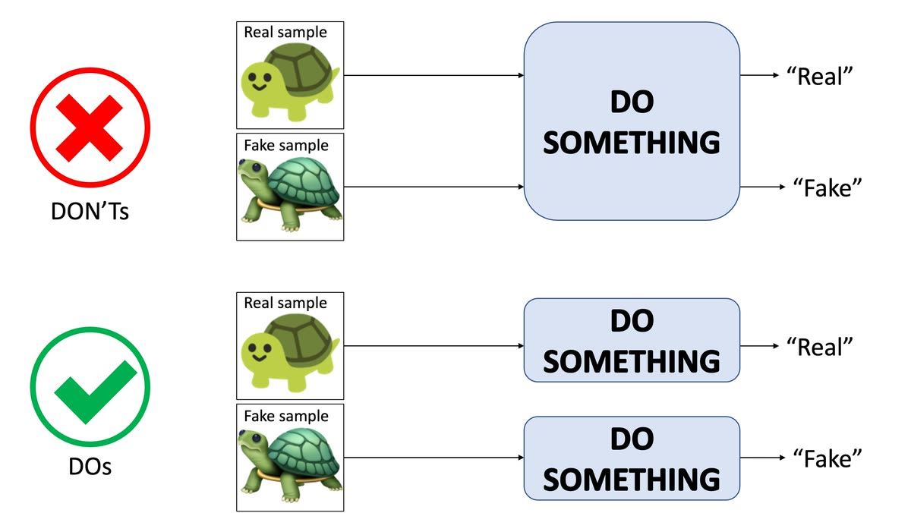

我不是设计师，但这些建议帮我提升了作品的清晰度。

希望它们对你也同样有用！

你画概览图最喜欢的技巧是什么？

## 如何做出好的表格？

原帖：<https://x.com/jbhuang0604/status/1626372600824844289> · 2023-02-17 · 共 8 条串文

如何做出好的表格？

读研时，我以为把实验数据一股脑倒进表格里，论文的活就干完了。🤦‍♂️

看看下面这些帮你提升表格质量的建议！🧵

*1⃣ 避免竖线*

表格里的竖线几乎总会降低可读性。无论如何都要避免。


*2⃣ 永远不要用双线*

忍不住想用双线（\hline）？

试试 booktabs 宏包的 \toprule、\midrule、\bottomrule 吧！瞬间让你的表格上一个档次！


*3⃣ 标注列的含义*

用上下箭头让读者知道该如何解读数字。

加上单位，让读者理解数字的含义。


*4⃣ 对齐所有东西*

• 文字左对齐
• 数字居中对齐
• 数字按小数点对齐


*5⃣ 给结果分组*

有两组或更多结果，又忍不住想用竖线分隔？

\multicolumn 来救场！

记得用 \cmidrule 把对应的列分组！


*6⃣ 用属性安排行*

一张表，一个信息。不要把所有的结果混在一起。

如果可能，用「属性」来组织不同的行，让读者容易理解/比较不同行的结果。


希望有帮助！

一个干净清晰的表格绝对能让你的信息传达得更有效！

你最喜欢的做表技巧是什么？

### 作者补充回复

@ccrommel 图擅长展示*总体趋势*。
表擅长展示*具体数字*。

你的表很容易被后续工作复用，图则不然。

<https://x.com/jbhuang0604/status/1626813373537984512>

## 论文里怎么写数学？

原帖：<https://x.com/jbhuang0604/status/1643118681960923137> · 2023-04-04 · 共 11 条串文

论文里怎么写数学？

数学让你能精确、简洁地传达想法。但怎样才能写得清楚？🤔

看看一些高层面的建议（附带例子）。🧵

*要可读*

数学写作是「自然语言」和「数学语言」的融合。它应该是*可读的*。


*遵循好风格*

• 数学中的文本：用 \mathrm
• 转置：用 ^\top 而不是 ^T
• 大括号：用 \left 和 \right


*提到记号时同时给出它的名称*

没有比来回翻页找记号含义更让人抓狂的事了。


*给每个公式起名字*

你的读者会感谢你！


*用一致的格式书写*

减轻读者的心智负担。


*避免多余的记号*

如果不会再用到，就不要引入不必要的记号。


*定义记号和宏*

用描述性的名字作为宏。
这有助于避免论文中记号不一致。


*简化记号*

例如，避免带括号的下标


*正确使用负数*

你的 LaTeX 编辑器会把「-」解析成连字符。请改用 $-1$。


资源/参考：

看看这些优秀资源！
https://www.robots.ox.ac.uk/~phst/Style/Ten_Rules.pdf

https://cs.dartmouth.edu/~wjarosz/writing.md.html

https://www.ece.ucdavis.edu/~jowens/commonerrors.html

https://people.csail.mit.edu/fredo/PUBLI/writing.pdf

相关链接：
- <https://www.robots.ox.ac.uk/~phst/Style/Ten_Rules.pdf>
- <https://cs.dartmouth.edu/~wjarosz/writing.md.html>
- <https://www.ece.ucdavis.edu/~jowens/commonerrors.html>
- <https://people.csail.mit.edu/fredo/PUBLI/writing.pdf>

## 如何准备期刊回复信？

原帖：<https://x.com/jbhuang0604/status/1387148974377865219> · 2021-04-27 · 共 7 条串文

分享一些撰写修改回复信的思路。

向期刊投稿时，几乎必然会收到编辑给出的大修/小修意见。我们该如何回应？

看看示例 https://www.overleaf.com/read/ccjtfbxcnvkv
以及下面的一些建议 💡

相关链接：
- <https://www.overleaf.com/read/ccjtfbxcnvkv>
- <https://t.co/AWdUUbU3nd> — Overleaf, Online LaTeX Editor

*现在就做*

会议 rebuttal 里你承诺「将会」做出的修改；期刊回复信则应展示你「已经」做出的修改。

尊重审稿人的时间，遵循核心原则：清楚、自包含、详尽。

▶ [GIF 动画（点击播放）](../media/1387148982753939467-1.mp4)

*一次回应一条意见/问题*

审稿人常常会写好几大段意见。把意见拆解、组织成「一口大小」的问题，这样你能直接用证据回应。

▶ [GIF 动画（点击播放）](../media/1387148991410974723-1.mp4)

*要详尽*

妥善回应审稿人的「所有」意见，包括你不同意的（例如解释为什么不能补充 X 基线、为什么不在 Y 数据集上运行）。不这么做只会让你的论文被不必要地拖延。

▶ [GIF 动画（点击播放）](../media/1387148999531143171-1.mp4)

*自包含*

• 有新的图/表？加进回复信。
• 修改了文字？展示修改「之前」和「之后」的文本。
• 附上一份带高亮修改的稿件。

不要让审稿人去解决心智配对问题。

https://x.com/jbhuang0604/status/1279992087497314305?s=20

> **引用 [@jbhuang0604](https://x.com/jbhuang0604)**：
>
> 分享一个我觉得对论文写作很有用的想法：
>
> 不要让别人去解决「对应关系」问题。
>
> 下面是一些 Do 和 Don't 的例子：
>
> *图*：不要让别人把 (a)、(b)、(c)……和图注中的描述一一配对。

*要主动*

审稿人 2 的问题：你是怎么设 $K$ 的值的？灵敏度很重要。

Lvl 1：凭经验。
Lvl 2：我们通过交叉验证选 K。
Lvl 3：展示整个过程。讨论 K 的取值在验证集上的灵敏度。

▶ [视频（点击播放）](../media/1387149035635625992-1.mp4)

*礼貌且专业*

把审稿人当作帮你改进工作的同事。他们常常帮你指出缺陷、提供宝贵建议。谢谢他们。

▶ [GIF 动画（点击播放）](../media/1387149045030850560-1.mp4)

## 如何准备补充材料？

原帖：<https://x.com/jbhuang0604/status/1592563395936817154> · 2022-11-15 · 共 7 条串文

如何准备补充材料？

投稿时附上补充材料已成惯例。但为什么要准备、准备什么、怎么准备高质量的补充材料，很多低年级学生并不清楚。😕

下面分享一些思路 🧵

*为什么需要补充材料？*

当审稿人 2 审你的论文时，脑子里唯一的问题是：

「我怎样才能干掉这篇论文？🧐」

• 表述不清？
• 细节不足？
• 验证没有说服力？

不要给他们任何理由。

▶ [GIF 动画（点击播放）](../media/1592563402819661824-1.mp4)

*是什么？—— 表述*

正文受页数限制，没法把工作讲清楚？

预判会被问到的问题！在补充材料里加入额外的图、表、证明和算法，能极大地缓解这些问题。

[](../media/1592563410725900290-1.mp4)

▶ [GIF 动画（点击播放）](../media/1592563410725900290-1.mp4)

*是什么？—— 细节*

可复现性是每个审稿人都关心的问题。

提供足够的方法、数据、方法论和评测协议的实现细节，让所有人都能复现你的发现。

▶ [GIF 动画（点击播放）](../media/1592563418573045762-1.mp4)

*是什么？—— 验证*

论文未必是展示实验验证的最佳格式。

例如，如果你的工作是视频，务必要展示视频结果（而不是抽帧）。

用图像展示视频，就像用一条一维扫描线展示一张图！

[](../media/1592563430267187201-1.mp4)

▶ [GIF 动画（点击播放）](../media/1592563430267187201-1.mp4)

*怎么做？—— 组织*

不要在没有清晰组织的情况下把所有内容一股脑倒出来。

我个人非常喜欢用本地（不依赖外部链接）HTML 文件来组织所有结果。交互式浏览非常方便。

https://alex04072000.github.io/SOLD/website/Obstruction_HTML_CameraReady/result.html

[](../media/1592563438320234496-1.mp4)

▶ [GIF 动画（点击播放）](../media/1592563438320234496-1.mp4)

相关链接：
- <https://alex04072000.github.io/SOLD/website/Obstruction_HTML_CameraReady/result.html>

希望这能给你准备补充材料提供一些初步思路！

祝投稿顺利！


## 如何引用论文？

原帖：<https://x.com/jbhuang0604/status/1672342931473137664> · 2023-06-23 · 共 10 条串文

如何引用论文？

正确引用论文可以
👉 把功劳给到应得的人，
👉 为你的论断提供支撑证据，
👉 呈现相关工作的有组织视图。

分享一些我觉得有用的建议。🧵


*括号式引用*

「括号式」：去掉引用之后，你的句子仍然应该说得通。

写相关工作时，把重点放在「故事」上，沿途引用相关论文。

这样才能呈现出有组织的、论文之间如何关联的图景。

[](../media/1672342941275398145-1.mp4)

▶ [GIF 动画（点击播放）](../media/1672342941275398145-1.mp4)

*叙述式引用*

这种风格常常以作者的名字开头。

例如：A 等人提出 X。B 等人探索 Y。

优点：想突出某项具体工作时很有用。

缺点：很容易写成糟糕的「流水账」。

[](../media/1672342953329557504-1.mp4)

▶ [GIF 动画（点击播放）](../media/1672342953329557504-1.mp4)

*给引用分组*

避免不加区分地罗列一长串引用。

❌ 最近的工作扩展了 X，以提升速度、质量和内存效率 [1, 2, 3, 4]。

✅ 最近的工作扩展了 X，以提升速度 [1]、质量 [2, 3] 和内存效率 [4]。

[](../media/1672342961730863107-1.mp4)

▶ [GIF 动画（点击播放）](../media/1672342961730863107-1.mp4)

*原地重复引用*

在合适的地方重复引用是没问题的，比如在表格里引用方法/数据集。

没有人能记住所有这些缩写。🥱

▶ [GIF 动画（点击播放）](../media/1672342970098413569-1.mp4)

*更宽的引用面*

如果可能，更广泛地引用相关工作。给别人功劳并不损害你的功劳。

作者发现自己的论文没被你引用时的实时画面：（配图）

[](../media/1672342978554216449-1.mp4)

▶ [GIF 动画（点击播放）](../media/1672342978554216449-1.mp4)

*BibTeX 格式（会议/期刊）*

永远不要相信从 Google Scholar 下载的 BibTeX。

写得很烂！

手动修正这些条目。

会议 👉 inproceedings
期刊 👉 article

▶ [GIF 动画（点击播放）](../media/1672342986921844737-1.mp4)

*BibTeX 格式（label）*

我觉得 <第一作者姓氏><年份><标题首词> 这种标签风格很好用。

永远不要直接用 dblp 的 BibTeX label。

写得很烂！

你会很难分辨自己在引用哪篇论文。🥴

[](../media/1672342995281084417-1.mp4)

▶ [GIF 动画（点击播放）](../media/1672342995281084417-1.mp4)

*BibTeX 格式（宏）*

BibTeX 提供宏来帮助规范化你的引用。

对频繁引用的会议/期刊，用宏来保证全文引用格式一致。

▶ [GIF 动画（点击播放）](../media/1672343003665510401-1.mp4)

*BibTeX 格式（大小写）*

BibTeX 区分大小写。输入作者名、标题和期刊名时要小心。

需要保留大小写的地方用花括号 {} 包起来。

[](../media/1672343012087668740-1.mp4)

▶ [GIF 动画（点击播放）](../media/1672343012087668740-1.mp4)

# 演讲

## 如何开场演讲？

原帖：<https://x.com/jbhuang0604/status/1548882661581754370> · 2022-07-18 · 共 6 条串文

如何开场演讲？

大多数人一上来就是无聊的信息（比如重复主持人刚说过的话）和没有动机的技术细节。🥱

几分钟后，所有人都开始看手机！😱

怎么避免？这里有一个简单的模板。🧵

*钩子*

❌「大家好，我叫……我是……来自……我的研究……很高兴来到这里。今天我讲幻灯片上的这个标题。」

✅ 用故事、图片、惊人的统计数字、名言、问题、现场投票或猜谜游戏来开场。

[](../media/1548882682318393345-1.mp4)

▶ [视频（点击播放）](../media/1548882682318393345-1.mp4)

*过渡*

用钩子抓住所有人的注意力之后，平滑地过渡到你要讲的主题。

「我为什么要讲这个故事呢？」

「我为什么要展示这张图呢？」

「我看到大多数人都举手了。但实际上……」

[](../media/1548882706947358722-1.mp4)

▶ [视频（点击播放）](../media/1548882706947358722-1.mp4)

*预览*

现在你已经用钩子和过渡讲清了「为什么」要讲这个话题，接下来预览一下「要讲什么」。

关于如何组织演讲的更多内容：https://x.com/jbhuang0604/status/1509033327981965313

> **引用 [@jbhuang0604](https://x.com/jbhuang0604)**：
>
> 如何组织你的演讲？
>
> 资格考/开题/答辩/会议季就要到了！😱 怎样组织演讲才不会让委员会成员睡着？
>
> 一些我觉得有用的简单建议……👇

▶ [GIF 动画（点击播放）](../media/1548882714929020929-1.mp4)

*给听众的好处*

说服听众，为什么他们应该把接下来 40 分钟的生命（拿不回来的）花在听你的报告上。

你会回答什么问题？他们会学到什么？你的报告对听众有什么好处？

▶ [GIF 动画（点击播放）](../media/1548882723141550080-1.mp4)

祝演讲顺利！希望这个简单模板有帮助！

资源：

这个模板我是从下面两个视频里学到的：
https://www.youtube.com/watch?v=aGEFtRwPhE4
https://www.youtube.com/watch?v=LrjlW00kkws
它们帮了我大忙。一定要去看看！

相关链接：
- <https://www.youtube.com/watch?v=aGEFtRwPhE4>
- <https://www.youtube.com/watch?v=LrjlW00kkws>

## 如何结尾演讲？

原帖：<https://x.com/jbhuang0604/status/1549959041908150275> · 2022-07-21 · 共 6 条串文

如何结尾演讲？

你已经用一个精彩的故事开场，讲了一肚子了不起的工作。🤩

那么，怎么收尾？🤔

看看我喜欢的一个简单模板！🧵

*回望*

提醒大家「关键要点」是什么。

记住，听众的记忆缓冲区非常有限（通常不超过 3 个短语）。😵‍💫

👉 要可视化！要简洁！

[](../media/1549959049537519617-1.mp4)

▶ [GIF 动画（点击播放）](../media/1549959049537519617-1.mp4)

*展望*

为听众回答「接下来能做什么」这个问题。

❓他们可以去哪里了解更多？
❓有哪些令人兴奋的新方向可以探索？
❓他们如何应用你展示的酷东西？

👉 要可执行！

▶ [GIF 动画（点击播放）](../media/1549959057787740160-1.mp4)

*致谢*

把幕后英雄的名字和照片都亮出来！

功劳不像钱。把功劳给别人，你自己的功劳不会变少。

👉 要慷慨！

▶ [GIF 动画（点击播放）](../media/1549959065039765504-1.mp4)

*以总结页收尾，而不是「谢谢」页*

把总结页作为最后一页。这一页会在 Q&A 期间停留 5 分钟，帮助大家提出好问题。

不要浪费在毫无意义的「thank you slide」上。

👉 要有信息量！

▶ [GIF 动画（点击播放）](../media/1549959072174194688-1.mp4)

就这些！

希望这个简单模板能给你收尾演讲的思路！

1⃣ 回望
2⃣ 展望
3⃣ 致谢
4⃣ 以总结收尾

祝好运，去奉献一场精彩的报告吧！

▶ [GIF 动画（点击播放）](../media/1549959079581335557-1.mp4)

## 演讲中如何应对提问？

原帖：<https://x.com/jbhuang0604/status/1553583984948531205> · 2022-07-31 · 共 7 条串文

演讲中如何应对提问？

当学生时，我在报告后的 Q&A 环节总是压力山大。😵‍💫 很多时候我不知道怎么回应，只能愣在那里！🥶

分享一些我从别人那里学到的建议。🧵

*重新框定问题*

复述并总结关键问题有助于：
1⃣ 让提问者感到被倾听，
2⃣ 确认你回答的是正确的问题，
3⃣ 让其他听众理解这个问题，
4⃣ 给自己一点缓冲时间思考和规划回答。

▶ [GIF 动画（点击播放）](../media/1553583993643307008-1.mp4)

*简洁作答*

直接、简洁地回应问题。不要花 1 分钟翻幻灯片找那一页。😵‍💫

当你
- 很懂 👉 简洁回答。
- 不知道答案 👉 承认不知道，并承诺后续跟进。

▶ [GIF 动画（点击播放）](../media/1553584001373421568-1.mp4)

*把控节奏*

不要让刁难的问题打乱你的节奏，例如：

「回到未来」式提问：
👉 「我后面几页会讲到。」

纠缠不必要的细节：
👉 「非常乐意会后讨论。」

Schmidhuber 式提问：
👉 「我们的工作与它不同……」

[](../media/1553584048504799241-1.mp4)

▶ [GIF 动画（点击播放）](../media/1553584048504799241-1.mp4)

*检查听众是否跟上了*

❌ 「这部分有问题吗？」「清楚吗？」「合理吗？」

没人提问 👉 讲得清楚？
错 🫤，这可能意味着听众已经放弃或根本不在乎。

换成：
✅ 「我这里可以回答两个问题吗？」

▶ [GIF 动画（点击播放）](../media/1553584057174396928-1.mp4)

*预判并准备问题*

预判会被问什么，然后练习、练习、再练习。

会议报告的专业技巧：
👉 给你的 session chair 准备一两个问题。

这能帮他们问出好问题，也帮你回答得好。😎

▶ [GIF 动画（点击播放）](../media/1553584066301026305-1.mp4)

祝答题顺利！

希望这些能帮你为下一次报告做好更充分的准备！

很想学习更多你应对刁难问题的技巧！

## 如何展示折线图？

原帖：<https://x.com/jbhuang0604/status/1506101759911116809> · 2022-03-22 · 共 6 条串文（另有 1 条在 X 上已不可用）

如何展示折线图？

折线图非常适合描述两个变量之间的关系。

遗憾的是，大多数低年级学生会直接复制论文里的图放到报告里，造成许多困惑。😕

让我们一步步拆解……🧵


*第 1 步：讲 X 轴*

❌ 直接展示整张图。信息量太大根本没法消化。

✅ 只展示 *X-Y 坐标轴*（先不画线！）。说明你「怀疑」哪些因素会影响 Y 轴，例如时间、模型复杂度、数据集规模。

▶ [GIF 动画（点击播放）](../media/1506101769461456908-1.mp4)

*第 2 步：讲 Y 轴*

告诉我们……
👉 我们在衡量什么？
👉 数值越高越好还是越低越好？
👉 完美/oracle 曲线应该长什么样？

[](../media/1506101777367801859-1.mp4)

▶ [GIF 动画（点击播放）](../media/1506101777367801859-1.mp4)

*第 3 步：搭好舞台*

既然讲清了这张图在说什么，就开始搭舞台，展示：
✅ 朴素结果（例如随机猜测）
✅ 基线方法
✅ 竞争方法

▶ [GIF 动画（点击播放）](../media/1506101786406498304-1.mp4)

> ⚠️ 此处一条推文在 X 上显示为「不可用」（可能已删除），线程内容在此处不连续。

*第 5 步：比较*

不要只是展示，要建立联系并比较！

例如：
⏩（固定 Y 轴）我们的方法达到同样精度，但快 100 倍 / 只用了 5% 的训练数据
⏩（固定 X 轴）在同样的模型下，我们的方法把误差降低了 30%。

[](../media/1506101811375132673-1.mp4)

▶ [GIF 动画（点击播放）](../media/1506101811375132673-1.mp4)

*第 6 步：把结果放到语境中*

把数字转换成别人容易有概念的东西。

例如：
❌ 代码每秒处理一帧
✅ 对于一辆时速 90 公里的车，等我们处理完下一张图，车已经向前开了 25 米。


### 作者补充回复

@CrespoTR 对，没错。用动画会很好。或者做多张*局部*图，每页展示一张。

很多资深研究者的演讲都不怎么样。😬

自己多实验，摸索出属于你自己的风格。

<https://x.com/jbhuang0604/status/1506127240123273217>

@darkcorp 你可以在 @jcjohnss 的演讲里看到这些步骤的实际应用。

https://youtu.be/swg0wCRBUJE?t=349

<https://x.com/jbhuang0604/status/1506284766869565462>

## 如何准备报告幻灯片？

原帖：<https://x.com/jbhuang0604/status/1397058827405742085> · 2021-05-25 · 共 14 条串文

分享一些准备报告幻灯片的建议

最近参加了很多学期末的学位答辩和资格考。我在这里整理了一些常见问题，希望对一些人有用。

看看下面的线程 🧵！

*目录页*

我很惊讶有这么多报告以「目录」开场。

没有人，真的是没有人，会为这样的开场兴奋：「我先介绍问题，然后讨论相关工作，接着展示我们的方法，再给出一些结果，最后总结。」


*简洁*

不要把幻灯片当讲稿。

我给学生准备报告的经验法则：
• 绝不写完整句子（除非引用）
• 一律写单行句
• 每页不超过三行文字

[](../media/1397058838730268673-1.mp4)

▶ [GIF 动画（点击播放）](../media/1397058838730268673-1.mp4)

*表格*

你论文里的表格带着引用编号和对比方法，信息量很足，这很好。但原样搬到报告里就是灾难。

没人知道 [17]、[39] 是什么。要替听众高亮并解读关键结果。


*图*

解释你的图怎么读。X 轴/Y 轴是什么意思？不同线条代表什么？我们能从这张图学到什么？

如果打算跳过某些图的讨论，直接把它们删掉。

*有信息量的页标题*

不要把幻灯片最显眼的位置用来写「结果」「可视化对比」「消融实验」。

标题应该描述这一页要传达的「结论信息」。

▶ [GIF 动画（点击播放）](../media/1397058853779423233-1.mp4)

*最后一页*

不要停留在「谢谢观看」页。把主要结果/结论/贡献作为最后几页展示。这能提醒大家你做了什么，也有助于他们提出好问题。


*资源*

网上有很多优秀的资源，去看看吧！几个指路：

Patrick Henry Winston: https://ocw.mit.edu/resources/res-tll-005-how-to-speak-january-iap-2018/how-to-speak/

Matt Might: https://matt.might.net/articles/academic-presentation-tips/

Kristen Grauman: https://www.youtube.com/watch?v=4LEZED1YXm0

相关链接：
- <https://ocw.mit.edu/resources/res-tll-005-how-to-speak-january-iap-2018/how-to-speak/>
- <https://matt.might.net/articles/academic-presentation-tips/>
- <https://www.youtube.com/watch?v=4LEZED1YXm0>

*动画*

用动画把复杂的图/概念拆开，一步一步讲。

切换动画时，确保所有元素完美对齐，减少听众的心智负担。

[](../media/1397169302256693253-1.mp4)

▶ [GIF 动画（点击播放）](../media/1397169302256693253-1.mp4)

*视频*

把视频插入幻灯片（不要用 YouTube 内嵌），用动画控制它出现、播放、停止的时机。否则你会在演讲时忙着找鼠标去点播放。

▶ [GIF 动画（点击播放）](../media/1397169310590722049-1.mp4)

*细节程度*

学生倾向于把尽可能多的论文内容塞进报告。可以理解，毕竟都是辛苦做出来的。

但记住，听众更乐意看到一场简洁清晰的报告。

▶ [GIF 动画（点击播放）](../media/1397208899674062849-1.mp4)

*指示器*

如果你要指向幻灯片里的某个数字/文字/图，就加一个箭头/框/圈（带动画）指过去。不要用鼠标指针。

现场报告也不要用激光笔。没有比追踪一个抖动的红点更烦人的了。

▶ [GIF 动画（点击播放）](../media/1397230019118878733-1.mp4)

就这些（目前）！祝演讲顺利！

你最喜欢的演讲技巧（或最讨厌的做法）是什么？

*强调/弱化*

当你想强调某个核心信息或重要概念时，也要把其余内容「弱化」掉。

怎么做？加一个 10% 透明度的方块遮住其余内容。

▶ [GIF 动画（点击播放）](../media/1397349031983075329-1.mp4)

### 作者补充回复

@ftmguney 只是转述一些我从导师们那里得到的建议。希望能尽可能传递下去。:-)

<https://x.com/jbhuang0604/status/1397293363980869632>

@gvmcmurray @mlatgt 没错！听众很难同时做两件事。限制幻灯片上的文字也有助于准备更清晰的报告，因为我们必须提炼核心信息/想法。

<https://x.com/jbhuang0604/status/1397534898622279685>

## 如何组织你的演讲？

原帖：<https://x.com/jbhuang0604/status/1509033327981965313> · 2022-03-30 · 共 7 条串文

如何组织你的演讲？

资格考/开题/答辩/会议季就要到了！😱 怎样组织演讲才不会让委员会成员睡着？

一些我觉得有用的简单建议……👇

*目录页*

用一张「目录」幻灯片来组织演讲？

我想不出比用目录开场更弱的方式了！🥱

取而代之，开头先解释：
👉 他们为什么要在乎？

说明这个问题为什么重要、有趣、有挑战性。


*菜单，而不是目录*

做完动机铺垫后，展示一张「菜单」页，包含两三个「主菜」（你想在报告中覆盖的主题）。

为什么？
👉 因为菜单提供了一种简单的导航方式。

▶ [GIF 动画（点击播放）](../media/1509033339981869058-1.mp4)

*告诉他们你将讲什么*

展示所有主菜选项，然后高亮第一个（别忘了弱化其余选项）。

这让大家知道我们要往哪里去。

▶ [GIF 动画（点击播放）](../media/1509033347695140869-1.mp4)

*讲出来*

舞台已经搭好，直接讲吧！

在这里你可以用任意多页来介绍第一道主菜。

[](../media/1509033359678320640-1.mp4)

▶ [GIF 动画（点击播放）](../media/1509033359678320640-1.mp4)

*告诉他们你讲了什么*

讲完第一部分后，拉回到*同一张*菜单页。

✅ 总结你刚讲的内容
✅ 解释为什么需要看第二道主菜（记得强调/弱化不同的主菜）

然后重复这三步。

▶ [GIF 动画（点击播放）](../media/1509033367907491844-1.mp4)

*最后一页*

不要展示毫无意义的「谢谢观看」页。

在报告结尾回到你的「菜单」页，这样大家就能方便地「点菜」（也就是提出好问题）。

## 如何设计你的演示？

原帖：<https://x.com/jbhuang0604/status/1865199644415832424> · 2024-12-07 · 共 6 条串文

如何设计你的演示？

演示是学术工作者的必备技能。

在参加过那么多组会、资格考、答辩、研究报告和课程之后，我意识到自己可能一直都用错了方法……

一些（苦涩的）教训。👇

*页标题？*

「每一页都应该有信息量丰富的标题。」

我以前也这么想，但最近意识到这极大地限制了灵活性。

换个角度，把幻灯片当作视觉辅助。去掉所有标题之后，我幻灯片的清晰度大幅提升。

[](../media/1865199651650933062-1.mp4)

▶ [GIF 动画（点击播放）](../media/1865199651650933062-1.mp4)

*要点列表？*

「把你的要点总结成列表。」

空白幻灯片上那句「单击添加文本」会诱惑你把所有东西都变成要点列表。

但这会稀释你的信息，让人更难跟上。不如一次只讲一个想法。

[](../media/1865199658886152554-1.mp4)

▶ [GIF 动画（点击播放）](../media/1865199658886152554-1.mp4)

*转场*

我以前做幻灯片，每页都有自己的内容/主题/标题。但这样一来，每次翻页，听众的注意力都会被「重置」，打断专注。

现在，我完全拥抱平滑过渡（morph），让想法自然、连续地流动。

▶ [GIF 动画（点击播放）](../media/1865199665982951512-1.mp4)

*工具导向 vs. 问题导向*

讲一个主题时，我常常觉得必须先介绍技术背景 A、B、C，最后才说明它们与问题 X 的关系。

但这完全是本末倒置——人们为什么要关心？

不如讲一个「如何解决某个问题」的故事，沿途讨论所有工具/算法/背景。

▶ [GIF 动画（点击播放）](../media/1865199673251684678-1.mp4)

*「然后」vs.「但是，因此」*

报告里可能有主题 A、B、C。我以前按顺序讲——A，然后 B，然后 C。

但这对保持注意力来说糟透了。😱

不如围绕主题 A 讲一个故事：但是发生了很严重的问题，因此我们需要主题 B。但是 B 也有严重的问题，因此引出主题 C。

[](../media/1865199681158209850-1.mp4)

▶ [GIF 动画（点击播放）](../media/1865199681158209850-1.mp4)

## 如何避免演示中的常见错误？

原帖：<https://x.com/jbhuang0604/status/1866987294894231756> · 2024-12-11 · 共 8 条串文

演示中你应该避免说的话

……以及你听众内心最坦率的 OS。🧵

「清楚了吗？有问题吗？（……尴尬的沉默）」

不，一点都不清楚。不清楚到我甚至不知道从哪里问起，才不会显得像个彻底的傻瓜。

▶ [GIF 动画（点击播放）](../media/1866987301919920604-1.mp4)

「如果这部分不清楚请告诉我，我很乐意再解释一遍。」

算了，谢谢，我已经对你解释这件事的能力失去信心了。我们能往下走、假装什么都没发生吗？

[](../media/1866987309154947450-1.mp4)

▶ [GIF 动画（点击播放）](../media/1866987309154947450-1.mp4)

「（……大讲一通细节……）这些细节都不重要，重要的是……」

那……那你为什么要浪费我时间？

▶ [GIF 动画（点击播放）](../media/1866987316096504290-1.mp4)

「呃，我想说的是……」

能先自己把话想清楚吗？

▶ [GIF 动画（点击播放）](../media/1866987323029852253-1.mp4)

「这一页有点满。不过你先忽略这张图和那张图。」

「准备」这两个字听说过吗？

▶ [GIF 动画（点击播放）](../media/1866987330382467382-1.mp4)

「我知道这让人困惑。」

那就直说你恨我们算了……

▶ [GIF 动画（点击播放）](../media/1866987337873494298-1.mp4)

「我快没时间了，所以接下来一分钟我要飞快过完 20 页。」

我真该坐到后门旁边。

[](../media/1866987345947529640-1.mp4)

▶ [GIF 动画（点击播放）](../media/1866987345947529640-1.mp4)

## 如何用故事结构组织你的演讲？

原帖：<https://x.com/jbhuang0604/status/1983579012476621192> · 2025-10-29 · 共 3 条串文

如何组织你的演讲？

我以前这样做报告，觉得自己「学术」「有条理」「专业」。

但是，从听众视角看，这糟透了。😱

看看他们为了听懂你在说什么，需要维持多长的上下文记忆！


这里有一个简单的修正：

不要只是罗列信息，而是讲一个故事。

讲你如何遇到一个问题、解决它、引出新的冲突、再化解它，如此往复。

不断制造好奇心闭环，让你的听众保持投入、不断被重新抓住。


感谢来听我的 TED 演讲

### 作者补充回复

@tin_ng_qn 这个话题以前有个线程。

https://x.com/jbhuang0604/status/1553583984948531205

<https://x.com/jbhuang0604/status/1983978885894304143>

@igilitschenski 同意——有一个统一的主题，并在开头告诉听众他们会看到什么，是合理的。

对于较长的演示，这两种风格结合使用效果应该不错。

<https://x.com/jbhuang0604/status/1984016967548989799>

# 海报展示

## 如何做学术海报？

原帖：<https://x.com/jbhuang0604/status/1438948793718804486> · 2021-09-17 · 共 9 条串文

如何做学术海报？

海报展示是展示研究、与研究者交流、获取反馈的绝佳（且有趣的！）方式。但怎样才能做好一张海报？🤔

以下是我的一点浅见 🧵

*摘要*

海报是一份「视觉摘要」。请不要把论文摘要直接倒上去。你的任务是让人兴奋起来，然后去读你的论文。

你的海报应该
• 零完整句子
• 只有单行句

▶ [GIF 动画（点击播放）](../media/1438948802979942414-1.mp4)

*论文/网站/数据的链接*

提供简单的方式，帮听众进一步了解你的工作！

例如：
• 在海报顶部放一个二维码。
• 用一个*自定义*短链（没人记得住 https://bit.ly/3tPGM3x 这种随机串）

▶ [视频（点击播放）](../media/1438948810810593285-1.mp4)

相关链接：
- <https://bit.ly/3tPGM3x>

*提炼论文的关键信息*

接受一个事实：你不可能把论文里的所有东西都搬到海报上。无情地删掉所有不重要的细节/结果。

▶ [GIF 动画（点击播放）](../media/1438948819258036224-1.mp4)

*对齐所有元素*

你的海报通常有多个内容块，例如问题、核心想法、方法、结果。把所有块在水平和垂直方向对齐，让海报平衡、悦目。

▶ [GIF 动画（点击播放）](../media/1438948827969564676-1.mp4)

*参考文献*

不要简单复制粘贴论文里的大表格。没人知道 [14] [42] [57] 是什么。

简化、可视化关键结果。把数字引用替换成 [姓名-会议-年份]。

▶ [GIF 动画（点击播放）](../media/1438948839638114304-1.mp4)

*配色*

不必好看，但请不要灼伤别人的视网膜……


*重要信息放在顶部*

这主要适用于线下会议。当海报前挤满人时，只有顶部区域对所有人可见。把更重要的内容放在那里。

[](../media/1438948853538082817-1.mp4)

▶ [GIF 动画（点击播放）](../media/1438948853538082817-1.mp4)

*写讲稿*

写下你 1-2 分钟的电梯演讲，以便快速讲清工作要点。听一场冗长且没有条理的海报讲解非常烦人（而且打断你想走又很尴尬）。

▶ [GIF 动画（点击播放）](../media/1438948865105973255-1.mp4)

## 如何在会议上做海报展示？

原帖：<https://x.com/jbhuang0604/status/1518097856325996545> · 2022-04-24 · 共 13 条串文

如何在会议上做海报展示？

海报展示是传播研究成果、深入讨论、拓展人脉的绝佳方式！

以下是一些让你表现得像个专业人士的建议！👇

*热情迎客*

✅ 站在海报侧面。
✅ 永远不要面朝海报、背对听众。
✅ 主动上前招呼路过的人。

▶ [GIF 动画（点击播放）](../media/1518097864601358336-1.mp4)

*保持热情*

如果你自己都对工作不兴奋，别人为什么要兴奋？

给自己打打气！🤗

人们能感受到正能量，也更愿意了解你的工作。

▶ [GIF 动画（点击播放）](../media/1518097872050339842-1.mp4)

*早到、晚走*

在正式海报时段的*之前*和*之后*，人都更少。

不要错过与真正对你工作感兴趣的人进行有趣长谈的好机会。

▶ [GIF 动画（点击播放）](../media/1518097879574921216-1.mp4)

*简洁*

❌ 从上到下线性讲 10 分钟。
✅ 用 30 秒做电梯演讲。先勾起兴趣，然后回应问题。

▶ [GIF 动画（点击播放）](../media/1518097887086919680-1.mp4)

*善用工具*

海报只是一个*静态*视觉摘要。

如果你的工作涉及其他*动态*媒介（例如视频、声音），带一台笔记本或平板会让展示生动得多。

▶ [GIF 动画（点击播放）](../media/1518097894611595265-1.mp4)

*别说「你知道 X 吗？」*

是的，你的初衷是好的，但这只会让别人觉得自己很蠢。

用 10 秒给个背景，然后重点讲*你的工作*。

[](../media/1518097902022889472-1.mp4)

▶ [GIF 动画（点击播放）](../media/1518097902022889472-1.mp4)

*讲义*

把迷你海报打印若干份作为讲义，发给想进一步了解的人。

确保海报上有链接/条形码指向你的项目主页。

▶ [GIF 动画（点击播放）](../media/1518097909488705537-1.mp4)

*积累人脉*

• 感谢*每一位*驻足你海报和/或提出好问题的人。
• 说出他们的名字（或问对方名字怎么念）。

👉 这样下次你就能主动打招呼，关系就建立起来了。

▶ [GIF 动画（点击播放）](../media/1518097916824539137-1.mp4)

*把人带到学生海报前*

资深人士：把你认识的资深同行带到你学生的海报前！

没有什么比向自己仰慕的研究者展示工作更令人振奋了。

▶ [GIF 动画（点击播放）](../media/1518097924290490368-1.mp4)

*先做好海报*

要做好海报展示，你得先有一张好海报！

海报本身很糟糕，任何展示技巧都救不回来。

https://x.com/jbhuang0604/status/1438948793718804486

> **引用 [@jbhuang0604](https://x.com/jbhuang0604)**：
>
> 如何做学术海报？
>
> 海报展示是展示研究、与研究者交流、获取反馈的绝佳（且有趣的！）方式。但怎样才能做好一张海报？🤔
>
> 以下是我的一点浅见 🧵

[](../media/1518097931534012417-1.mp4)

▶ [GIF 动画（点击播放）](../media/1518097931534012417-1.mp4)

*与共同作者分享反馈*

海报时段一结束就立刻记录反馈和问题。

与共同作者分享，让大家都能从中学习。

▶ [GIF 动画（点击播放）](../media/1518097939209535488-1.mp4)

祝海报展示顺利！

会很累，但我保证也会非常有成就感！

你最喜欢的海报展示建议是什么？

## 如何修改学术海报？

原帖：<https://x.com/jbhuang0604/status/1974198882906325054> · 2025-10-03 · 共 18 条串文

如何修改学术海报？

设计清晰的海报是学生必备的技能。我们最近为上周展示的一篇论文修改了一张海报。

但是，与其只让一个学生从这个过程中受益，我把它分享出来，希望有人觉得有用。🧵

初稿里，通常会把论文大部分图表直接放进海报。

这是个不错的起点。

但是，这往往导致细节过多，反而让海报更难传达主要信息。


第二稿中，我们突出了关键信息（问题、核心想法、结果）。

但是，仍有很多设计/排版/写作上的选择可以改进。

让我们仔细看看，好吗？


很多海报上都有这类校徽。

但是，其实没人认识，而且太小根本看不清。🔍

更好的做法是直接把机构名称写出来。

作者列表很重要。

作为低年级学生，你希望这部分清楚、显眼，让别人记住你。

细节：
- 放大
- 用空格代替逗号
- 修正上标
- 用换行让作者列表居中


这里，@JayLEE_0301 以一个问句开头。

但是，这个问句有两个问题：
- 1）不清楚「structured」或「human-like」具体指什么
- 2）这句话有两行

永远写单行句！没人有时间读！


要点列表

每当我们用要点列表时，都应使用平行表述（平行结构）。

这能降低读者解析文本时的认知负担。

（我不太喜欢用很多颜色，但还行，因为它们有助于与其他部分建立对应）


建立对应关系！

修改前：
- 标题与图之间关系不清
- 图标风格不一

修改后：
- 用标题把三张图串起来
- 放大文字标注。


稍微改进一下插图。

这里我们要传达「可能的结果」这一概念（例如，悬空的方块会滑落）。

但是，我们只展示了最终状态。

加上「历史」和「轨迹」能让这个错觉更清楚。


写作要简洁，无论如何都要避免多行句子！


现在看中间一列。

这里句子用了平行结构，很好！

但是，排版没有强化这个平行概念。

让我们把它们对齐，让平行结构一目了然。


方法概览图很棘手。

它需要恰当的抽象层次，同时又有足够的细节说明它如何工作。

这里我们调整了布局、加了几个标注来提升清晰度。


除非是引用，否则避免写完整句子。

你原本想写的那些句子，是演讲时要「说」的内容。

让大家把注意力放在你身上，而不是海报/幻灯片上。


结果部分，初稿也是又一个列表。

我觉得换个方式，把它视觉化呈现会很有趣。

可惜我被告知机器人领域的人相当保守，不会喜欢这样。

所以我的修改建议被否决了……


修改前：

原始结果呈现有两个问题：
- 文字不在同一行，对应关系不清
- 蓝色有点随意

修改后：
- 修正对齐
- 用绿色唤起「增益」的概念（来自股市）


用表格展示结果时，务必加上注释（例如成功率）来提供背景。

没有这些信息，读者很难准确解读结果。


把所有这些合到一起。这是修改后的海报。

仍有很多可改进的地方，比如概览图、文字过多、颜色过多、版式设计。

但经过这些修改，现在它已经是一张像样的海报展示了！


这是三个版本海报的 PPT 文件。

https://www.dropbox.com/scl/fi/abjsbt44tfyfxr2exqfc9/poster_IVE.pptx?rlkey=gbhtuyq2a3iqtbsmccpjlyvfu&dl=0

感谢 @JayLEE_0301 的海报设计/修改！

如果你感兴趣，可以看看这项研究：https://ive-robot.github.io/

相关链接：
- <https://www.dropbox.com/scl/fi/abjsbt44tfyfxr2exqfc9/poster_IVE.pptx?rlkey=gbhtuyq2a3iqtbsmccpjlyvfu&dl=0>
- <https://ive-robot.github.io/>
- <https://t.co/9WatO94NV7> — poster_IVE.pptx

# 沟通

## 如何用视频展示你的工作？

原帖：<https://x.com/jbhuang0604/status/1752768310087737588> · 2024-01-31 · 共 14 条串文

如何用视频展示你的工作？

作为学术工作者，我们习惯于用静态的文字、图表来分享和沟通工作。

但很多时候，视频是更清晰传达想法的媒介。

下面分享一些我学到的技巧 🧵

*一开始就满足期待*

我以前觉得开场应该先自我介绍、讲问题多重要、（一大堆不相关的）相关工作，才显得「学术」。

不如直接、具体一点！

示例：https://youtu.be/IfHiGSsm7K0

▶ [视频（点击播放）](../media/1752768311526408606-1.mp4)

相关链接：
- <https://youtu.be/IfHiGSsm7K0>

*权衡空间与时间*

• 空间：你塞进一帧的内容
• 时间：帧的序列

想想你要传达什么（结果？对比？），据此来编排视频。

示例：https://youtu.be/VizL7q9o-5Y

▶ [视频（点击播放）](../media/1752768313153761699-1.mp4)

相关链接：
- <https://youtu.be/VizL7q9o-5Y>

*用动画呈现数学推导*

让你的演示保持一致。这种一致性思维同样适用于数学推导。

不要用堆满公式的帧，改用简单的平滑过渡来更好地说明。

示例：https://youtu.be/i2qSxMVeVLI

▶ [视频（点击播放）](../media/1752772130264014947-1.mp4)

相关链接：
- <https://youtu.be/i2qSxMVeVLI>

*使用视觉指示*

当画面元素繁杂时，指出来你正在讲什么会很有帮助。

示例：https://youtu.be/i2qSxMVeVLI

▶ [视频（点击播放）](../media/1752772131694199021-1.mp4)

相关链接：
- <https://youtu.be/i2qSxMVeVLI>

*音效——动作*

给视频加上简单音效能提升信息清晰度。

这是一个展示「裁剪」动作音效的例子。

示例：https://youtu.be/8vi5K8pTM3c

▶ [视频（点击播放）](../media/1752772132956737752-1.mp4)

相关链接：
- <https://youtu.be/8vi5K8pTM3c>

*音效——语义*

音效也能帮助强化视觉元素的语义（例如「哞～～」）。

示例：https://youtu.be/i2qSxMVeVLI

▶ [视频（点击播放）](../media/1752772690803318814-1.mp4)

相关链接：
- <https://youtu.be/i2qSxMVeVLI>

音效——表达情绪

没人给你喝彩？自己给自己打气！

示例：https://youtu.be/VizL7q9o-5Y

▶ [视频（点击播放）](../media/1752773671272190005-1.mp4)

相关链接：
- <https://youtu.be/VizL7q9o-5Y>

*音效——表现意外结果*

用「故障」音效来表现意外。

示例：https://youtu.be/m_-mNNrhvgc

▶ [视频（点击播放）](../media/1752773672476049796-1.mp4)

相关链接：
- <https://youtu.be/m_-mNNrhvgc>

*音乐——压音（ducking）*

有背景音乐很好。

但有时它会干扰你的讲述。

加上 ducking 效果，让音量动态变化。

示例：https://youtu.be/Rkt2EeHHbHI

▶ [视频（点击播放）](../media/1752773674183131423-1.mp4)

相关链接：
- <https://youtu.be/Rkt2EeHHbHI>

*音乐——画面卡点*

听着音乐，让剪辑跟节拍对上！

示例：https://youtu.be/o-tljMgkGew

▶ [视频（点击播放）](../media/1752774360136348074-1.mp4)

相关链接：
- <https://youtu.be/o-tljMgkGew>

*音乐——J-cut 与 L-cut*

一直画面配音乐会无聊。试试不同的剪辑方式，让视频节奏更好。

J-cut：先出声，后出画面
L-cut：先出画面，后出声

这是一个 J-cut 的例子。

示例：https://youtu.be/VizL7q9o-5Y

▶ [视频（点击播放）](../media/1752774859267178990-1.mp4)

相关链接：
- <https://youtu.be/VizL7q9o-5Y>

*音效——与画面匹配*

文字用打字机效果出现？
-> 加打字音效

图片做动画？
-> 加鼠标点击音效

示例：https://youtu.be/ihDbAUh0LXk

▶ [视频（点击播放）](../media/1752777079790145938-1.mp4)

相关链接：
- <https://youtu.be/ihDbAUh0LXk>

*保持讲述的一致性*

用一致的图形/记号/颜色/运动方式，帮听众理解事情如何运作。

示例：https://youtu.be/ljar4GAFkUk

▶ [视频（点击播放）](../media/1752777081119711646-1.mp4)

相关链接：
- <https://youtu.be/ljar4GAFkUk>

## 如何传播你的研究？

原帖：<https://x.com/jbhuang0604/status/1379448897823776769> · 2021-04-06 · 共 20 条串文

分享关于如何传播研究的想法。

「我非常激动地分享，我们的论文被……接收了！」

恭喜！然后呢？没有人会去翻几千篇被接收论文的列表。没人有那个时间。

看下面的线程 🧵 找例子。

*网站*

给项目网站用容易记的域名，方便别人找到/分享链接。没有学校账号？没关系。为 GitHub 页面注册一个新域名。

例如：
• http://oops.cs.columbia.edu/
• http://crowdsampling.io/
• http://robust-cvd.github.io/

相关链接：
- <http://oops.cs.columbia.edu/>
- <http://crowdsampling.io/>
- <http://robust-cvd.github.io/>

*缩写（Acronym）*

让人容易记住和称呼你的工作。正如 David Patterson 所说，元音很重要。

例如，NeRF 听起来比 NRF 酷多了。

▶ [视频（点击播放）](../media/1379448946406346758-1.mp4)

*结果视频*

做一段简单视频，展示你工作里最亮眼的结果！按我粗略估算，我得在 Zoom 海报时段连续讲 18 年这篇 ECCV 论文，才能达到同样的曝光度。

https://x.com/jbhuang0604/status/1301899594838704128?s=20

> **引用 [@jbhuang0604](https://x.com/jbhuang0604)**：
>
> 非常激动地在 #ECCV2020 分享我们的视频补全工作！🤩我们的方法能从随手拍摄的视频中无缝移除物体、水印，或扩展视野。
>
> 论文：https://t.co/JwT9bYN85V
> 项目：https://t.co/7raLq7jVQx
>
> 与 @gaochen315、Ayush 和 @JPKopf 合作

*论文视频*

有一段介绍论文精髓的短视频，可以说是最好的。

我喜欢的例子：
• https://www.youtube.com/watch?v=EpH175PY1A0 （@jon_barron）
• https://www.youtube.com/watch?v=K3z68mOLbNo （@AbeDavis）
• https://www.youtube.com/watch?v=sA4Za3Hv6ng （@JPKopf）

相关链接：
- <https://www.youtube.com/watch?v=EpH175PY1A0>
- <https://www.youtube.com/watch?v=K3z68mOLbNo>
- <https://www.youtube.com/watch?v=sA4Za3Hv6ng>
- <https://t.co/tQnG4k25Od> — Mip-NeRF: A Multiscale Representation for Anti-Aliasing Neural Radiance Fields

*可下载的结果*

不要把结果视频放在 YouTube 上再内嵌到网站。要让人非常容易地下载（并分享）你的结果。帮助别人帮你传播工作。

不要限制图片/视频大小，尽可能分享最高质量。

*额外结果*

很多时候，你需要花很大力气在多个数据集上构造基线结果。把它们公开出来，方便别人跟进。例如，这项工作的许多引用并不是冲着具体技术贡献来的。

*补充网站*

把跨数据集、方法和消融的所有结果整理到一个网页上。这让「所有人」（包括我自己）都能交互式地查看结果。

示例：
https://alex04072000.github.io/ObstructionRemoval/website/Obstruction_HTML_CameraReady/pages/reflection.html

相关链接：
- <https://alex04072000.github.io/ObstructionRemoval/website/Obstruction_HTML_CameraReady/pages/reflection.html>

*GitHub*

不要把杂乱的研究代码直接丢到 GitHub 上。写清楚说明，简化让代码跑起来所需的步骤。

我喜欢的例子：
- https://github.com/junyanz/pytorch-CycleGAN-and-pix2pix （@junyanz89）
- https://github.com/NVlabs/stylegan2

相关链接：
- <https://github.com/junyanz/pytorch-CycleGAN-and-pix2pix>
- <https://github.com/NVlabs/stylegan2>

*Colab*

不是所有人都有知识/资源在你的 GitHub 代码上搭环境。准备一个 Colab notebook demo（或其他平台），让所有人都能玩一玩你的方法。

*arXiv*

把你所有的论文都放到 arXiv 上。论文被付费墙挡住非常让人沮丧。在特定时间发布论文还能进一步提升曝光/阅读量/影响力。

https://x.com/jbhuang0604/status/1337985347733622788?s=20

> **引用 [@jbhuang0604](https://x.com/jbhuang0604)**：
>
> 你有没有想过，为什么顶尖大学/研究机构的论文经常出现在 arXiv 每日邮件和网页公告的前列？
>
> 为什么会这样？我为什么要在意？

*Teaser 图片/视频*

在发表页面上展示 teaser 图片/视频，让访客能快速浏览你的所有工作。花力气优化 teaser 的质量！相信我，绝对值得。

https://filebox.ece.vt.edu/~jbhuang/#pubs

相关链接：
- <https://filebox.ece.vt.edu/~jbhuang/#pubs>

*互动*

在社交媒体或其他网站（例如 Twitter、YouTube、HackerNews、Reddit……）分享时，与评论你工作的人互动，哪怕有时会遇到恶意评论。时间一长，他们会成为你最好的盟友。

▶ [GIF 动画（点击播放）](../media/1379522270146793477-1.mp4)

*超链接*

确保每个页面都有指向其他页面的超链接。例如，加上作者主页、相关项目、GitHub/Colab、数据集、YouTube 视频、额外结果的链接。让内容能通过多条路径方便导航。

▶ [GIF 动画（点击播放）](../media/1379549674688946180-1.mp4)

*BibTeX*

大家都知道 Google Scholar 的 bibtex 有错。帮读者一个忙，让大家能正确引用你的论文。

*论文标题*

标题应当抓住论文「特别」的地方。看看 Jitendra Malik 关于论文标题的演讲。

顺便说一句，整个 workshop 都很棒，去看看！
https://www.cc.gatech.edu/~parikh/citizenofcvpr/

▶ [视频（原视频已失效，需在线播放）](https://x.com/jbhuang0604/status/1379653498837602309)

相关链接：
- <https://www.cc.gatech.edu/~parikh/citizenofcvpr/>

*音乐*

什……什么？！音乐和研究有什么关系？有！它能让你的视频更吸引人、更好看。如果可能，让转场跟上音乐的节拍。

我喜欢的例子：
https://youtu.be/rHnOr3oZ5VI

https://youtu.be/KO3sULs4hso

https://youtu.be/VjR11gkmm3E （@holynski_）

相关链接：
- <https://youtu.be/rHnOr3oZ5VI>
- <https://youtu.be/KO3sULs4hso>
- <https://youtu.be/VjR11gkmm3E>

*网站模板*

不会写响应式网页的 HTML？好模板就是你的朋友！

我喜欢的例子：
• https://nerfies.github.io/
• https://richzhang.github.io/colorization/
• https://alex04072000.github.io/ObstructionRemoval/

相关链接：
- <https://nerfies.github.io/>
- <https://richzhang.github.io/colorization/>
- <https://alex04072000.github.io/ObstructionRemoval/>

*链接同期工作*

给读者呈现一幅完整的同期工作图景。

「功劳不像钱。把功劳给别人，不会减少你的论文得到的认可。」——Simon Peyton Jones

例如：
• https://phog.github.io/snerg/
• https://alexyu.net/plenoctrees/

相关链接：
- <https://phog.github.io/snerg/>
- <https://alexyu.net/plenoctrees/>

*易于安装*

你的工作/代码对别人来说安装越简单，被采用就越广。

例如：
• pip install（@rzhang88）
• PyTorch hub

### 作者补充回复

@Samujjwal_Sam 绝对的！想想那些花在文献调研、研究讨论、实现、实验和写作上的无数小时。我会说，花在传播上的时间是最大化影响力最具性价比的投入。

<https://x.com/jbhuang0604/status/1379531097344765953>

@LChoshen 我不是专家，所以我的建议仅供参考。

开头几秒对抓住注意力非常重要。展示你「最棒」的结果，而不是无聊的标题/作者/机构页（除非你很有名）。只保留你工作的精华。

<https://x.com/jbhuang0604/status/1384226958016356354>

## 如何提研究问题？

原帖：<https://x.com/jbhuang0604/status/1472808608874352641> · 2021-12-20 · 共 7 条串文

如何提研究问题？

Zoom 疲劳是真的 😱。当你完全不知道学生的工作内容时（因为你一直在刷 Twitter），你怎么给学生反馈？下面是一些可以直接拿来用的模板问题。🧵

*我（或别人）为什么要在乎？*

你的工作将如何改变这个领域？这能提醒学生找到工作的核心动机。

▶ [GIF 动画（点击播放）](../media/1472808617472581632-1.mp4)

*你什么时候会用到它？*

把研究工作与实际应用联系起来，有助于发现潜在的不现实约束/假设。

▶ [GIF 动画（点击播放）](../media/1472808624871428098-1.mp4)

*别人做过什么，为什么还不够好？*

如果已有方法已经很好用了，你为什么还需要做这个研究项目？

▶ [GIF 动画（点击播放）](../media/1472808632429461505-1.mp4)

*最接近的相关工作是哪篇，你的有何不同？*

清楚表达你工作的核心新意。

▶ [GIF 动画（点击播放）](../media/1472808640532860929-1.mp4)

*你怎么知道它有效（比先前工作更好）？*

所有论断都被验证了吗？实验公平吗？结果对应用领域有代表性吗？

▶ [GIF 动画（点击播放）](../media/1472808648250466306-1.mp4)

*如果再多三个月，你会做什么？*

想一想在给定时间预算下，如何最大化地强化这项工作。

▶ [GIF 动画（点击播放）](../media/1472808656093777921-1.mp4)

### 作者补充回复

@usamakhawajaa 对，如果你的导师是那样，快跑。（不过这个线程说的不是博士指导）

<https://x.com/jbhuang0604/status/1473301358325424133>

## 如何改善异步沟通？

原帖：<https://x.com/jbhuang0604/status/1515912622721355781> · 2022-04-18 · 共 8 条串文（另有 1 条在 X 上已不可用）

如何改善异步沟通？

远程办公两年了，异步沟通对工作效率和生产力从未如此重要。

一些高效异步沟通的建议 🧵

*一次一个话题*

❌ 这是我们讨论过的实验结果。顺便，能批准我的会议差旅费吗？

✅ 会议差旅费——需在 4 月 20 日前批准。

▶ [GIF 动画（点击播放）](../media/1515912633253302274-1.mp4)

*格式*

❌ 写又长又散的自由段落。

✅ 写结构化、简洁、清晰的文字。格式化工具（粗体、下划线、斜体、项目符号、编号、分段、换行）都是你的朋友。

▶ [GIF 动画（点击播放）](../media/1515912642346553352-1.mp4)

> ⚠️ 此处一条推文在 X 上显示为「不可用」（可能已删除），线程内容在此处不连续。

*内联内容*

❌ 我在这里做了概览图 <JPEG 链接>，数学推导写在这里 <PDF 链接>。

✅ 把内容直接内联嵌入。

▶ [GIF 动画（点击播放）](../media/1515912661850066947-1.mp4)

*同步会议前先异步分享*

❌ 会上才描述你的工作、展示结果。

✅ 会前就总结好工作/结果并发出去，收集早期反馈。充分利用你喜欢的协作文档平台。

▶ [GIF 动画（点击播放）](../media/1515912671438290949-1.mp4)

*同步会议后有可执行的下一步*

❌ 只是聊了聊。头脑风暴了多个想法。创建了一堆任务。

✅ 明确「谁」在「什么时候」之前做「什么」。

▶ [GIF 动画（点击播放）](../media/1515912680883769352-1.mp4)

*约会议时把主动权交给别人*

❌ 你下周什么时候有空？

✅ 我在以下时间段有空。你哪个时间最方便？用日历工具（calendly、Google Calendar）避免来回讨论。

▶ [GIF 动画（点击播放）](../media/1515912690333585409-1.mp4)

*议程、议程、议程*

❌ 我们下周开个电话聊聊吧。

✅ 发一份清晰的会议议程，并为每个议题分配时间。

▶ [GIF 动画（点击播放）](../media/1515912703453376514-1.mp4)

## 如何清晰沟通？

原帖：<https://x.com/jbhuang0604/status/1520615196498214913> · 2022-05-01 · 共 7 条串文

如何清晰沟通？

我们大部分时间都花在邮件、slack 消息和大量会议上。

但作为学生，没有人教过我怎么好好沟通。（我一路肯定惹烦了很多人……😬）

这里有一个组织信息的模板。

*（1）What？*

你的关键点是什么？请不要讲一个绕来绕去、渐渐才引出重点的故事。没人有那个时间！

👉 找出你的主要信息，放到最前面。

▶ [GIF 动画（点击播放）](../media/1520615204777832449-1.mp4)

*（2）So What？*

它为什么与你的工作/项目/团队相关或重要？你的听众为什么要在乎？🤷‍♂️🤷‍♀️

👉 告诉我「为什么」。

▶ [GIF 动画（点击播放）](../media/1520615212474273793-1.mp4)

*（3）Now What？*

接下来的*可执行*步骤是什么？
例如：再约一次会？请求反馈？为新任务列出计划？

👉 呼吁具体行动！

▶ [GIF 动画（点击播放）](../media/1520615220271538176-1.mp4)

示例：研究

1⃣ What？
这是玩具问题 A 的结果。

2⃣ So what？
这很重要，因为这个实验帮我们只研究问题 A，不被问题 B/C 分心。

3⃣ Now what？
我将继续研究问题 B 和 C。

示例：机会

1⃣ What？
我有兴趣与你合作。

2⃣ So what？
我有相关技能、经验，以及把你最近工作 X 扩展到 Y 和 Z 的具体想法。

3⃣ Now what？
你什么时候方便，我来展示这些具体方向？

祝沟通顺利！

在写和说「任何事」时心里装着 What/So What/Now What 模板，对保持信息清晰简洁非常有用！

希望对你也有帮助！👍

## 如何设置好的日历邀请？

原帖：<https://x.com/jbhuang0604/status/1528566229505650691> · 2022-05-23 · 共 6 条串文

如何设置好的日历邀请？

我们的日历上排满了各种日程（项目会、圆桌、委员会、一对一）🗓️

但大多数日历邀请都极其模糊，导致会议低效。

写好日历邀请的五个建议 👇

*1⃣ 具体的标题*

没人知道「项目更新」或「实习周会」是什么。🙄

给日程起一个具体的标题，对大家都有帮助！

▶ [GIF 动画（点击播放）](../media/1528566243871141893-1.mp4)

*2⃣ 目标*

写下会议的具体目标！

你在占用别人的时间。在日历邀请里，告诉他们你想从会议中得到什么。

会议结束前务必回顾一下目标。

*3⃣ 议程*

有多个话题要讨论？

写下来，并为每个话题分配所需的具体时间。

没有议程就不要开会。

▶ [GIF 动画（点击播放）](../media/1528566257733275654-1.mp4)

*4⃣ 会前准备*

列出你希望参会者在「会前」完成的任务。

所有人都准备好时，会议会高效得多。

▶ [GIF 动画（点击播放）](../media/1528566265836670977-1.mp4)

*5⃣ 一目了然的信息*

❌ zoom meeting ID
✅ zoom meeting link

❌ 「我刚把幻灯片发到聊天里了。」
✅ 在日历邀请里附上链接（文档/幻灯片）

参会者需要的一切，都应该在日历邀请里一键可达。

▶ [GIF 动画（点击播放）](../media/1528566276519493632-1.mp4)

## 如何被人记住？

原帖：<https://x.com/jbhuang0604/status/1611588521440976898> · 2023-01-07 · 共 7 条串文

如何被人记住？

每年发表数万篇论文，怎样才能保证你的报告、工作或论文被人记住？🤔

看看 Winston 的「明星」💫！

*符号*

加入一个能体现你工作核心的视觉符号。

精心打磨那个 logo 🦇、图片 🖼️、手绘 ✏️、图表 📈 或插图 🏞️！

▶ [GIF 动画（点击播放）](../media/1611588529875828736-1.mp4)

*口号*

用一句简短的、口号式的短语作为你工作的「抓手」。

你的口号应该
• 唤起关键概念，
• 抓住你工作的独特性，
• 让人记得住。

▶ [GIF 动画（点击播放）](../media/1611588540067897344-1.mp4)

*突出*

你的工作通常有若干个想法。挑那个「跳出来」的，而不只是重要的。

把一堆想法硬塞进一场报告不是好主意。

▶ [GIF 动画（点击播放）](../media/1611588547286556673-1.mp4)

*惊喜*

突出工作中的惊喜点。我们都爱惊喜！

▶ [GIF 动画（点击播放）](../media/1611588557012963328-1.mp4)

*故事*

人类天生被故事吸引。故事能建立情感连接、唤起共鸣。

描述你是怎么做的、和谁、何时、何地？

▶ [GIF 动画（点击播放）](../media/1611588565212844032-1.mp4)

想让你的工作被人记住？包含

🌟 符号
🌟 口号
🌟 突出
🌟 惊喜
🌟 故事

别忘了看 Patrick Winston 教授的演讲「How to Speak」！精彩绝伦！
https://www.youtube.com/watch?v=Unzc731iCUY

相关链接：
- <https://www.youtube.com/watch?v=Unzc731iCUY>

## 如何约会议？

原帖：<https://x.com/jbhuang0604/status/1866260228150337632> · 2024-12-09 · 共 6 条串文

如何约会议？

当你请求和别人开会时，你是在占用他们的时间——你想让别人把他们最宝贵、有限的资源花在你自己身上（为了建议、社交、提问和机会）。

以下是我觉得有用的一些建议。

*先主动给出你的空闲时间*

你能做的最烦人的事就是问：

「你能给我列一下你有空的时间段吗？」

这基本等于要求别人把「所有」空闲时间都为你留着。

▶ [GIF 动画（点击播放）](../media/1866260235423265077-1.mp4)

*替对方转换时区*

提供空闲时间时，顺手把时间段换算成对方所在时区，方便他们安排日程。

▶ [GIF 动画（点击播放）](../media/1866260243178725419-1.mp4)

*列出会议的具体目标*

告诉他们这个会议如何能帮到你。写下你要问的问题。说明你已经做了哪些功课。提供你想讨论内容的背景材料。

让他们确信你不会浪费他们的时间。

▶ [GIF 动画（点击播放）](../media/1866260250497524212-1.mp4)

*尽快发出日历邀请*

没有出现在日历上的日程，等于不存在。

时间敲定后，请尽快发出带有详细标题/内容/链接的日历邀请。会前再发一条提醒，告诉他们可以期待什么。

▶ [GIF 动画（点击播放）](../media/1866260257657483323-1.mp4)

大多数人都乐于花时间帮助别人。

遵循这些建议能提高别人愿意见你的概率，帮你达成目标！

# 职业发展

## 如何准备简历（CV）？

原帖：<https://x.com/jbhuang0604/status/1433651068282540033> · 2021-09-03 · 共 9 条串文

如何准备简历（CV）？

你的 CV（Curriculum Vitae，拉丁语「人生历程」）是各种职业机会中最重要的文件 📜。但不是所有学生都有资源学习如何写好一份 CV。

看看下面的线程 🧵！

*要放个人照片吗？*

在 CV 里放证件照要注意文化差异。在你所在地区（例如欧洲、亚洲）可能是标配，但申请美国、英国的职位时反而奇怪（出于反歧视考量）。

▶ [GIF 动画（点击播放）](../media/1433651077371637771-1.mp4)

*加超链接*

都 2021 年了。别把 CV 当成纯文本文档。在 CV 里处处加上超链接，让读者方便了解你和你的工作，例如个人主页、邮箱、项目页、论文链接、视频和 GitHub 代码。

▶ [GIF 动画（点击播放）](../media/1433651090755670017-1.mp4)

*把表格做好*

表格非常适合展示结构化数据（例如教育/工作经历）。但花点时间学会怎么做一张好表吧。

[](../media/1433651102893977608-1.mp4)

▶ [GIF 动画（点击播放）](../media/1433651102893977608-1.mp4)

*提供背景*

加入背景信息，帮读者（例如招生委员会）理解你的成就。例如：排名第 X（一共多少人？）？GPA X（换算成 4.0 是多少？）？准确率 95%（什么任务？基线是多少？）。

[](../media/1433651115623698433-1.mp4)

▶ [GIF 动画（点击播放）](../media/1433651115623698433-1.mp4)

*描述你的工作*

每个项目都讲清楚：(1) 问题是什么？(2) 你做了什么？(3) 影响/结果是什么？大多数时候 (3) 是缺失的。没有 (3)，别人很难判断你工作的分量。

▶ [GIF 动画（点击播放）](../media/1433651128311365632-1.mp4)

*选一个好 LaTeX 模板*

选一个视觉上悦目的模板。通常 CV 没有页数限制。不要为了压成一两页而牺牲可读性。

▶ [GIF 动画（点击播放）](../media/1433651141049569280-1.mp4)

*给技能自评打分？*

列出技能没问题，但我真不知道 CV 上「Python 4.2 星」「C++ 3.5 星」是什么意思。

▶ [GIF 动画（点击播放）](../media/1433651149278752772-1.mp4)

*寻求反馈*

很多学生组织会提供 CV 和其他申请材料的评审与反馈（尤其是研究生申请）。提交申请前去找他们看看！

[](../media/1433651161882669078-1.mp4)

▶ [GIF 动画（点击播放）](../media/1433651161882669078-1.mp4)

## 如何找研究实习？

原帖：<https://x.com/jbhuang0604/status/1438337355031719941> · 2021-09-16 · 共 9 条串文

如何找研究实习？

实习能帮你
• 扩展人脉 🕸️，
• 探索新方向 💡，
• 学习新的研究技能 🔬，
• 还能多赚点钱 💰！

但怎样找到好的实习机会？🤔
一个线程 👇👇👇

*找一个支持你的导师*

选择鼓励/支持/允许学生暑期实习的导师。有些导师可能要求你暑假做资助项目，或者因为实习而延毕。

问问以前的学长学姐，多了解情况！

▶ [GIF 动画（点击播放）](../media/1438337363365801984-1.mp4)

*保持联络*

很多实习机会不会公开发布，而是在教职员工之间通过邮件流传。保持联络，才能拿到最好的信息（例如请朋友/导师转发相关招聘）。


*上 Twitter*

Twitter 上有很多很好的实习（或工作）机会。

[](../media/1438337375084687361-1.mp4)

▶ [GIF 动画（点击播放）](../media/1438337375084687361-1.mp4)

*广泛申请*

你永远不知道你的专长/兴趣是否匹配工业实验室里的某个团队（他们每年的重点可能变化很大）。

记住：没有申请的职位，就拿不到 offer！

▶ [GIF 动画（点击播放）](../media/1438337382735097856-1.mp4)

*尽早申请*

大多数职位是*滚动录取*。如果申请晚了，你可能会发现大部分岗位已经招满。😔

▶ [GIF 动画（点击播放）](../media/1438337390490292232-1.mp4)

*发冷邮件*

如果你发现兴趣与你非常匹配的研究者，别害羞，给他们发冷邮件！

关于冷邮件的更多内容：https://x.com/jbhuang0604/status/1420611695848869892

> **引用 [@jbhuang0604](https://x.com/jbhuang0604)**：
>
> *内容*
>
> 你的邮件应包含四个要素。
>
> • 问候：「Hello」
> • 介绍：「我叫 Inigo Montoya。」
> • 背景/联系：「你杀了我的父亲。」
> • 行动呼吁：「准备受死吧。」

[](../media/1438337398472155137-1.mp4)

▶ [GIF 动画（点击播放）](../media/1438337398472155137-1.mp4)

*延续并完成你的项目*

暑假过得飞快。很多时候你需要额外的几个月才能把工作做完、变成一篇好论文。

这涉及导师的支持、公司政策（例如代码/数据发布或知识产权）和签证问题（例如 CPT）。

[](../media/1438337406286057473-1.mp4)

▶ [GIF 动画（点击播放）](../media/1438337406286057473-1.mp4)

祝实习愉快！

祝申请顺利！

## 如何实习？

原帖：<https://x.com/jbhuang0604/status/1505734716657438724> · 2022-03-21 · 共 9 条串文

如何实习？

研究实习是在工业实验室做酷研究的绝佳机会！但要在 3 个月内完成扎实的工作绝不容易。

一些让实习成功的建议……🧵

*做好准备*

在实习*开始前*联系你的 mentor：
• 了解主题是什么
• 熟悉相关文献
• 提醒 mentor 敲定一份详细的实习计划

👉 确保你能一上手就启动！

▶ [GIF 动画（点击播放）](../media/1505734725083799552-1.mp4)

*主动提出想法*

当实习内容与你的论文主题契合时，效果最好。怎么做到？

👉 主动向 host 提出你自己的研究想法。

▶ [GIF 动画（点击播放）](../media/1505734732763570177-1.mp4)

*设定 SMART 目标*

不要把实习当作对研究想法的随意探索。设定具体（Specific）、可衡量（Measurable）、可实现（Achievable）、相关（Relevant）、有时限（Time-bound）的目标。

👉 尽早与 host 一起定 SMART 目标，画出清晰的路线图。

▶ [GIF 动画（点击播放）](../media/1505734740225237003-1.mp4)

*帮助导师更好地帮助你*

你的 mentor 希望你能成功！

👉 通过良好沟通来帮他们做到。

更多：https://x.com/jbhuang0604/status/1418407079077842944

> **引用 [@jbhuang0604](https://x.com/jbhuang0604)**：
>
> 如何与导师高效地做研究？
>
> 我在公开答疑时间经常被问到这个问题。我也还在学习，但希望分享我的 ✌💰 对一些人有用。
>
> 核心思想 ➡️ **帮他们更好地帮助你！**
>
> 怎么做？看下面的线程 🧵

▶ [GIF 动画（点击播放）](../media/1505734747615641601-1.mp4)

*延伸到暑假之后*

3 个月内做不完项目很正常。与导师保持沟通，争取他们的支持。国际学生：尽早规划，因为可能会被流程拖延（例如 part-time CPT）。

👉 漂亮收尾！

[](../media/1505734756268396552-1.mp4)

▶ [GIF 动画（点击播放）](../media/1505734756268396552-1.mp4)

*结识新朋友*

除了做项目，和实习小伙伴一起吃饭、听讲座、提问互动、周末和新朋友出去玩。

👉 你会发现，这些人脉比你的项目*宝贵得多*。

▶ [GIF 动画（点击播放）](../media/1505734763772063746-1.mp4)

祝实习愉快！

祝大家度过一个有趣又高产的夏天！

▶ [GIF 动画（点击播放）](../media/1505734774496841741-1.mp4)

*把项目当成自己的*

记住你是*研究科学家实习生*。你来这里是为了学习、展示独立研究能力并与他人合作。

👉 像研究科学家一样行动，而不是一个只会听指令的学生。

▶ [GIF 动画（点击播放）](../media/1528217943774994437-1.mp4)

## 如何找到研究机会？

原帖：<https://x.com/jbhuang0604/status/1627191986091438080> · 2023-02-19 · 共 7 条串文

如何找到研究机会？

对想读研的学生来说，找到积累经验的机会可以说是最难的，尤其是没有资源/人脉的人。

一些接触潜在导师的建议。🧵


*以价值开场*

❌ 「我很感兴趣……我想成长……我想获得经验……我有很多经历……我我我我我我我！」

✅ 「这是我能为你的团队贡献什么。我能做这件事，因为我在某某方面的经验/技能。」

[](../media/1627191998288470016-1.mp4)

▶ [GIF 动画（点击播放）](../media/1627191998288470016-1.mp4)

*多做一步*

❌ 给 500 位教授群发的通用邮件：「我发现你的项目 X 很启发我。」

✅ 「我跑了你最新项目 X 的代码。以下是我发现的一些局限。我认为可以从这个和那个方向来攻克这个问题。」

[](../media/1627192005557190658-1.mp4)

▶ [GIF 动画（点击播放）](../media/1627192005557190658-1.mp4)

*让对方容易说「好」*

❌ 「这学期我想跟你做研究。我们约一小时 zoom，你告诉我能做什么项目好吗？」

✅ 「我想研究问题 X。这是我初步探索的文档和我的计划。你能给我一些反馈吗？」

▶ [GIF 动画（点击播放）](../media/1627192017527754753-1.mp4)

*（公开地）展示你的工作*

❌ 一份罗列各种项目的长篇简历。

✅ 一个网站，记录你工作在不同阶段的样子（代码、报告、幻灯片、海报、视频、论文）。

[](../media/1627192029099835397-1.mp4)

▶ [GIF 动画（点击播放）](../media/1627192029099835397-1.mp4)

*有机会时，把工作做到最好*

❌ 做 8 周实习蜻蜓点水，收集「经历」，然后奔向又一个机会。

✅ 努力工作，完成并记录你的项目。做好工作自然会带来更多机会。

▶ [GIF 动画（点击播放）](../media/1627192045440835590-1.mp4)

希望有帮助！希望每个人都能拿到梦想中的学习和成长机会。

祝好运！

▶ [GIF 动画（点击播放）](../media/1627192052889821184-1.mp4)

## 如何准备研究生面试？

原帖：<https://x.com/jbhuang0604/status/1482238901595127808> · 2022-01-15 · 共 6 条串文

如何准备研究生面试？

在把 GradCafe 页面和邮箱刷新了足够多次之后，你拿到了梦校潜在导师的 🎊面试🎊！🤯

恭喜！但面试怎么表现出色？下面是一些建议 🧵

*做好准备*

有些老师会说「就是随便聊聊」。他们撒谎了！他们会认真评估通话中的互动，并据此形成判断。

准备一套总结你工作的幻灯片，练习常见问题（例如研究、目标、为什么选这里）。

▶ [GIF 动画（点击播放）](../media/1482238909253922817-1.mp4)

*表达兴趣*

院系通常只能录取有限名额，所以必须策略性地分配 offer。你表达的兴趣程度很重要。如果院系觉得招到你的概率很低，就不会给你 offer。

▶ [GIF 动画（点击播放）](../media/1482238917168541696-1.mp4)

*有条理*

与老师的邮件往来会释放出你条理性的信号。发送简洁、清晰、格式良好的邮件。提供具体时间段（换算成他们的时区）。帮他们更好地管理时间。

▶ [GIF 动画（点击播放）](../media/1482238929046802435-1.mp4)

*提问*

面试是双向的。你也在面试老师和学校。做功课，问对你最重要、最具体的问题。

示例问题：https://drive.google.com/file/d/1o2ZTrUQYDXKbMlcmSH8lE-MW5vOX77PR/view

▶ [GIF 动画（点击播放）](../media/1482238936726577156-1.mp4)

相关链接：
- <https://drive.google.com/file/d/1o2ZTrUQYDXKbMlcmSH8lE-MW5vOX77PR/view>

*做你自己*

不用紧张。你不需要改变什么，也不需要为这些面试穿正装。潜在导师想了解的是你和你 的研究。展现真实的你。

▶ [视频（点击播放）](../media/1482238967881814019-1.mp4)

## 提交申请后如何继续提升研究生申请？

原帖：<https://x.com/jbhuang0604/status/1472410988322377732> · 2021-12-19 · 共 7 条串文

提交申请后如何继续提升研究生申请？

你努力准备并提交了申请材料。现在你能做的只是每 30 分钟刷一次 GradCafe、为无尽等待而焦虑，对吧？

其实你还可以做这些！👇

*建个网站*

建网站并持续更新作品集，让你有机会进一步强化申请！它能承载申请材料里难以展示的内容。

相信我，评审人会上网搜你。

[](../media/1472410996669038603-1.mp4)

▶ [GIF 动画（点击播放）](../media/1472410996669038603-1.mp4)

*确认推荐信都提交了*

（如果系统里查不到状态）友善地提醒推荐人在截止日期前上传。他们每个申请季可能要提交 100+ 封推荐信，漏掉几封很正常。

▶ [GIF 动画（点击播放）](../media/1472411004025946114-1.mp4)

*记录你的项目*

为每个研究/课程项目做一个简单页面，记录任务、你提出的方法和结果。这为评审人理解你的技术背景提供了急需的背景（尤其如果你不是来自「顶尖院所」）。

▶ [GIF 动画（点击播放）](../media/1472411011554717698-1.mp4)

*分享你的工作*

读到有意思的论文？写篇博客或分享一下讲解！
实现了觉得有用的工具？放到 GitHub 上！

这能展示你对这个领域的热情。

▶ [GIF 动画（点击播放）](../media/1472411028810084354-1.mp4)

*联系潜在导师*

除非委员会相信你能在这个项目里找到合适的导师，否则你不会被录取。发冷邮件前先做好潜在导师的功课。

关于冷邮件：https://x.com/jbhuang0604/status/1420611683035324425?s=20

> **引用 [@jbhuang0604](https://x.com/jbhuang0604)**：
>
> 写冷邮件
>
> 给陌生人写邮件可能很吓人，但这是建立联系、探索机会乃至推进职业发展的绝佳方式。
>
> 如何写一封有效的冷邮件？
>
> 看下面的线程 🧵 找一些思路。

▶ [GIF 动画（点击播放）](../media/1472411037525757956-1.mp4)

祝申请顺利！

[](../media/1472414683055460353-1.mp4)

▶ [GIF 动画（点击播放）](../media/1472414683055460353-1.mp4)

### 作者补充回复

@PalashSethi6 很难说，因为每位老师的看法不同。但我相信，一封写得用心、量身定制的邮件通常能帮你的申请进入他们的视野。

<https://x.com/jbhuang0604/status/1472436351010230272>

@shihaizhou 由你决定。我看不出联系其他老师有什么不合适的。

<https://x.com/jbhuang0604/status/1472721234525892611>

@gfxptr 对，这确实很难。最理想的情况是你出于兴趣学习，已经做过（或类似）的工作。

<https://x.com/jbhuang0604/status/1473302182854287367>

## 如何最大化博士申请的成功率？

原帖：<https://x.com/jbhuang0604/status/1425204888301150208> · 2021-08-10 · 共 11 条串文

所以你想申请博士

申请季就要来了。怎样才能最大化被梦校录取的机会？🤔

看看下面的线程，找资源/建议/技巧！

*Casey Fiesler（@cfiesler）的博士申请视频*

关于博士申请你需要知道的一切！这些视频精彩绝伦！（我申请时要是知道就好了！）

https://www.youtube.com/playlist?list=PLPA3GFqdHv_oL8gRg-44TmvMzjcFRMH4I

相关链接：
- <https://www.youtube.com/playlist?list=PLPA3GFqdHv_oL8gRg-44TmvMzjcFRMH4I>
- <https://t.co/C4Q27vU9p9> — Applying for PhD Programs

*一切围绕研究*

不要把太多时间花在刷 GPA（例如选水课）或那个「伟大的荒谬考试」（GRE）分数上。展示你做研究的能力！

还不确定自己是否喜欢做研究？那你为什么要申请？

▶ [GIF 动画（点击播放）](../media/1425204898623369222-1.mp4)

*一切围绕人*

如果没有老师能当你的导师，你不会被这个项目录取。在院系里找出 1-3 位潜在导师（并在 SOP 里提到他们）。CS 申请者可以查 http://csrankings.org/

▶ [GIF 动画（点击播放）](../media/1425204906995113986-1.mp4)

相关链接：
- <http://csrankings.org/>

*一切围绕你的作品*

拜托，都 2021 年了。做一个个人网站，把所有项目、经历和写作样例放上去。附上邮箱，方便别人联系你。

▶ [GIF 动画（点击播放）](../media/1425204915585101827-1.mp4)

*一切围绕做自己*

不要假装对某个领域感兴趣，只因为它「火」或「热门」。突出你的优势，但不要过度推销。

▶ [GIF 动画（点击播放）](../media/1425204924724482055-1.mp4)

*展示，而不是宣告*

别只说「我对 XXX 充满热情。」
->
你做过什么问题/项目？这些经历如何把你带到今天？读博期间你想探索哪些具体方向？以及「为什么」？

▶ [GIF 动画（点击播放）](../media/1425204933800890376-1.mp4)

*找真正了解你的推荐人*

不惜一切代价避免「上过课、表现良好」（D.W.I.C）式推荐信。给推荐人留出写推荐信的时间。和他们聊你的目标/兴趣，把 SOP 发给他们，让他们能写出最好的推荐信。

▶ [GIF 动画（点击播放）](../media/1425204941715558402-1.mp4)

*联系潜在导师*

先看他们网站，了解他们对收邮件的态度。

写清楚、格式一致、量身定制的邮件。群发的邮件一眼就能看出来。

没收到回复也不要气馁。老师们常被邮件淹没。

▶ [GIF 动画（点击播放）](../media/1425204949923807238-1.mp4)

*上 Twitter*

在这里你能找到一手信息：有哪些（新）老师、他们热爱什么，有时甚至能知道他们未来的研究重点（例如最近拿到的资助项目）。

▶ [GIF 动画（点击播放）](../media/1425204958257950729-1.mp4)

希望这对未来的申请者有一点帮助！

你还有哪些资源/建议/技巧想推荐？

### 作者补充回复

@RabirajBandyop1 方便分享链接吗？这样感兴趣的人能有个指引。

<https://x.com/jbhuang0604/status/1425437136526970885>

## 如何请求推荐信？

原帖：<https://x.com/jbhuang0604/status/1522072974068703233> · 2022-05-05 · 共 9 条串文

如何请求推荐信？

又一轮研究生、奖项/奖学金、工作申请要来了！

推荐信可以说是申请材料中最关键的一环。

怎样拿到一封有力的推荐信？🤔

*这是他们的工作*

很多学生不敢开口要推荐信，觉得老师是在*帮自己一个忙*。

这是*他们的工作*！（他们当年为了拿到现在的职位，大概也求过几百封推荐信。）

👉 如果一位老师能够对你做出详细评价，直接开口问！

[](../media/1522072982486761474-1.mp4)

▶ [GIF 动画（点击播放）](../media/1522072982486761474-1.mp4)

*提早开口*

写一封信要花时间，很多时间。

👉 确保你给老师留出足够的时间拖延！

▶ [GIF 动画（点击播放）](../media/1522072990019690496-1.mp4)

*经常开口*

从零写一封信很难。

修改一封信则容易得多。

👉 为更早的机会也请求推荐信，这样你的推荐信会随着时间越来越精雕细琢。

[](../media/1522072997921796096-1.mp4)

▶ [GIF 动画（点击播放）](../media/1522072997921796096-1.mp4)

*具体说明*

告诉写信人你希望他们覆盖什么内容（例如你在 X 项目中的参与？你在 Y 中的贡献）？
提供所有材料（例如 SOP、CV、你的项目、截止日期）。

👉 让他们的工作更轻松！

▶ [GIF 动画（点击播放）](../media/1522073005274378241-1.mp4)

*请求「校准」*

很多推荐信只会写泛泛的描述。可是，谁不是勤奋、有动力、有团队精神呢？

👉 确保你的推荐信提供某种校准（在你所在机构同侪中、或在往年申请者中的相对位置）。

▶ [GIF 动画（点击播放）](../media/1522073014833197057-1.mp4)

*跟进*

发友善的提醒，让写信人别忘了上传推荐信（以及回答很多愚蠢的问题）。

记录推荐信是否已提交。

👉 帮写信人保持清醒！

▶ [GIF 动画（点击播放）](../media/1522073024748560384-1.mp4)

*分享好消息*

看到自己指导的学生拿奖、找到工作、拿到研究生 offer，是非常有成就感的事！

👉 记得分享结果，并感谢你的推荐人！

▶ [GIF 动画（点击播放）](../media/1522073036622598144-1.mp4)

希望这有帮助。

祝你拿到梦想的工作、学校和奖项！！

## 如何度过博士第一年？

原帖：<https://x.com/jbhuang0604/status/1523505108318924802> · 2022-05-09 · 共 9 条串文

如何度过博士第一年？

对秋季开始读博感到兴奋？🤩
如何充分利用第一年，把自己引上正确的轨道？

以下是几个我希望当年有人告诉我的建议。🧵

*这是「你的」博士*

不是导师的博士。他们的博士早读完了。

现在你是司机。找一位能支持、引导*你的*愿景的导师。

👉 做你真正热爱、享受的事情。

▶ [GIF 动画（点击播放）](../media/1523505116975964161-1.mp4)

*找到你的「不公平优势」*

更了解自己，找到你独特的才能/技能，例如：跳出框架的思考者？分析能力强？写代码快？善于沟通？

👉 投入并放大你的不公平优势。

*基础*

不要被领域里各种花哨的最新进展分心。花时间打基础。主动去给相关课程当助教！教是最好的学。

👉 把基础吃透，受益长远！

▶ [GIF 动画（点击播放）](../media/1523505132436176897-1.mp4)

*课程成绩*

最优 GPA = 最低要求 GPA + ε

没人在乎你的课程成绩！

拿 A 没问题。但如果你拿了 A+，说明哪里不对劲……你应该把更多时间花在研究上。

👉 博士的意义是产出新知识！

▶ [GIF 动画（点击播放）](../media/1523505140766068736-1.mp4)

*学会好好沟通*

没错，学技术很重要。但学会好好沟通同样重要。

👉 抓住一切机会练习写作和表达（每一封消息、每一次 reading group 报告）。

▶ [GIF 动画（点击播放）](../media/1523505149225975808-1.mp4)

*听讲座*

不要只听与自己工作密切相关的报告。看似无关的报告能开阔视野、带来新洞见！

另外，那些免费饼干很好吃！

👉 好报告（和烂报告）都能让你学到东西！

▶ [GIF 动画（点击播放）](../media/1523505157610348544-1.mp4)

*展示你的工作*

读博是孤独的旅程。搭个个人网站、博客、Twitter 账号，开始*公开*分享你的工作。是的，这有点可怕，但你的经历会帮到别人，也会吸引志同道合的人。

👉 找到你的同侪支持群体！

▶ [GIF 动画（点击播放）](../media/1523505165994795009-1.mp4)

希望这有帮助！

我特别期待看到你们许多人做出的了不起的工作！🤩

你对研究生新生最好的建议是什么？

## 如何准备教职电话面试？

原帖：<https://x.com/jbhuang0604/status/1852505510035026086> · 2024-11-02 · 共 7 条串文

如何准备教职电话面试？

恭喜！🎉 太令人兴奋了！你的申请脱颖而出，进入了候选名单。

但怎样才能拿下电话面试、进入下一轮？

一些建议 👇

*预判问题*

教职招聘委员会必须问所有候选人同样的问题。这意味着面试问题是完全可预测的，例如：

❓ 为什么选 X（大学/院系）
❓ 你未来的研究议程
❓ 外部资助计划
❓ 想开什么课

[](../media/1852505516955553914-1.mp4)

▶ [GIF 动画（点击播放）](../media/1852505516955553914-1.mp4)

*练习回答*

如果你不是母语者或说得不够流利，练习、练习、再练习。

我的建议：把完整回答写下来，大声朗读很多很多遍。

▶ [GIF 动画（点击播放）](../media/1852505523880374685-1.mp4)

*不要只是说，要「表达」*

作为非母语者，没有丰富的语调变化，我们的回答往往显得平淡。练习脚本时夸张地做音高变化。

这能帮你找到语感，最终自然流露。

▶ [GIF 动画（点击播放）](../media/1852505530675151193-1.mp4)

*问好问题*

问题反映你在乎什么。

问那些网上查不到、对你重要的问题，例如：

❓ 新课程的开设流程（暗示你想带来新内容）
❓ 与 XYZ 研究所的互动（暗示你对合作和搭建桥梁的兴趣）

▶ [GIF 动画（点击播放）](../media/1852505537730019813-1.mp4)

*表达兴趣*

不管你的背景多亮眼，如果候选人对这个地方没有明确兴趣，没人愿意邀请他来校园面试。

▶ [GIF 动画（点击播放）](../media/1852505544608882818-1.mp4)

祝面试顺利，祝你找到梦想的工作！！

▶ [GIF 动画（点击播放）](../media/1852507243398267107-1.mp4)

### 作者补充回复

@chriswolfvision 为教职面试做准备！

▶ [GIF 动画（点击播放）](../media/1852727604278710306-1.mp4)

<https://x.com/jbhuang0604/status/1852727604278710306>

## 如何拿到终身教职轨的教职？

原帖：<https://x.com/jbhuang0604/status/1533302893364789257> · 2022-06-05 · 共 11 条串文

如何拿到终身教职轨的教职？

有兴趣走学术道路？夏天是启动求职的最佳时机！

以下是我学到的一些建议。🧵

*了解时间线*

1⃣ 准备
• 夏季：写申请材料
• 11-12 月：提交！

2⃣ 电话面试
• 1-3 月：电话筛选、安排日程

3⃣ 校园面试
• 3-5 月：求职报告、见老师、offer、谈判、二次访问。

▶ [GIF 动画（点击播放）](../media/1533302903338844162-1.mp4)

*自己邀请自己*

如果你是超级明星，那恭喜你，面试/offer 会主动找上门。但我们大多数人不是。怎么办？

💡 自己邀请自己去做特邀报告！

• 扩展人脉。
• 练习报告并获得反馈。

▶ [GIF 动画（点击播放）](../media/1533302912834752514-1.mp4)

*在准备好之前就开始*

是的，把自己工作展示给仰慕的人很吓人。😱 你永远不会有「准备好」的感觉。

在*准备好*之前就*开始*。哪怕幻灯片还没做，先把报告约上。

💡 逼自己*提前*把事做完！

▶ [GIF 动画（点击播放）](../media/1533302921911312385-1.mp4)

*好好传播你的工作*

如果工作被付费墙挡住，再出色也触达不到别人。

💡 把所有论文、代码、数据都放到网站上，方便获取。

[](../media/1533302931398742016-1.mp4)

▶ [GIF 动画（点击播放）](../media/1533302931398742016-1.mp4)

*准备电话面试*

电话面试问题结构化且可预测（委员会对所有人问同一套问题）。

准备好谈你最好的工作、未来方向、如何获得资助、教学。

💡 练习、练习、再练习！

▶ [GIF 动画（点击播放）](../media/1533302945852190720-1.mp4)

*问好问题*

问题展示你在乎什么，例如：

• 与 X 中心合作？👉 展示你的研究契合。
• 学生招生？👉 展示你会建什么样的实验室。
• 外展服务？👉 展示你在 DEI 方面的经历/计划。

💡 把自我推销伪装成问题。

▶ [GIF 动画（点击播放）](../media/1533302955742461952-1.mp4)

*做一场好报告*

好的求职报告能证明你是好老师、研究出色、知道要往哪里去。

💡 说服你领域*之外*的人！（领域内的人已经被你说服了，不然你不会被邀请。）

更多：https://www.eecs.mit.edu/career-opportunities-at-eecs/faculty-job-talks-tips-from-the-faculty/

[](../media/1533302964605145088-1.mp4)

▶ [GIF 动画（点击播放）](../media/1533302964605145088-1.mp4)

相关链接：
- <https://www.eecs.mit.edu/career-opportunities-at-eecs/faculty-job-talks-tips-from-the-faculty/>

*目标是沟通，而不是炫技*

在报告和单独会谈中，重点是讲清楚你的领域是什么、你的工作为什么重要有趣。

💡 避免用术语和过度细节去砸晕别人。

▶ [GIF 动画（点击播放）](../media/1533302974122016768-1.mp4)

*感谢信*

老师和学生花了 30 分钟他们拿不回来的生命来见你。

💡 表达感谢，给每个人发一封感谢信！

[](../media/1533302983177474048-1.mp4)

▶ [GIF 动画（点击播放）](../media/1533302983177474048-1.mp4)

祝求职顺利！

整个过程会很紧张，但同时也是一段奇妙的经历！

玩得开心！

▶ [GIF 动画（点击播放）](../media/1533302992283238400-1.mp4)

### 作者补充回复

@DiverseInAI @mechseILLINOIS @UofIllinois

[](../media/1533512759450664963-1.mp4)

▶ [GIF 动画（点击播放）](../media/1533512759450664963-1.mp4)

<https://x.com/jbhuang0604/status/1533512759450664963>

## 作为准学生如何给老师发邮件？

原帖：<https://x.com/jbhuang0604/status/1592024757062750209> · 2022-11-14 · 共 7 条串文

作为准学生如何给老师发邮件？

给你想跟其工作的老师发邮件，是让你进入他们视野的好方法。

但写这些邮件可能很吓人 😱、压力很大 😩。

以下是一些建议 👇

*不要期待回复*

这是一段申请季老师的珍贵影像。

老师们很忙。没收到回复不要失望/觉得被冒犯。

▶ [GIF 动画（点击播放）](../media/1592024764264202240-1.mp4)

*先看他们的网站*

很多老师已经在网站上写明是否招新生。

10 秒就能查到的事还要问，可能暗示你不注意细节。

▶ [GIF 动画（点击播放）](../media/1592024771168198662-1.mp4)

*聚焦研究经历与契合度*

老师审申请时都会问两个问题：
1⃣ 这个学生有做好研究的潜力吗？
2⃣ 我能想象自己与这个学生合作吗？

不要只是重复 GPA/TOEFL/GRE，聚焦回答这两个问题。

▶ [GIF 动画（点击播放）](../media/1592024778701148161-1.mp4)

*争取他们能给的建议*

在邮件里问问他们有什么建议。

有些老师可能会提供这样的信息：
• 「我今年不招新生。」
• 「你的背景可能适合我们新来的老师 XXX，你可以联系他/她。」

▶ [GIF 动画（点击播放）](../media/1592024786171203586-1.mp4)

*你的邮件就是写作样本*

写清晰、有组织、有结构的邮件。📧

记住，你的邮件就是写作样本。写得潦草可能留下不好的印象。

▶ [GIF 动画（点击播放）](../media/1592024802914897921-1.mp4)

祝研究生申请顺利！

▶ [GIF 动画（点击播放）](../media/1592024810661580800-1.mp4)

## 如何找到好的博士导师？

原帖：<https://x.com/jbhuang0604/status/1636597849130450948> · 2023-03-17 · 共 9 条串文

如何选择好的博士导师？

研究生申请季接近尾声。恭喜拿到 offer！现在，怎样选一位能帮你成功的导师？

以下是一些（我希望当年就知道的）建议。


*找一个有时间给你的*

很多老师没有给学生分配足够的时间。

找一位能给出详细、建设性、诚实反馈的导师，这样你才能成长。


*找一个完全支持你休假的*

你会需要的！


*找一个把你当人看的*

……而不是一根棍子上的大脑。


*找一个同侪优秀的实验室*

有出色的实验室伙伴，会让你的博士旅程愉快得多！


*找一个「演示」而不只是「说教」的*

谁都会告诉你：论文要写得清楚、想法要新颖、执行要精确。

但*怎么*做？🤔

有一位能给出具体例子的导师，会加速你的学习。


*找一个支持你研究兴趣的*

读博是用金钱换自由。

找一位在乎你的兴趣、愿景和探索的导师，而不是只让你执行他的想法。


*找一个会回你邮件的*

好吧，这个门槛挺低的。

但我见过很多老师根本不在乎在申请过程中帮你，只在乎你的产出/结果。


*找一个与人为善的*

好的导师会帮你打开许多合作机会，推动你的研究！


## 如何给潜在导师写邮件？

原帖：<https://x.com/jbhuang0604/status/1694789023175266553> · 2023-08-24 · 共 5 条串文

如何给潜在导师写邮件？

又到了老师被准学生邮件淹没的季节。

但大多数邮件写得很差。😱

一些让你的邮件脱颖而出的小建议。👇

▶ [GIF 动画（点击播放）](../media/1694789023175266553-1.mp4)

*写一个独特的标题行*

每封邮件的标题都是「Fall 2024 准博士生申请」。

写点关于「你」的特别之处：具体技能、经历或成就。

▶ [GIF 动画（点击播放）](../media/1694789034919268445-1.mp4)

*个性化你的邮件*

怎么强调都不为过！如果你没法个性化邮件，就不要发。

❌ 「我深受 [从你主页随便抓的两篇论文] 启发。」

✅ 「我跑了 [你的论文] 的代码，发现一个有趣的失败案例。我的想法是……」

[](../media/1694789047934189634-1.mp4)

▶ [GIF 动画（点击播放）](../media/1694789047934189634-1.mp4)

*以价值开场*

❌ 「我很感兴趣……我想成长……我想获得经验……我有好多经历……我我我我我我我！」

✅ 「这是我能为你的团队贡献什么。我能做这件事，因为我在某某方面的经验/技能。」

[](../media/1694789056893235302-1.mp4)

▶ [GIF 动画（点击播放）](../media/1694789056893235302-1.mp4)

*避免不必要的问题*

❓ 我被录取的机会有多大？
-> 视情况而定。

❓ 你今年招新生吗？
-> 我网站上写了。

❓ 你能面试我吗？
-> 没人有那个时间。

[](../media/1694789066884075911-1.mp4)

▶ [GIF 动画（点击播放）](../media/1694789066884075911-1.mp4)

## 如何自己邀请自己去做报告？

原帖：<https://x.com/jbhuang0604/status/1704969868301201723> · 2023-09-21 · 共 7 条串文

如何自己邀请自己去做报告？

如果你还不出名、不是名校出身、导师也不是大牛，那你几乎肯定不会收到报告邀请。

你可以愤世嫉俗地每天抱怨……

或者，你可以自己邀请自己！


*怎么做？*

一切靠人脉。

但作为低年级学生，你认识的校外资深老师不多。怎么办？

1⃣ 借助导师的人脉。
2⃣ 你的联系人（大多是外校学生）。
3⃣ 冷邮件。

逐一展开。

▶ [GIF 动画（点击播放）](../media/1704969876702368240-1.mp4)

*借助导师的人脉*

问导师哪些课题组会对你的研究感兴趣。问他们能否帮忙推荐你。

好导师总在找机会宣传你。你开口，他们会很乐意帮。

▶ [GIF 动画（点击播放）](../media/1704969895471874185-1.mp4)

*你的联系人*

不敢联系从没见过的 PI？给你的（学生）联系人发邮件。他们可以帮你打听、帮忙组织报告。

很多这类报告/研讨会本来就是学生组织的。

怎么认识更多人？

看看 https://x.com/jbhuang0604/status/1517352789780934656

> **引用 [@jbhuang0604](https://x.com/jbhuang0604)**：
>
> 如何在会议上社交？
>
> 今年很多学生会第一次参加*线下*会议。太兴奋了！🤩
>
> 一些充分利用会议的建议。🧵

*冷邮件*

对很多人来说这很吓人。

但其实没那么糟。

大多数收到自荐报告请求的人，都很乐意帮忙组织。

需要的话这里有个模板。


*在准备好之前就跳*

「等我准备好了再去做报告。」

不，你永远不会准备好。那只是你的大脑在说服你留在舒适区。

准备报告是梳理工作的绝佳方式，也很适合建立联系和获取反馈。

[](../media/1704969908033884277-1.mp4)

▶ [GIF 动画（点击播放）](../media/1704969908033884277-1.mp4)

希望有帮助！

做一场好报告不仅能帮你厘清愿景，也能与他人建立持久的联系（当然，还能推进你的事业）。

祝好运！

## 如何让别人认识你？

原帖：<https://x.com/jbhuang0604/status/1704714420989862299> · 2023-09-21 · 共 7 条串文

收到几个关于教职求职的建议请求。🎓

人们常问 CV 和研究/教学/多元化陈述怎么写。

是的，那些都重要。但根据我的经验，求职中最重要的一个因素是：

在你申请之前，他们「已经」认识你吗？

▶ [GIF 动画（点击播放）](../media/1704714420989862299-1.mp4)

*为什么？*

老师是忙碌的生物。大多数老师大概没时间把你的 CV/陈述从头到尾细读，然后「客观」地形成对你的判断。

很不幸，但这是事实。

[](../media/1704714437091877134-1.mp4)

▶ [GIF 动画（点击播放）](../media/1704714437091877134-1.mp4)

*不公平优势*

如果他们早已认识你——不管是
- 通过你的研究（获奖论文、亮眼论文），还是
- 通过你那位到处做特邀报告的著名导师，

你就比其他人拥有巨大优势。

（因为邀请你面试变成了一件*安全*的事。）

[](../media/1704714444045988034-1.mp4)

▶ [GIF 动画（点击播放）](../media/1704714444045988034-1.mp4)

*对名校的偏好*

这大概就是为什么学术界「以教职产出上普遍极端的不平等为特征」。

https://x.com/jbhuang0604/status/1637151669732491264

> **引用 [@jbhuang0604](https://x.com/jbhuang0604)**：
>
> 学生：我想走学术道路。一定要在顶尖大学读博吗？
>
> 我：当然不用！你会被按工作质量评价，而不是学校名气。
>
> 学生：但我们面试的所有教职候选人都是名校的。
>
> 我：……

*那我该怎么办？*

不是名校出身、没有著名导师、没有论文奖项？

没关系。

让别人「认识」你就好。

▶ [GIF 动画（点击播放）](../media/1704714457350365495-1.mp4)

*怎么做？*

1⃣ 公开分享你的工作，建立受众。

2⃣ 学会把工作「卖」好。

3⃣ 自己邀请自己去做特邀报告。

我发现这三个策略对弥补劣势特别有效。

▶ [GIF 动画（点击播放）](../media/1704714464895914232-1.mp4)

希望有帮助，祝你求职顺利！

每个行动项大概都能单独做个线程……改天再说吧。

敬请期待！

## 如何安排答辩时间？

原帖：<https://x.com/jbhuang0604/status/1896673265378308497> · 2025-03-03 · 共 5 条串文

如何安排论文答辩？

你以为发顶会论文很难？等你需要安排资格考/答辩的时候就知道了！

一些常见错误和建议：

*生成 vs 验证？*

不要给每个人发一堆选项的 when2meet/doodle。

你实际上是在要求忙碌的学者们花 10 分钟标注「所有」空闲时间，并把它们全部为你*预留*。

没人有那个时间。

▶ [GIF 动画（点击播放）](../media/1896673272869331052-1.mp4)

*改用「验证」方式*

不要让人生成所有空闲时间，而是请他确认某些时间段是否可行。

确保先排除课程/出差等硬性约束。

验证方式轻松多了。

你很快就能收到回复！

▶ [GIF 动画（点击播放）](../media/1896673281543213138-1.mp4)

*具体一点*

不要问「这周什么时候都行」。学者是珍视自由的生物。

他们的日历一团糟！面试、报告、出差、为了组建另一个委员会而开的委员会会议。每周都不一样。

直接问具体的日期/时间。

▶ [GIF 动画（点击播放）](../media/1896673290623823921-1.mp4)

*立刻发日历邀请*

达成一致了？恭喜！

立刻发日历邀请、敲定确认。学者就像金鱼，一归档你的邮件线程就忘了。

没上日历的日程等于不存在！

[](../media/1896673299331232096-1.mp4)

▶ [GIF 动画（点击播放）](../media/1896673299331232096-1.mp4)

# 效率

## 如何管理时间？

原帖：<https://x.com/jbhuang0604/status/1430003911037947904> · 2021-08-24 · 共 11 条串文

五年来第一次有了全职工作日程。我以为自己会轻松高效三四倍，结果发现管理时间实在太难了。😬

在靠看效率视频拖延之后，以下是我觉得有用的方法。🧵

*吃掉那只青蛙*

如果你必须吃一只青蛙，把它作为一天中的第一件事。如果你一天要吃三只青蛙，不要从最小的开始。

▶ [GIF 动画（点击播放）](../media/1430003926179405824-1.mp4)

*要有计划*

如果你不知道下周三下午 2:30 自己要做什么，那你就做错了。灵活调整计划可以，但首先你得有个计划。

▶ [GIF 动画（点击播放）](../media/1430003938091323392-1.mp4)

*做当下之事*

清楚意识到此刻你在做什么任务。多任务只是快速切换上下文的幻觉。

*把时间当空间*

把你计划做的「所有事」都变成日历条目（包括规划日历本身），并在那个时间去做。看看 @deviparikh 的精彩博文。

https://deviparikh.medium.com/calendar-in-stead-of-to-do-lists-9ada86a512dd

▶ [GIF 动画（点击播放）](../media/1430003951533965318-1.mp4)

相关链接：
- <https://deviparikh.medium.com/calendar-in-stead-of-to-do-lists-9ada86a512dd>

*合并中断*

按紧急程度把中断（邮件、slack 消息、twitter 信息流）分组、延后处理。每天分配固定时间段处理这些中断。

▶ [GIF 动画（点击播放）](../media/1430003959796797441-1.mp4)

*把一天切分成小时间块*

准备一个计时器/App，专注工作 25 分钟，休息 5 分钟，如此重复。（番茄工作法）

▶ [GIF 动画（点击播放）](../media/1430003969607229444-1.mp4)

*学会说不*

接受任何新任务之前，问自己：
• 我为什么要做它？
• 如果我不做会怎样？

专业提示：建一个「no」文件夹，存放你拒绝掉的事。庆祝自己夺回了多少生命时间。

*放弃精细的任务排序*

有时候你花在给任务排序上的时间比真正做它的时间还多。

▶ [GIF 动画（点击播放）](../media/1430003982328647682-1.mp4)

*每封邮件只碰一次*

打开邮件、扫一眼、快速决定（回复/归档/分配时间段）。让收件箱保持清空。

▶ [GIF 动画（点击播放）](../media/1430003991103029250-1.mp4)

非常欢迎任何时间管理的技巧/建议！

（用这条推特线程来拖延……）

## 如何养成高产的日常习惯？

原帖：<https://x.com/jbhuang0604/status/1570131220499148800> · 2022-09-14 · 共 7 条串文

如何养成高产的日常习惯？

从结构化的学习环境（课程）过渡到非结构化的环境（研究）时，养成高产的日常习惯并管理好时间，对生产力至关重要。

分享一些我觉得有用的技巧！👇

*一周 168 小时*

时间是有的。🕘

用「一周」（而不是一天）来衡量你拥有的时间，会让你对能完成多少有全新的认知。

🧮168 - (8 小时睡眠 × 7 天) - (每周 40 小时工作) = 72 小时！

把时间用在你最在乎的事情上！

▶ [GIF 动画（点击播放）](../media/1570131227776061441-1.mp4)

*时间块*

把计划做的事都放到日历上。📆
被排进日程的事才会被完成。

关于这一点，看看 @deviparikh 的精彩博文！https://deviparikh.medium.com/calendar-in-stead-of-to-do-lists-9ada86a512dd

▶ [GIF 动画（点击播放）](../media/1570131234940162049-1.mp4)

相关链接：
- <https://deviparikh.medium.com/calendar-in-stead-of-to-do-lists-9ada86a512dd>

*做当下之事*

多任务给你虚假的高产感。

跟着日历走，一次只专注一件事。

▶ [GIF 动画（点击播放）](../media/1570131242586198017-1.mp4)

*锻炼、锻炼、锻炼*

清晨规律锻炼能给你带来一整天的：
• 思维敏锐 🧠
• 身体能量 💪
• 情绪稳定 😁
• 社交健康 👋

▶ [GIF 动画（点击播放）](../media/1570131249477345280-1.mp4)

*吃掉那只青蛙*

一天从最重要的任务（也就是青蛙 🐸）开始。

给大脑一点多巴胺，剩下的一天会自动运转！

▶ [GIF 动画（点击播放）](../media/1570131262966202368-1.mp4)

希望有帮助！

你最喜欢的效率技巧是什么？💡
很想多学习！

▶ [GIF 动画（点击播放）](../media/1570131272009228289-1.mp4)

## 如何多任务处理？

原帖：<https://x.com/jbhuang0604/status/1643454248229785604> · 2023-04-05 · 共 10 条串文

如何多任务处理？

待办清单上的多项任务让你不堪重负？😩

怎样有效管理和切换任务？🤹 🤹‍♂️ 🤹‍♀️ 下面是一些建议。👇

*冷静*

不要慌！只要有良好的优先级排序和策略，我相信你能搞定！

▶ [GIF 动画（点击播放）](../media/1643454257604214784-1.mp4)

*优先级排序*

多任务只是快速切换上下文的幻觉。

要做好，就要识别每个任务的重要性和紧急度，制定策略。

▶ [GIF 动画（点击播放）](../media/1643454266059661314-1.mp4)

*说不*

这些任务「真的」都必要吗？

「不」应该是你的默认答案。

无情地砍掉不必要的任务，把它们甩掉。

▶ [GIF 动画（点击播放）](../media/1643454273982799873-1.mp4)

*雪崩法*

管理多项任务与管理信用卡债务类似。

雪崩法：专注于利率最高（最重要）的债务。

👍 长期看更高效/有效。
👎 如果任务耗时长，可能让人泄气。

▶ [GIF 动画（点击播放）](../media/1643454283063390208-1.mp4)

*雪球法*

雪球法：专注于余额最小（最容易）的债务。

👍 享受沿途的小胜利，更有成就感/动力。
👎 对最终目标效果较差。

▶ [GIF 动画（点击播放）](../media/1643454291028393989-1.mp4)

*两分钟法则*

如果一个任务能在两分钟以内完成，现在就做掉。不要把它加进清单。

▶ [GIF 动画（点击播放）](../media/1643454299416952832-1.mp4)

*时间块*

策略定好后，为具体任务分配时间块，并严格执行。

用日历 🗓️，别用待办清单 🗒️！

▶ [GIF 动画（点击播放）](../media/1643454317393768449-1.mp4)

*设定截止日期*

帕金森定律：工作会膨胀，占满所有可用的完成时间。

设定人为的截止日期，用更短的时间做更多的事！

▶ [GIF 动画（点击播放）](../media/1643454325195251712-1.mp4)

*照顾好自己*

照顾好自己。睡够 🛌、吃好 🍲、锻炼 💪。

让身心能高效完成多项任务。

▶ [GIF 动画（点击播放）](../media/1643454332786843656-1.mp4)

## 如何判断何时放弃一个项目？

原帖：<https://x.com/jbhuang0604/status/1665218942611124225> · 2023-06-04 · 共 7 条串文

如何判断何时放弃一个项目？

一个项目做了很久，却毫无进展？🫠

什么时候该放弃 🏳️，什么时候该坚持 💪？👇

*想象成功*

花点时间想象项目完成后的成果。

它会让你喊出「太棒了！」还是无感？

如果你对潜在的成功都不兴奋，那就该放手了。

▶ [GIF 动画（点击播放）](../media/1665218970255867905-1.mp4)

*缩小范围*

很多时候我们卡住，是因为项目的范围需要重新界定。

是不是太宏大、让人喘不过气？

考虑能否拆成更小、更好管理的任务。

▶ [GIF 动画（点击播放）](../media/1665218976819953667-1.mp4)

*验证你的核心假设*

设计玩具实验来检验假设。不是所有想法都能走通。

如果要失败，就快点失败。

▶ [GIF 动画（点击播放）](../media/1665218992271761412-1.mp4)

*看清路径*

评估你的进展和项目轨迹。

你看到通往成功的路了吗？

如果你对问题连最初的下手之处都没有，可能值得重新考虑投入。

▶ [GIF 动画（点击播放）](../media/1665219008084279296-1.mp4)

*向导师寻求建议*

独自工作很容易掉进兔子洞。

与导师或同侪讨论你的项目，听听他们的视角。

▶ [GIF 动画（点击播放）](../media/1665219019220107266-1.mp4)

如果一个项目不再符合你的目标、也缺乏潜力，放弃它完全没问题。

这会为你省下宝贵的时间/精力，并打开新的机会！✨

▶ [GIF 动画（点击播放）](../media/1665219044721524736-1.mp4)

# 社交

## 如何在线下会议上社交？

原帖：<https://x.com/jbhuang0604/status/1517352789780934656> · 2022-04-22 · 共 12 条串文

如何在会议上社交？

今年很多学生会第一次参加*线下*会议。太兴奋了！🤩

一些充分利用会议的建议。🧵

*重要的是人，不是论文*

• 所有论文网上都有。
• 所有报告都会有录像。

👉 优先认识新朋友，而不是听遍每一场报告。

▶ [GIF 动画（点击播放）](../media/1517352798224068608-1.mp4)

*独自行动*

是的，和熟人一起走、用自己的语言和朋友聊天很舒服。

但你会变得难被接近，错过所有的社交机会。😱

👉 留出一些独处时间。

▶ [GIF 动画（点击播放）](../media/1517352805979377664-1.mp4)

*不要把圈子封死*

在社交场合，注意你站位的姿态。给其他人留出加入对话的空间。

遇到熟人？别忘了把他介绍给你的新朋友。

👉 为别人搭桥

▶ [GIF 动画（点击播放）](../media/1517352814191779840-1.mp4)

*善用场景*

❌ 只在安排的「社交时段」社交。
✅ 利用场景轻松开启对话！

在哪里？
• 午餐桌、咖啡队伍、邻座、领礼品袋排队、打车排队、电梯、洗手间排队、充电站

👉 处处留意机会！

▶ [GIF 动画（点击播放）](../media/1517352821523456000-1.mp4)

*会前社交*

会议从你踏出家门那一刻就开始了！

飞机上、大巴上、打车队伍里，你会看到很多去往同一地点的人。

看到那个拿着海报筒的人了吗？这正是社交的最好时机！

👉 旅途中的社交

▶ [GIF 动画（点击播放）](../media/1517352829916270594-1.mp4)

*半满半空*

提前 5-10 分钟进入报告厅/午餐区，找一个半满的位子，和邻座聊天。

👉 不要坐在空桌或空排。

▶ [GIF 动画（点击播放）](../media/1517352838204112896-1.mp4)

*保持开放*

低年级同学：不要只想着认识资深「大人物」。

资深人士：不要轻视来自不知名学校的低年级学生。（我还记得当年被无视的糟糕经历……😬）

👉 你总能从新朋友身上学到新东西。

▶ [GIF 动画（点击播放）](../media/1517352846580142080-1.mp4)

*让自己好接近*

这些视觉线索在告诉别人「别跟我说话」：
❌ 看手机。
❌ 玩糖果传奇。
❌ 抱着笔记本干活。
❌ 戴耳机。

👉 放下手机/电脑，去认识人！

▶ [GIF 动画（点击播放）](../media/1517352855111442438-1.mp4)

*退出话术*

1⃣ 赞美：「和你聊天很愉快。」

2⃣ 后续事项：「我会在 twitter/邮件上联系你。」/「今晚派对上见。」

3⃣ 碰肘告别：「回头见。」

👉 所有对话都会结束。优雅地结束。

▶ [GIF 动画（点击播放）](../media/1517352863424561154-1.mp4)

*跟进*

会议结束后，别忘了跟进你认识的人并感谢他们！这简单的一步非常有用！

👉 管理和壮大你的人脉。

▶ [GIF 动画（点击播放）](../media/1517352871821463552-1.mp4)

祝社交顺利！

会议上认识的人，可能成为你未来多年的好友和合作者！

你最喜欢的社交技巧是什么？

## 如何在虚拟会议上社交？

原帖：<https://x.com/jbhuang0604/status/1446692346800873477> · 2021-10-09 · 共 9 条串文

如何在虚拟会议上社交？🕸️

对参加第一次（虚拟）会议感到兴奋？怎样认识新朋友、扩展职业人脉？

一些我觉得有用的思路 👇👇👇

*会前确立目标*

提前查看论文/workshop/社交环节。找出你真正想认识的人，创造机会（冷邮件、参加海报环节、提问）。

你会发现很多人其实非常平易近人。

▶ [GIF 动画（点击播放）](../media/1446692355189452801-1.mp4)

*参加 zoom 海报环节*

线下会议你很难挤过人潮，而 zoom 海报环节是认识同好的绝佳机会。

对了，请打开摄像头！没有那么尴尬（可能就一点点）。

▶ [GIF 动画（点击播放）](../media/1446692363481534464-1.mp4)

*像 Inigo Montoya 那样自我介绍*

就像写冷邮件。Inigo 风格是建立联系的简单直接方式。

https://x.com/jbhuang0604/status/1420611695848869892

> **引用 [@jbhuang0604](https://x.com/jbhuang0604)**：
>
> *内容*
>
> 你的邮件应包含四个要素。
>
> • 问候：「Hello」
> • 介绍：「我叫 Inigo Montoya。」
> • 背景/联系：「你杀了我的父亲。」
> • 行动呼吁：「准备受死吧。」

*拿导师当「借口」*

我给参会学生的作业：每天发给我一份名单，列出 10 位他们之前不认识的人（姓名/单位/研究兴趣）。这给了你一个主动接触、认识新人的好理由（为了交作业）。

▶ [GIF 动画（点击播放）](../media/1446692373237538816-1.mp4)

*与他人分享有趣内容*

分享你喜欢的论文、令你受启发的报告、有洞见的名言。

▶ [GIF 动画（点击播放）](../media/1446692381219336192-1.mp4)

*与新建的人脉跟进*

发一封简短的跟进邮件，效果可以很远。

▶ [GIF 动画（点击播放）](../media/1446692393256988672-1.mp4)

*做个正派的人*

不要歧视、骚扰、报复。这真的不难……

▶ [GIF 动画（点击播放）](../media/1446692405118390273-1.mp4)

*探索合作*

加深关系最好的方式就是探索合作。

▶ [GIF 动画（点击播放）](../media/1446699879280033795-1.mp4)

## 如何让教授回复我的邮件？

原帖：<https://x.com/jbhuang0604/status/1441548826645602309> · 2021-09-24 · 共 10 条串文

如何让教授回复我的邮件？

为了约资格考、找研究机会或问课程问题，你给教授发了「那么多」邮件。但他们完全不回！😠

怎么把事办成？下面是一些建议 🧵

*安排会议要分组*

不要发带 30+ 个选项的 Doodle/When2meet！查一下他们的（课程）日程，只提出少数几个（3-5 个）时间段。

如果他们得花 15 分钟填你的约时间请求，他们会直接忽略你的邮件。

▶ [GIF 动画（点击播放）](../media/1441548836351057927-1.mp4)

*把规划一天的主动权交给他们*

约会议：

不要：你什么时候有空？
要：我在……有空。你这些时间段里哪个可行？

当你问「什么时候有空」，你实际上是在要求对方为「所有」时间段留出承诺。

▶ [GIF 动画（点击播放）](../media/1441548845486313472-1.mp4)

*日历邀请*

约好会议后，请务必发送带有全部必要信息（例如 zoom 链接）的日历邀请。

没上他们日历的东西等于不存在。

▶ [GIF 动画（点击播放）](../media/1441548854114111489-1.mp4)

*做到 90%，让他们完成 10%*

• 需要填表？尽量预填（你知道他们的姓名和邮箱）。
• 需要求职信？先写好草稿。
• 需要推荐信？发一份最新的 CV 和 SOP。
• 需要问课程问题？先读教学大纲。

▶ [视频（点击播放）](../media/1441548883323064324-1.mp4)

*抄送所有相关方*

要代码/数据/澄清？抄送你的 PI 和他们的 PI，绝对能帮你更快收到回复！

*不要抄送所有相关方*

不要在同一个线程里把请求发给「多个人」。每个人都会以为别人会做，结果没人做。改为分别单独发邮件。

▶ [GIF 动画（点击播放）](../media/1441548898611482626-1.mp4)

*一封邮件一个主题*

帮教授快速回复你的邮件。让邮件简单、清晰、可操作。

*格式*

你写的不是纯文本。
给邮件排版，让它易读，例如：
• 平行概念用项目符号
• 用粗体做高亮
• 用粗体短语组织邮件结构
• 用斜体做句子重音

*时间线*

给出具体的行动和任务需要完成的具体日期。这能帮他们安排日程、为你的请求腾出时间。

▶ [GIF 动画（点击播放）](../media/1441548915854254082-1.mp4)

# 财务

## 研究生（在美国）如何为退休储蓄？

原帖：<https://x.com/jbhuang0604/status/1510479669962940416> · 2022-04-03 · 共 7 条串文

研究生（在美国）如何为退休储蓄？

*为什么？*

「别嘲笑研究生。他们只是做了一个糟糕的人生选择。」——《辛普森一家》

是的，研究生收入很低。但靠着 RA/TA/奖学金/实习的收入，通常还是会有结余。

❌ 什么都不做
✅ 投资*税收优惠*账户

▶ [视频（点击播放）](../media/1510479698731716614-1.mp4)

*为什么越早存越好？*

越早为退休储蓄和投资，就越能享受复利的力量。

理想情况下，存满缴款上限（每年 6K）。

[](../media/1510479705853640706-1.mp4)

▶ [GIF 动画（点击播放）](../media/1510479705853640706-1.mp4)

*怎么存？*

两种个人退休账户（IRA）：

👉 传统型：现在省税，退休时缴税
👉 Roth：现在缴税，退休时取用

研究生税率低，Roth IRA 可能更划算。

收益增长 + 退休时取款：*免税*

▶ [GIF 动画（点击播放）](../media/1510479713243963395-1.mp4)

*为什么是现在？*

以前，靠奖学金或资助的研究生很难给 IRA 供款，因为这类收入不算「应税报酬」。

但 2019 年 12 月这项规定改了，所有研究生都能轻松储蓄了！

[](../media/1510479721179586560-1.mp4)

▶ [GIF 动画（点击播放）](../media/1510479721179586560-1.mp4)

*如果毕业后我真的需要这笔钱呢？*

✅ 提取 Roth IRA 的「本金」（不是收益）免税免罚。

✅ 以下几种提前提取收益也可免税/免罚，例如：首次购房、大额医疗支出、教育。

▶ [GIF 动画（点击播放）](../media/1510479729173925888-1.mp4)

祝储蓄愉快！

免责声明：这显然不是投资建议。你一定应该了解更多信息，并自己做决定。

不过，我真希望自己读研时就知道这些选项和税务优惠（对国际学生尤其如此）。

### 作者补充回复

@kushalchawla18 通过券商账户投资：
- 各种收入来源，如利息、股息、资本利得（卖出投资获利时），都需要缴税。

通过 Roth IRA 投资：
- 收益增长和符合条件的取款是免税的。

<https://x.com/jbhuang0604/status/1510798788134420489>

@whyisyoung 你仍然可以在 2022 年 4 月 18 日前向 2021 年的 Roth IRA 供款。

关于收入限制你说得对。对此你可以研究「后门 Roth IRA」（趁它还被禁之前），或者以后从 401k 等其他退休账户转入。

<https://x.com/jbhuang0604/status/1510956105102467072>
