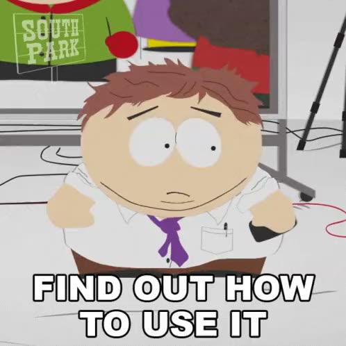

# 如何推动你的研究向前进

来源：Bluesky [@jbhuang0604.bsky.social](https://bsky.app/profile/jbhuang0604.bsky.social)，2024-12-01
原帖：<https://bsky.app/profile/jbhuang0604.bsky.social/post/3lcbmsfnzm224>（内容已完整本地化，无需访问原链接）
英文原文：[bsky-how-to-drive-your-research-forward.md](../bsky-how-to-drive-your-research-forward.md)

> 作者串文共 5 条（他人回复未收录）。

---

如何推动你的研究向前进？

「我试了上次讨论的想法。这是结果。它不 work。（……尴尬的沉默）」

和学生开会时，这样的对话发生过太多次。我们该如何向前推进？

你需要……

一个*梯度向量*——一个方向和一个大小，告诉你在浩瀚的可能解空间中应该往哪里探索。

只汇报你想法跑出来的结果，其实什么也没有告诉我们……这就像用一组参数去评估损失函数。

我们没有任何办法去优化/改进它。

第一，永远先展示跑最简单的基线会得到什么。

这给了你一个参照系，让你的结果有了上下文。

两者之差，就是你的*方向*。

第二，假装你能拿到某种 ground truth 的特权信息（比如借助玩具例子和合成实验）。这给了你方法表现的某种上界。

把三组结果放在一起比较，你就有*大小*的感觉了。

把研究问题当成一个优化问题来思考（找到并沿着梯度方向前进），在很多次卡壳的时候帮到了我。

也希望它对你有所帮助。

