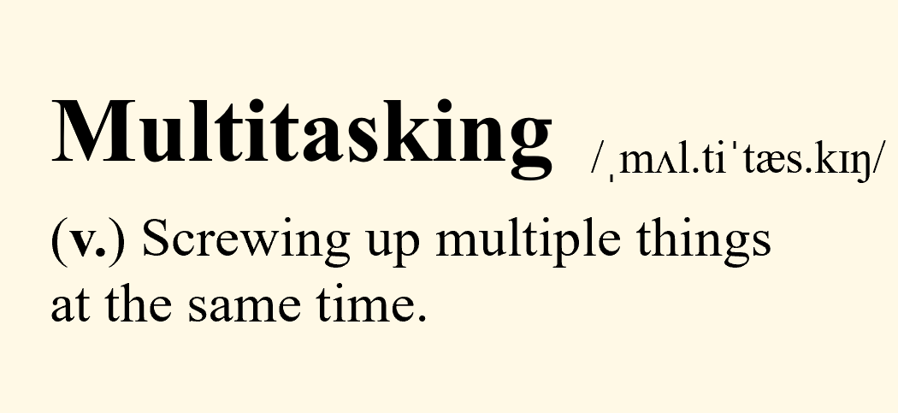
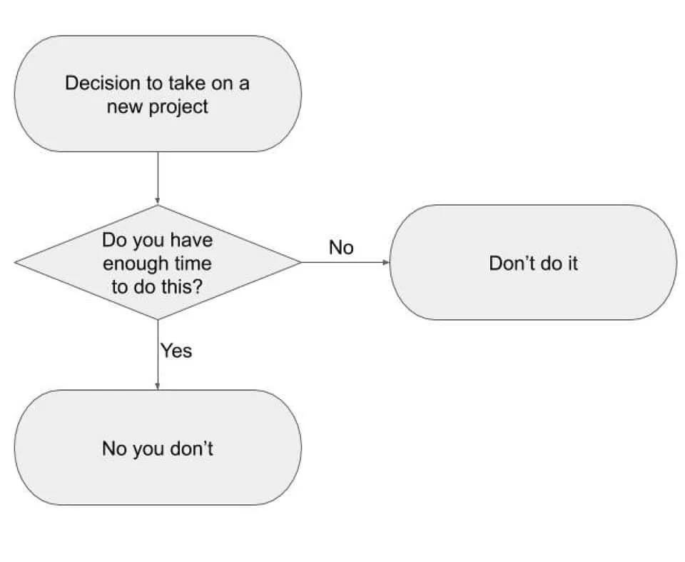
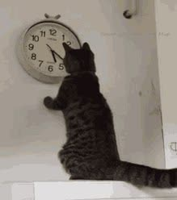
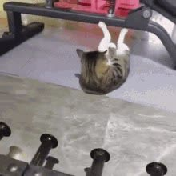
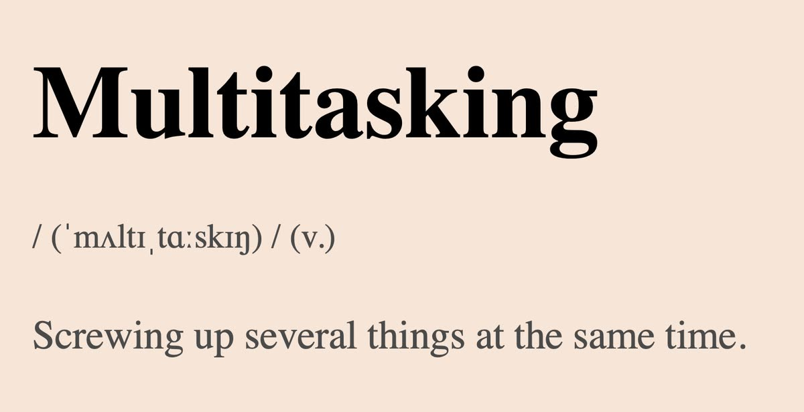
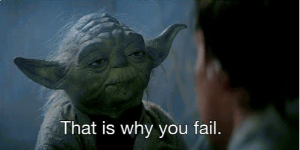

# 效率

> 完整串文中译（4 条）。返回 [中文索引](README.md) · [英文原版](../productivity.md)。

## 如何管理时间？

原帖：<https://x.com/jbhuang0604/status/1430003911037947904> · 2021-08-24 · 共 11 条串文

五年来第一次有了全职工作日程。我以为自己会轻松高效三四倍，结果发现管理时间实在太难了。😬

在靠看效率视频拖延之后，以下是我觉得有用的方法。🧵

*吃掉那只青蛙*

如果你必须吃一只青蛙，把它作为一天中的第一件事。如果你一天要吃三只青蛙，不要从最小的开始。

▶ [GIF 动画（点击播放）](../media/1430003926179405824-1.mp4)

*要有计划*

如果你不知道下周三下午 2:30 自己要做什么，那你就做错了。灵活调整计划可以，但首先你得有个计划。

▶ [GIF 动画（点击播放）](../media/1430003938091323392-1.mp4)

*做当下之事*

清楚意识到此刻你在做什么任务。多任务只是快速切换上下文的幻觉。

*把时间当空间*

把你计划做的「所有事」都变成日历条目（包括规划日历本身），并在那个时间去做。看看 @deviparikh 的精彩博文。

https://deviparikh.medium.com/calendar-in-stead-of-to-do-lists-9ada86a512dd

▶ [GIF 动画（点击播放）](../media/1430003951533965318-1.mp4)

相关链接：
- <https://deviparikh.medium.com/calendar-in-stead-of-to-do-lists-9ada86a512dd>

*合并中断*

按紧急程度把中断（邮件、slack 消息、twitter 信息流）分组、延后处理。每天分配固定时间段处理这些中断。

▶ [GIF 动画（点击播放）](../media/1430003959796797441-1.mp4)

*把一天切分成小时间块*

准备一个计时器/App，专注工作 25 分钟，休息 5 分钟，如此重复。（番茄工作法）

▶ [GIF 动画（点击播放）](../media/1430003969607229444-1.mp4)

*学会说不*

接受任何新任务之前，问自己：
• 我为什么要做它？
• 如果我不做会怎样？

专业提示：建一个「no」文件夹，存放你拒绝掉的事。庆祝自己夺回了多少生命时间。

*放弃精细的任务排序*

有时候你花在给任务排序上的时间比真正做它的时间还多。

▶ [GIF 动画（点击播放）](../media/1430003982328647682-1.mp4)

*每封邮件只碰一次*

打开邮件、扫一眼、快速决定（回复/归档/分配时间段）。让收件箱保持清空。

▶ [GIF 动画（点击播放）](../media/1430003991103029250-1.mp4)

非常欢迎任何时间管理的技巧/建议！

（用这条推特线程来拖延……）

## 如何养成高产的日常习惯？

原帖：<https://x.com/jbhuang0604/status/1570131220499148800> · 2022-09-14 · 共 7 条串文

如何养成高产的日常习惯？

从结构化的学习环境（课程）过渡到非结构化的环境（研究）时，养成高产的日常习惯并管理好时间，对生产力至关重要。

分享一些我觉得有用的技巧！👇

*一周 168 小时*

时间是有的。🕘

用「一周」（而不是一天）来衡量你拥有的时间，会让你对能完成多少有全新的认知。

🧮168 - (8 小时睡眠 × 7 天) - (每周 40 小时工作) = 72 小时！

把时间用在你最在乎的事情上！

▶ [GIF 动画（点击播放）](../media/1570131227776061441-1.mp4)

*时间块*

把计划做的事都放到日历上。📆
被排进日程的事才会被完成。

关于这一点，看看 @deviparikh 的精彩博文！https://deviparikh.medium.com/calendar-in-stead-of-to-do-lists-9ada86a512dd

▶ [GIF 动画（点击播放）](../media/1570131234940162049-1.mp4)

相关链接：
- <https://deviparikh.medium.com/calendar-in-stead-of-to-do-lists-9ada86a512dd>

*做当下之事*

多任务给你虚假的高产感。

跟着日历走，一次只专注一件事。

▶ [GIF 动画（点击播放）](../media/1570131242586198017-1.mp4)

*锻炼、锻炼、锻炼*

清晨规律锻炼能给你带来一整天的：
• 思维敏锐 🧠
• 身体能量 💪
• 情绪稳定 😁
• 社交健康 👋

▶ [GIF 动画（点击播放）](../media/1570131249477345280-1.mp4)

*吃掉那只青蛙*

一天从最重要的任务（也就是青蛙 🐸）开始。

给大脑一点多巴胺，剩下的一天会自动运转！

▶ [GIF 动画（点击播放）](../media/1570131262966202368-1.mp4)

希望有帮助！

你最喜欢的效率技巧是什么？💡
很想多学习！

▶ [GIF 动画（点击播放）](../media/1570131272009228289-1.mp4)

## 如何多任务处理？

原帖：<https://x.com/jbhuang0604/status/1643454248229785604> · 2023-04-05 · 共 10 条串文

如何多任务处理？

待办清单上的多项任务让你不堪重负？😩

怎样有效管理和切换任务？🤹 🤹‍♂️ 🤹‍♀️ 下面是一些建议。👇

*冷静*

不要慌！只要有良好的优先级排序和策略，我相信你能搞定！

▶ [GIF 动画（点击播放）](../media/1643454257604214784-1.mp4)

*优先级排序*

多任务只是快速切换上下文的幻觉。

要做好，就要识别每个任务的重要性和紧急度，制定策略。

▶ [GIF 动画（点击播放）](../media/1643454266059661314-1.mp4)

*说不*

这些任务「真的」都必要吗？

「不」应该是你的默认答案。

无情地砍掉不必要的任务，把它们甩掉。

▶ [GIF 动画（点击播放）](../media/1643454273982799873-1.mp4)

*雪崩法*

管理多项任务与管理信用卡债务类似。

雪崩法：专注于利率最高（最重要）的债务。

👍 长期看更高效/有效。
👎 如果任务耗时长，可能让人泄气。

▶ [GIF 动画（点击播放）](../media/1643454283063390208-1.mp4)

*雪球法*

雪球法：专注于余额最小（最容易）的债务。

👍 享受沿途的小胜利，更有成就感/动力。
👎 对最终目标效果较差。

▶ [GIF 动画（点击播放）](../media/1643454291028393989-1.mp4)

*两分钟法则*

如果一个任务能在两分钟以内完成，现在就做掉。不要把它加进清单。

▶ [GIF 动画（点击播放）](../media/1643454299416952832-1.mp4)

*时间块*

策略定好后，为具体任务分配时间块，并严格执行。

用日历 🗓️，别用待办清单 🗒️！

▶ [GIF 动画（点击播放）](../media/1643454317393768449-1.mp4)

*设定截止日期*

帕金森定律：工作会膨胀，占满所有可用的完成时间。

设定人为的截止日期，用更短的时间做更多的事！

▶ [GIF 动画（点击播放）](../media/1643454325195251712-1.mp4)

*照顾好自己*

照顾好自己。睡够 🛌、吃好 🍲、锻炼 💪。

让身心能高效完成多项任务。

▶ [GIF 动画（点击播放）](../media/1643454332786843656-1.mp4)

## 如何判断何时放弃一个项目？

原帖：<https://x.com/jbhuang0604/status/1665218942611124225> · 2023-06-04 · 共 7 条串文

如何判断何时放弃一个项目？

一个项目做了很久，却毫无进展？🫠

什么时候该放弃 🏳️，什么时候该坚持 💪？👇

*想象成功*

花点时间想象项目完成后的成果。

它会让你喊出「太棒了！」还是无感？

如果你对潜在的成功都不兴奋，那就该放手了。

▶ [GIF 动画（点击播放）](../media/1665218970255867905-1.mp4)

*缩小范围*

很多时候我们卡住，是因为项目的范围需要重新界定。

是不是太宏大、让人喘不过气？

考虑能否拆成更小、更好管理的任务。

▶ [GIF 动画（点击播放）](../media/1665218976819953667-1.mp4)

*验证你的核心假设*

设计玩具实验来检验假设。不是所有想法都能走通。

如果要失败，就快点失败。

▶ [GIF 动画（点击播放）](../media/1665218992271761412-1.mp4)

*看清路径*

评估你的进展和项目轨迹。

你看到通往成功的路了吗？

如果你对问题连最初的下手之处都没有，可能值得重新考虑投入。

▶ [GIF 动画（点击播放）](../media/1665219008084279296-1.mp4)

*向导师寻求建议*

独自工作很容易掉进兔子洞。

与导师或同侪讨论你的项目，听听他们的视角。

▶ [GIF 动画（点击播放）](../media/1665219019220107266-1.mp4)

如果一个项目不再符合你的目标、也缺乏潜力，放弃它完全没问题。

这会为你省下宝贵的时间/精力，并打开新的机会！✨

▶ [GIF 动画（点击播放）](../media/1665219044721524736-1.mp4)
